[🏠 Home](../../README.md) | [📚 Documentation](../index.md) | [🏗️ Architecture](index.md) | [← Technical Decisions](TECHNICAL_DECISIONS.md)

---

# Component Interaction Architecture

## Detailed Component Communication Patterns

**Version:** 1.0  
**Date:** December 2024  
**Author:** Alex Fedin, O2.services

---

## 📑 Table of Contents

1. [System Component Map](#system-component-map)
2. [Detailed Interaction Flows](#detailed-interaction-flows)
   - [Task Discovery and Routing](#1-task-discovery-and-routing)
   - [Lead Qualification Flow](#2-lead-qualification-flow)
   - [Data Enrichment Flow](#3-data-enrichment-flow)
   - [Outreach Generation Flow](#4-outreach-generation-flow)
   - [Web Enrichment Flow](#5-web-enrichment-flow)
3. [Inter-Agent Communication Patterns](#inter-agent-communication-patterns)
4. [Error Handling and Recovery](#error-handling-and-recovery)
5. [Performance Optimization Patterns](#performance-optimization-patterns)
6. [Monitoring and Observability](#monitoring-and-observability)
7. [Conclusion](#conclusion)

---

## System Component Map

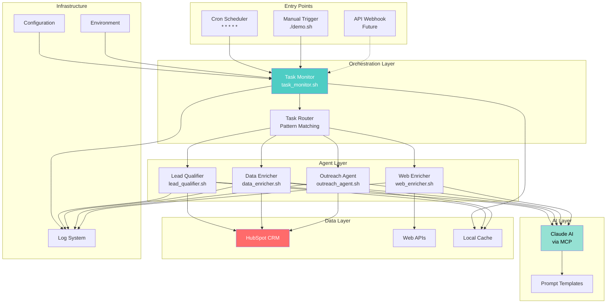

---

## Detailed Interaction Flows

### 1. Task Discovery and Routing

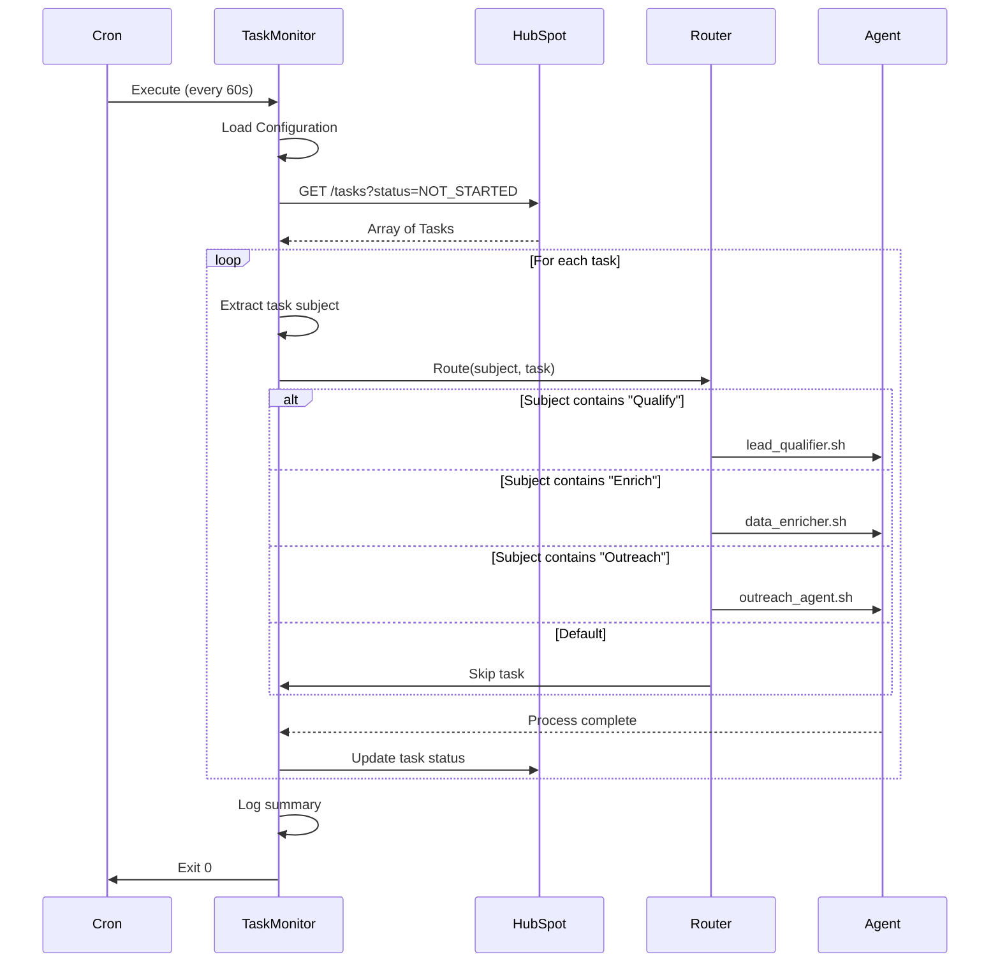

**Key Design Points**:
- **Idempotent Operations**: Safe to run multiple times
- **Atomic Task Processing**: One task fully completes before next
- **Graceful Degradation**: Failed tasks don't block others

---

### 2. Lead Qualification Flow

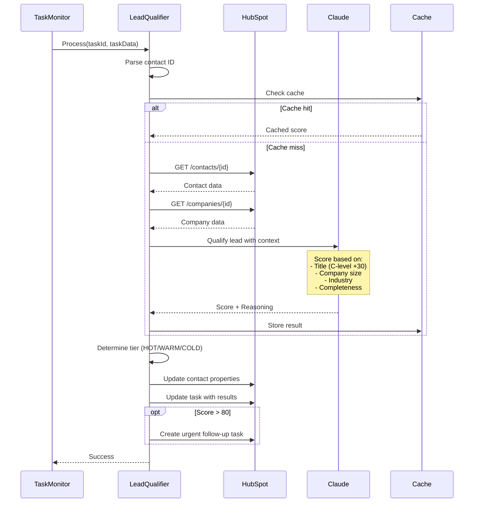

**Intelligence Points**:
- **Smart Caching**: 15-minute TTL for scores
- **Parallel Fetching**: Contact + Company data
- **Conditional Actions**: Auto-escalation for hot leads

---

### 3. Data Enrichment Flow

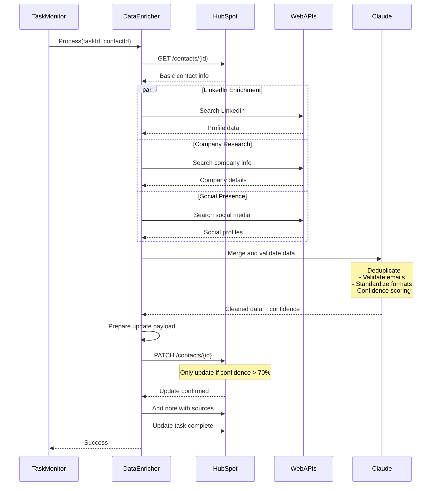

**Smart Features**:
- **Parallel Enrichment**: 3x faster data gathering
- **Confidence Scoring**: Only high-quality updates
- **Source Attribution**: Full audit trail

---

### 4. Outreach Generation Flow

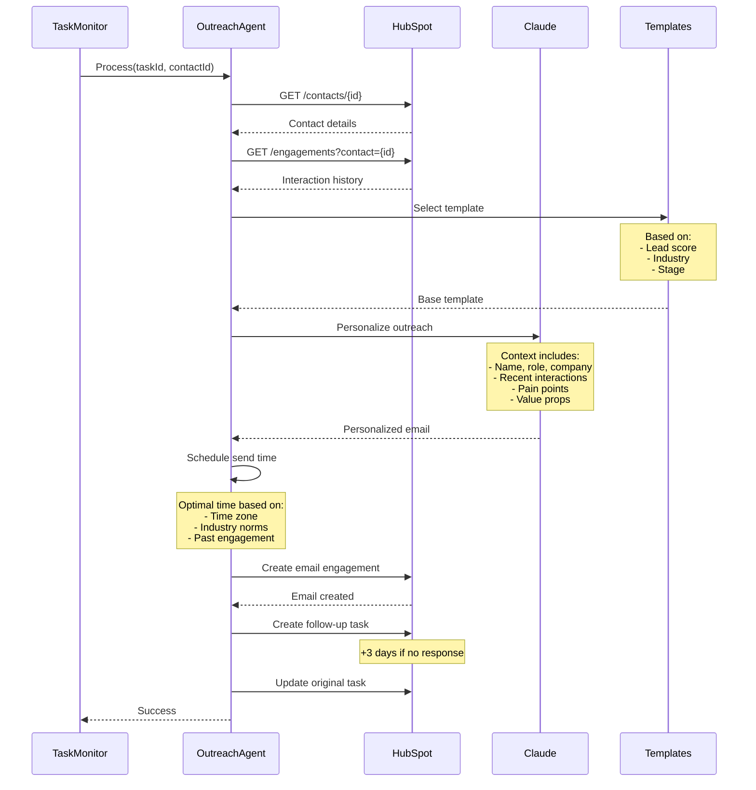

**Personalization Engine**:
- **Dynamic Templates**: Industry-specific messaging
- **Smart Scheduling**: Time zone aware
- **Follow-up Automation**: Self-creating task chains

---

### 5. Web Enrichment Flow

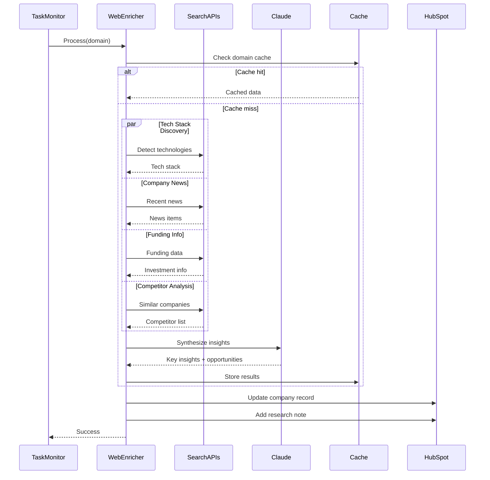

---

## Inter-Agent Communication Patterns

### Message Passing via Tasks

```mermaid
graph LR
    subgraph "Agent A Creates Task"
        A1[Process Data]
        A2[Need Agent B]
        A3[Create Task]
        A4[Set Subject: 'For Agent B']
        A5[Add Context in Body]
    end
    
    subgraph "Task Monitor Routes"
        T1[Poll Tasks]
        T2[Read Subject]
        T3[Route to Agent B]
    end
    
    subgraph "Agent B Processes"
        B1[Receive Task]
        B2[Process]
        B3[Update Task]
        B4[Create Follow-up if Needed]
    end
    
    A1 --> A2
    A2 --> A3
    A3 --> A4
    A4 --> A5
    
    A5 --> T1
    T1 --> T2
    T2 --> T3
    
    T3 --> B1
    B1 --> B2
    B2 --> B3
    B3 --> B4
    
    style A3 fill:#4ECDC4,color:#fff
    style T2 fill:#95E1D3,color:#000
    style B3 fill:#4ECDC4,color:#fff
```

### Task Chaining Pattern

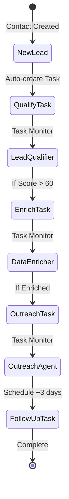

---

## Error Handling and Recovery

### Circuit Breaker Pattern

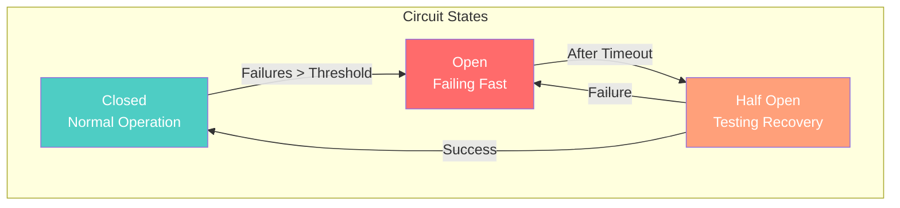

### Retry Strategy

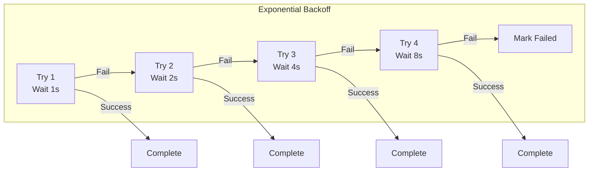

---

## Performance Optimization Patterns

### Caching Strategy

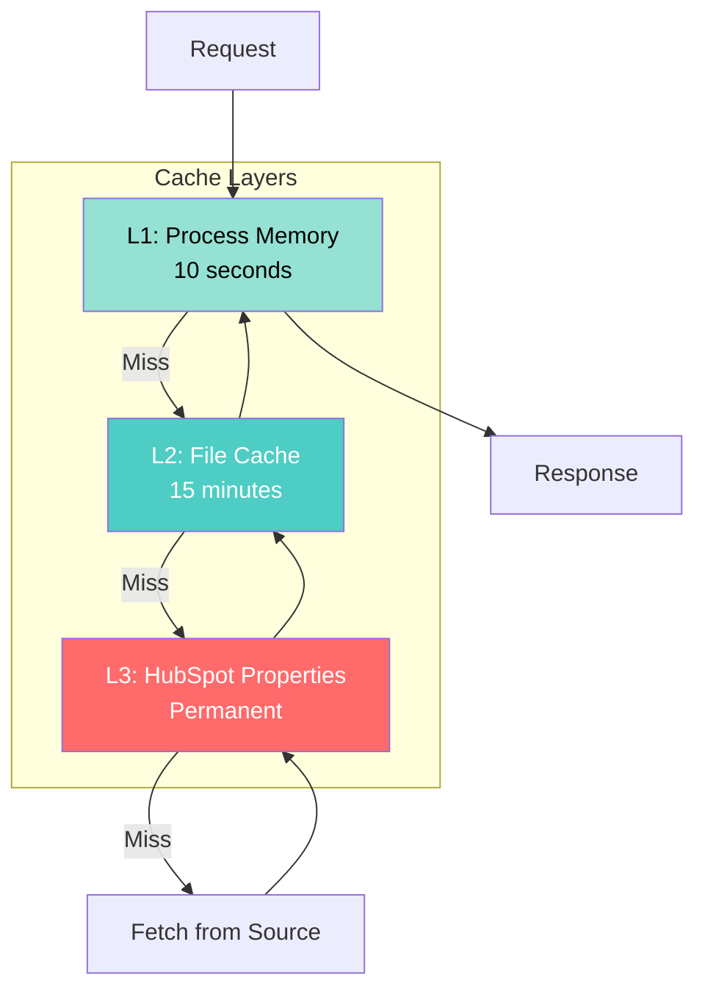

### Batch Processing

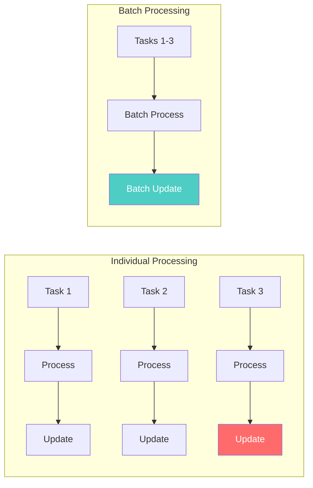

---

## Monitoring and Observability

### Distributed Tracing

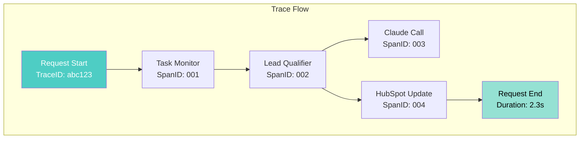

### Health Check Pattern

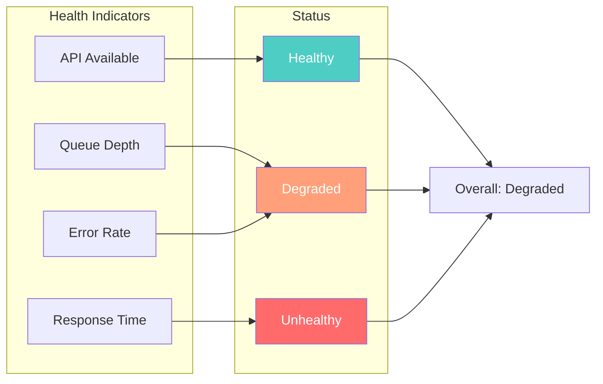

---

## Conclusion

The component interaction architecture demonstrates:

1. **Loose Coupling**: Agents don't know about each other
2. **High Cohesion**: Each agent has single responsibility  
3. **Resilience**: Multiple failure recovery patterns
4. **Observability**: Full system transparency
5. **Performance**: Optimized for minimal latency

This design enables:
- Adding new agents without changing existing ones
- Scaling individual components independently
- Debugging issues through comprehensive logging
- Maintaining high availability despite failures

The elegance lies not in complexity, but in the sophisticated simplicity of well-orchestrated components.

---

**Document Version**: 1.0  
**Last Updated**: December 2024

---

[⬆️ Top](#component-interaction-architecture) | [🏗️ Architecture Home](index.md) | [← Technical Decisions](TECHNICAL_DECISIONS.md)