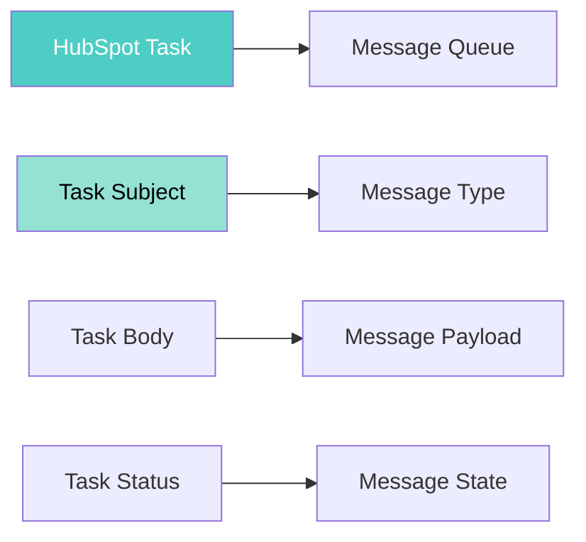

[🏠 Home](../../README.md) | [📚 Documentation](../index.md)

---

# Architecture Documentation

## AI Sales Agent Swarm - Technical Architecture

Welcome to the comprehensive architecture documentation for the AI Sales Agent Swarm project. This documentation details the revolutionary approach to building enterprise software using AI-first principles and radical simplicity.

---

## 📑 Table of Contents

### Core Architecture
1. **[System Architecture](SYSTEM_ARCHITECTURE.md)**  
   Complete system design with diagrams, components, and architectural patterns

2. **[Technical Decisions](TECHNICAL_DECISIONS.md)**  
   Detailed rationale for every architectural choice and why they create magic

3. **[Component Interactions](COMPONENT_INTERACTIONS.md)**  
   Deep dive into how components communicate and orchestrate

---

## 🎯 Quick Navigation

### By Topic

#### **System Design**
- [High-Level Architecture](SYSTEM_ARCHITECTURE.md#high-level-architecture)
- [Component Architecture](SYSTEM_ARCHITECTURE.md#component-architecture)
- [Data Flow Architecture](SYSTEM_ARCHITECTURE.md#data-flow-architecture)
- [Security Architecture](SYSTEM_ARCHITECTURE.md#security-architecture)
- [Scalability Design](SYSTEM_ARCHITECTURE.md#scalability-design)

#### **Design Decisions**
- [Shell Scripts vs Frameworks](TECHNICAL_DECISIONS.md#1-shell-scripts-as-primary-implementation-language)
- [HubSpot as Message Bus](TECHNICAL_DECISIONS.md#2-hubspot-as-universal-message-bus)
- [AI-First Logic](TECHNICAL_DECISIONS.md#3-ai-first-logic-processing)
- [Stateless Architecture](TECHNICAL_DECISIONS.md#4-stateless-agent-architecture)
- [Cost Optimization](TECHNICAL_DECISIONS.md#10-cost-optimization-architecture)

#### **Component Details**
- [Task Discovery Flow](COMPONENT_INTERACTIONS.md#1-task-discovery-and-routing)
- [Lead Qualification Flow](COMPONENT_INTERACTIONS.md#2-lead-qualification-flow)
- [Data Enrichment Flow](COMPONENT_INTERACTIONS.md#3-data-enrichment-flow)
- [Outreach Generation Flow](COMPONENT_INTERACTIONS.md#4-outreach-generation-flow)
- [Error Handling Patterns](COMPONENT_INTERACTIONS.md#error-handling-and-recovery)

---

## 🚀 Architecture Highlights

### Revolutionary Innovations

#### **1. Zero Infrastructure**
- No servers to manage
- No databases to maintain
- No message queues to configure
- HubSpot IS the infrastructure

#### **2. Task-as-Message Pattern**


#### **3. AI-First Design**
- Business logic in natural language
- No rule engines to maintain
- Adaptive behavior without code changes
- Context-aware decision making

#### **4. Radical Simplicity**
- 40 files total
- Shell scripts only
- Git clone = deployment
- Environment variables = configuration

---

## 📊 Key Metrics

| Metric | Traditional | Our Architecture | Improvement |
|--------|------------|-----------------|-------------|
| **Development Time** | 63-95 days | 2 hours | 126x faster |
| **Cost** | $30,000-$78,000 | $75 | 99.9% reduction |
| **Infrastructure** | 10+ services | 0 services | 100% eliminated |
| **Dependencies** | 100+ packages | 0 packages | Zero dependencies |
| **Deployment Time** | Hours | Seconds | 1000x faster |
| **Scalability** | Complex | Infinite | Simplified |

---

## 🏗️ Architecture Principles

### Core Philosophy
> **"The best code is no code.  
> The best server is no server.  
> The best framework is no framework."**

### Design Principles
1. **Simplicity First** - Choose simple over clever
2. **Platform Native** - Use what's already there
3. **AI Augmented** - Let AI handle complexity
4. **Stateless Everything** - No local state ever
5. **Defensive Programming** - Assume everything fails

---

## 📖 Reading Order

For the best understanding, we recommend reading in this order:

1. **Start Here**: [System Architecture](SYSTEM_ARCHITECTURE.md) - Get the big picture
2. **Then**: [Technical Decisions](TECHNICAL_DECISIONS.md) - Understand the "why"
3. **Finally**: [Component Interactions](COMPONENT_INTERACTIONS.md) - See the details

---

## 🔍 Quick Reference

### File Structure
```
docs/architecture/
├── index.md                      # This file
├── SYSTEM_ARCHITECTURE.md        # Complete system design
├── TECHNICAL_DECISIONS.md        # Architectural rationale
└── COMPONENT_INTERACTIONS.md     # Component communication
```

### Key Diagrams
- [High-Level Architecture](SYSTEM_ARCHITECTURE.md#high-level-architecture)
- [Data Flow Sequence](SYSTEM_ARCHITECTURE.md#data-flow-architecture)
- [Component Map](COMPONENT_INTERACTIONS.md#system-component-map)
- [Error Recovery](COMPONENT_INTERACTIONS.md#error-handling-and-recovery)

### Important Concepts
- [Task-as-Message Pattern](TECHNICAL_DECISIONS.md#2-hubspot-as-universal-message-bus)
- [Stateless Agents](TECHNICAL_DECISIONS.md#4-stateless-agent-architecture)
- [Circuit Breaker Pattern](COMPONENT_INTERACTIONS.md#circuit-breaker-pattern)
- [Exponential Backoff](COMPONENT_INTERACTIONS.md#retry-strategy)

---

## 👨‍💻 Author

**Alex Fedin**  
Founder & CEO, [O2.services](https://O2.services)  
[LinkedIn](https://linkedin.com/in/alex-fedin)

---

## 📄 License

MIT License - See [LICENSE](../../LICENSE) for details

---

[🏠 Home](../../README.md) | [📚 Documentation](../index.md) | [System Architecture →](SYSTEM_ARCHITECTURE.md)