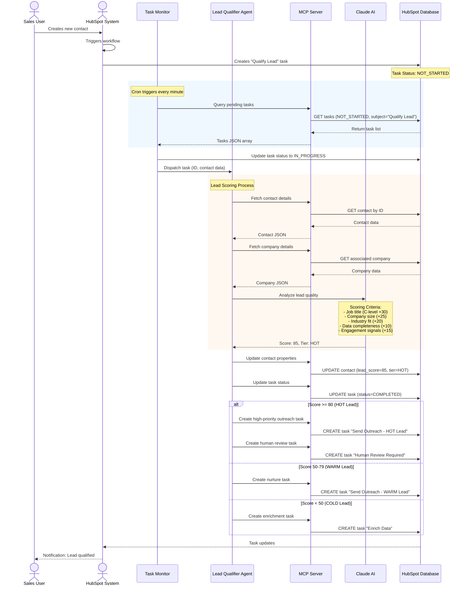
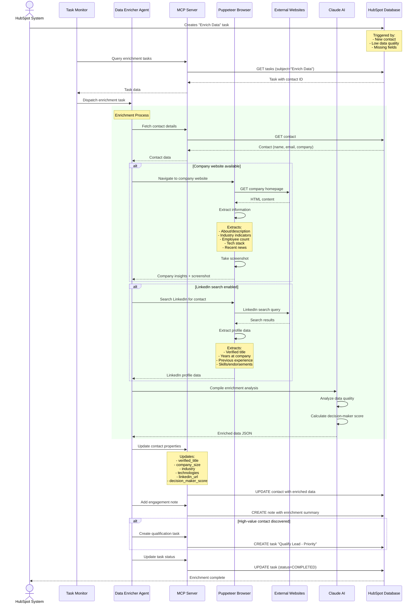
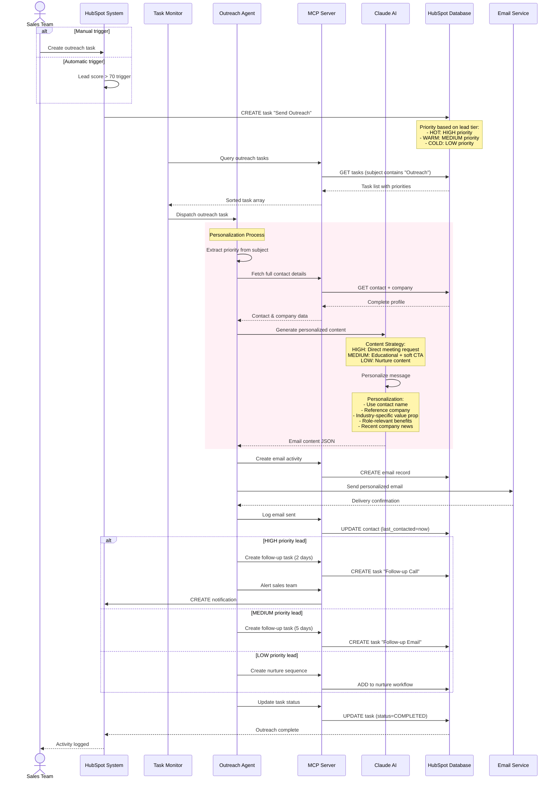
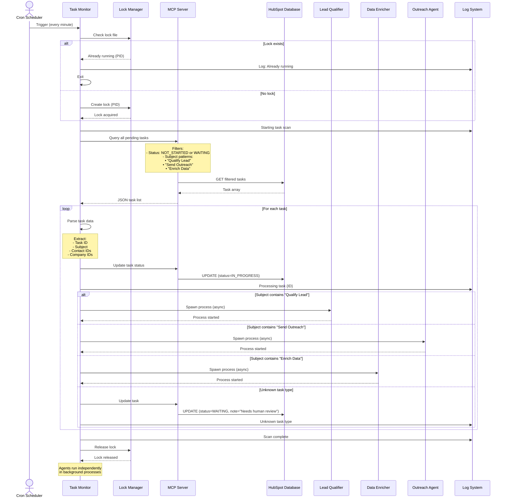
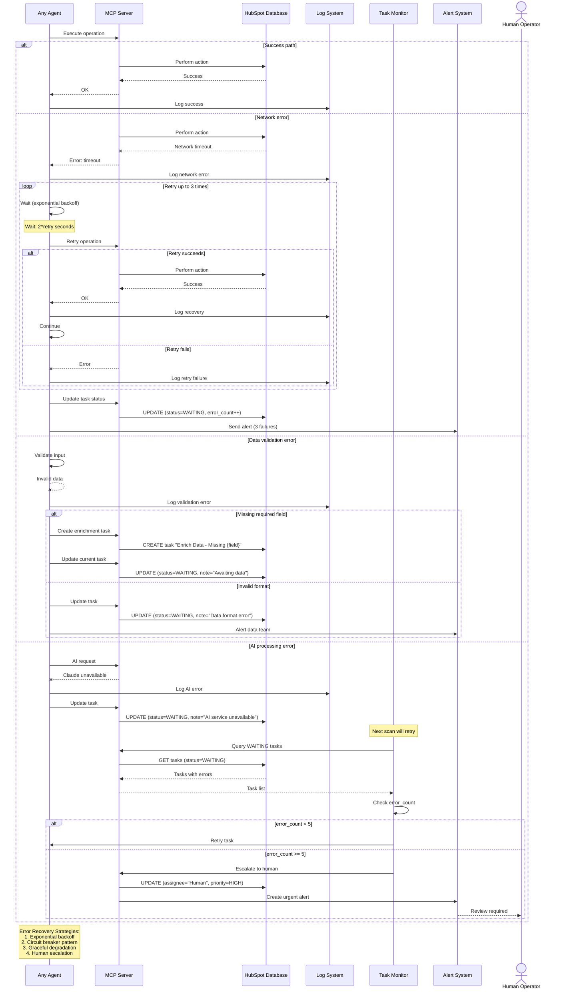
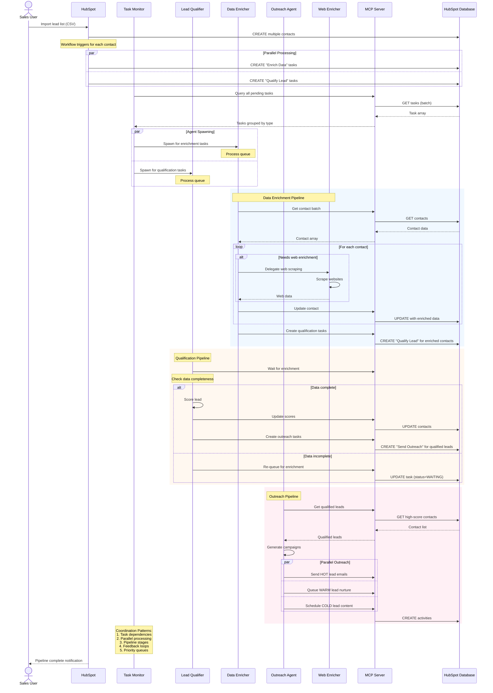

[🏠 Home](../../../README.md) | [📚 Documentation](../../index.md) | [🏗️ Architecture](../../architecture/index.md) | [⬆️ Components](./index.md)

---

# Component Interaction Sequence Diagrams

**Author:** Alex Fedin | [O2.services](https://O2.services) | [LinkedIn](https://linkedin.com/in/alex-fedin)  
**Last Updated:** 2025-08-18  
**Version:** 1.0.0

## 📑 Table of Contents
1. [Lead Qualification Workflow](#lead-qualification-workflow)
2. [Data Enrichment Process](#data-enrichment-process)
3. [Outreach Campaign Execution](#outreach-campaign-execution)
4. [Task Orchestration Flow](#task-orchestration-flow)
5. [Error Handling and Retry Mechanisms](#error-handling-and-retry-mechanisms)
6. [Agent Coordination Patterns](#agent-coordination-patterns)
7. [Related Documents](#related-documents)

---

## Lead Qualification Workflow

### Overview
The lead qualification workflow demonstrates how the system processes new leads through multiple scoring criteria to determine their sales readiness.

[⬆️ Back to top](#-table-of-contents)

---

## Data Enrichment Process

### Overview
The data enrichment process demonstrates how the system automatically gathers additional information about contacts and companies from external sources.

[⬆️ Back to top](#-table-of-contents)

---

## Outreach Campaign Execution

### Overview
The outreach campaign execution shows how personalized messages are generated and sent to qualified leads.

[⬆️ Back to top](#-table-of-contents)

---

## Task Orchestration Flow

### Overview
The task orchestration flow shows how the Task Monitor coordinates multiple agents and manages the overall workflow.

[⬆️ Back to top](#-table-of-contents)

---

## Error Handling and Retry Mechanisms

### Overview
The error handling flow demonstrates how the system handles failures, retries operations, and escalates issues when necessary.

[⬆️ Back to top](#-table-of-contents)

---

## Agent Coordination Patterns

### Overview
This diagram shows how multiple agents coordinate to process complex workflows that require sequential and parallel operations.

[⬆️ Back to top](#-table-of-contents)

---

## Related Documents

- [Workflow Orchestration](./workflow-orchestration.md) - Detailed task flow patterns
- [Error Handling](./error-handling.md) - Comprehensive failure scenarios
- [System Architecture](../../architecture/SYSTEM_ARCHITECTURE.md) - Overall system design
- [Component Interactions](../../architecture/COMPONENT_INTERACTIONS.md) - Component communication details
- [API Documentation](../../api/index.md) - Interface specifications

---

[⬅️ Components](./index.md) | [⬆️ Architecture](../../architecture/index.md) | [➡️ Workflow Orchestration](./workflow-orchestration.md)