[🏠 Home](../../../README.md) | [📚 Documentation](../../index.md) | [🏗️ Architecture](../../architecture/index.md) | [📊 Diagrams](./index.md)

---

# Component Diagrams (C4 Level 3)

**Author:** AI Architecture Assistant  
**Last Updated:** 2025-08-18  
**Version:** 1.0.0

## 📑 Table of Contents
1. [Overview](#overview)
2. [Task Monitor Components](#task-monitor-components)
3. [Lead Qualifier Components](#lead-qualifier-components)
4. [Data Enricher Components](#data-enricher-components)
5. [Outreach Agent Components](#outreach-agent-components)
6. [MCP Server Components](#mcp-server-components)
7. [Component Interactions](#component-interactions)
8. [Related Documents](#related-documents)

---

## Overview

This document provides detailed component-level architecture for each major subsystem in the AI Sales Agent Swarm, showing internal structure and interactions.

## Task Monitor Components

### Task Monitor Component Details

| Component | Responsibility | Implementation |
|-----------|---------------|----------------|
| Lock Manager | Ensures single instance | PID file at `/tmp/task_monitor.lock` |
| Task Poller | Queries HubSpot for tasks | MCP API calls every 60 seconds |
| Task Router | Matches tasks to agents | Pattern matching on task subject |
| Agent Dispatcher | Spawns agent processes | Shell subprocess execution |
| Status Updater | Updates task status | HubSpot API via MCP |
| Logger | Records all activities | Append to `logs/task_monitor.log` |
| Config Loader | Loads configuration | Reads JSON config files |
| Error Handler | Manages failures | Retry logic with backoff |

## Lead Qualifier Components

### Lead Qualifier Scoring Algorithm

```mermaid
graph LR
    subgraph "Scoring Weights"
        W1[Company: 25%]
        W2[Engagement: 20%]
        W3[Fit: 30%]
        W4[Timing: 15%]
        W5[Budget: 10%]
    end
    
    subgraph "Tier Thresholds"
        HOT[HOT: Score ≥ 80]
        WARM[WARM: 50 ≤ Score < 80]
        COLD[COLD: Score < 50]
    end
    
    W1 --> Score[Final Score]
    W2 --> Score
    W3 --> Score
    W4 --> Score
    W5 --> Score
    
    Score --> HOT
    Score --> WARM
    Score --> COLD
```

## Data Enricher Components

### Data Enrichment Pipeline

| Stage | Process | Output |
|-------|---------|--------|
| Discovery | Search multiple sources | Raw data collection |
| Extraction | Parse structured data | Normalized fields |
| Validation | Quality checks | Validated data |
| Merging | Combine with existing | Enriched record |
| Caching | Store for reuse | Performance optimization |

## Outreach Agent Components

### Outreach Personalization Matrix

## MCP Server Components

### MCP Protocol Flow

## Component Interactions

### Cross-Agent Communication

### State Management

### Error Handling Strategy

---

## Related Documents

- [System Context](./system-context.md) - System boundaries
- [Container Architecture](./container-architecture.md) - Container view
- [Deployment Architecture](./deployment-architecture.md) - Infrastructure
- [Data Flow Diagrams](./data-flow.md) - Data movement

[⬆️ Back to top](#-table-of-contents)

---

[⬅️ Container Architecture](./container-architecture.md) | [⬆️ Diagrams](./index.md) | [➡️ Deployment Architecture](./deployment-architecture.md)