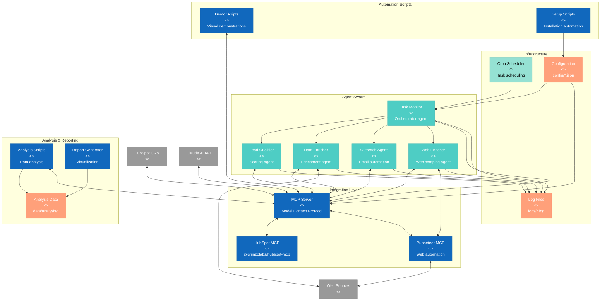
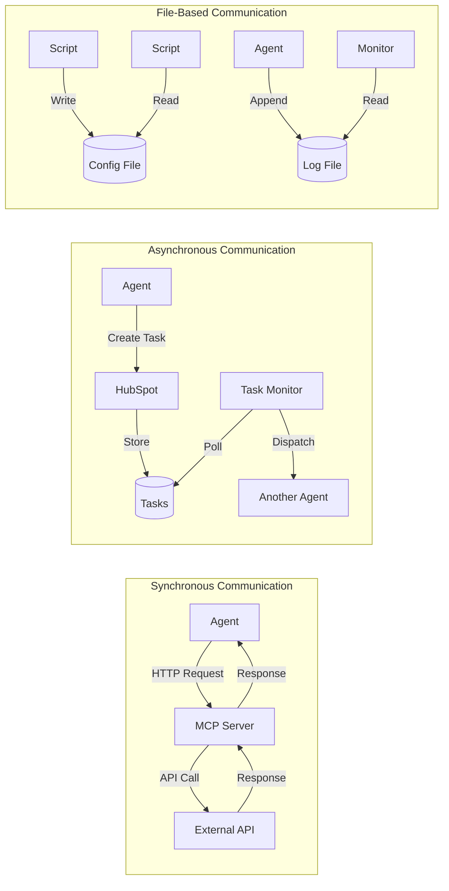

[🏠 Home](../../../README.md) | [📚 Documentation](../../index.md) | [🏗️ Architecture](../../architecture/index.md) | [📊 Diagrams](./index.md)

---

# Container Architecture Diagram (C4 Level 2)

**Author:** AI Architecture Assistant  
**Last Updated:** 2025-08-18  
**Version:** 1.0.0

## 📑 Table of Contents
1. [Overview](#overview)
2. [Container Diagram](#container-diagram)
3. [Container Descriptions](#container-descriptions)
4. [Technology Stack](#technology-stack)
5. [Inter-Container Communication](#inter-container-communication)
6. [Data Storage](#data-storage)
7. [Related Documents](#related-documents)

---

## Overview

This document shows the high-level containers (applications and data stores) that make up the AI Sales Agent Swarm system and how they interact with each other.

## Container Diagram



## Container Descriptions

### Integration Layer

#### MCP Server
- **Technology**: Node.js
- **Purpose**: Protocol abstraction for AI models and services
- **Dependencies**: @hubspot/mcp-server
- **Communication**: REST API, WebSocket

#### HubSpot MCP Module
- **Technology**: Node.js module
- **Purpose**: HubSpot-specific MCP implementation
- **Package**: @shinzolabs/hubspot-mcp v2.0.5
- **Features**: Contact management, task operations, email automation

#### Puppeteer MCP Module
- **Technology**: Node.js with Puppeteer
- **Purpose**: Web automation and scraping
- **Package**: @modelcontextprotocol/server-puppeteer
- **Capabilities**: Browser automation, screenshot capture, DOM manipulation

### Agent Swarm

#### Task Monitor
- **Technology**: Bash shell script
- **Location**: `agents/task_monitor.sh`
- **Schedule**: Every 60 seconds via cron
- **Responsibilities**:
  - Poll HubSpot for pending tasks
  - Route tasks to appropriate agents
  - Monitor agent health
  - Update task statuses

#### Lead Qualifier
- **Technology**: Bash shell script
- **Location**: `agents/lead_qualifier.sh`, `agents/lead_qualifier_v2.sh`
- **AI Integration**: Claude AI for scoring
- **Functions**:
  - Multi-factor lead scoring
  - Tier assignment (HOT/WARM/COLD)
  - CRM field updates
  - Qualification reasoning

#### Data Enricher
- **Technology**: Bash shell script
- **Location**: `agents/data_enricher.sh`
- **Data Sources**: Web APIs, public databases
- **Enrichment Types**:
  - Company information
  - Contact details
  - Social profiles
  - Industry data

#### Outreach Agent
- **Technology**: Bash shell script
- **Location**: `agents/outreach_agent.sh`
- **AI Integration**: Claude AI for content
- **Capabilities**:
  - Email personalization
  - Template selection
  - Send scheduling
  - Follow-up automation

#### Web Enricher
- **Technology**: Bash shell script
- **Location**: `agents/web_enricher.sh`
- **Integration**: Puppeteer MCP
- **Functions**:
  - LinkedIn scraping
  - Company website analysis
  - News monitoring
  - Competitor research

### Infrastructure

#### Cron Scheduler
- **Technology**: Unix cron
- **Configuration**: User crontab
- **Jobs**:
  ```cron
  * * * * * /path/to/agents/task_monitor.sh
  ```

#### Log System
- **Technology**: File-based logging
- **Location**: `logs/`
- **Files**:
  - `task_monitor.log`
  - `cron.log`
  - `test_results.json`
- **Rotation**: Daily with 7-day retention

#### Configuration
- **Technology**: JSON and shell scripts
- **Location**: `config/`
- **Files**:
  - `agent_identity.sh` - Agent configurations
  - `mcp_hubspot_config.json` - MCP settings
  - `task_assignment_rules.json` - Routing rules
  - `workflow_triggers.json` - Automation triggers

### Automation Scripts

#### Demo Scripts
- **Technology**: JavaScript, AppleScript
- **Location**: `scripts/`
- **Purpose**: Visual demonstrations and testing
- **Types**:
  - Browser automation demos
  - HubSpot workflow demos
  - End-to-end scenarios

#### Setup Scripts
- **Technology**: Bash
- **Location**: `scripts/bash/setup/`
- **Functions**:
  - Environment setup
  - Dependency installation
  - MCP configuration
  - Cron job setup

### Analysis & Reporting

#### Analysis Scripts
- **Technology**: Python
- **Location**: `scripts/python/analysis/`
- **Libraries**: pandas, numpy, matplotlib
- **Functions**:
  - Repository analysis
  - Cost calculations
  - Performance metrics
  - ROI analysis

#### Report Generator
- **Technology**: Python
- **Location**: `scripts/python/reporting/`
- **Outputs**: Markdown reports, visualizations
- **Reports**:
  - Development metrics
  - Cost comparisons
  - Performance analysis
  - FOMO reports

## Technology Stack

### Languages & Runtimes
- **Shell Scripting**: Bash (primary orchestration)
- **Node.js**: v18+ (MCP server and modules)
- **Python**: 3.9+ (analysis and reporting)
- **JavaScript**: ES6+ (demos and automation)
- **AppleScript**: macOS automation

### Key Dependencies
```json
{
  "@hubspot/mcp-server": "^0.4.0",
  "@modelcontextprotocol/server-puppeteer": "^2025.5.12",
  "@shinzolabs/hubspot-mcp": "^2.0.5"
}
```

### External Services
- HubSpot CRM API
- Claude AI API
- Web data sources

## Inter-Container Communication

### Communication Patterns



### Protocol Details

#### MCP Communication
- **Protocol**: HTTP/REST
- **Authentication**: API tokens
- **Format**: JSON
- **Error Handling**: Exponential backoff

#### HubSpot Integration
- **API Version**: v3
- **Authentication**: Private App Token
- **Rate Limiting**: 100 requests/10 seconds
- **Batch Operations**: Supported

#### Inter-Agent Messaging
- **Medium**: HubSpot tasks
- **Format**: Task subject (command), body (parameters)
- **State Management**: Task status fields
- **Concurrency**: Lock files for critical sections

## Data Storage

### Operational Data
- **Location**: HubSpot CRM
- **Types**: Contacts, companies, tasks, emails
- **Retention**: Indefinite
- **Backup**: HubSpot managed

### Configuration Data
- **Location**: Local filesystem
- **Format**: JSON, shell variables
- **Version Control**: Git tracked
- **Sensitivity**: API keys in environment variables

### Log Data
- **Location**: `logs/` directory
- **Format**: Timestamped text
- **Rotation**: Daily
- **Retention**: 7 days

### Analysis Data
- **Location**: `data/` directory
- **Format**: JSON
- **Types**: Metrics, reports, visualizations
- **Processing**: Python scripts

---

## Related Documents

- [System Context](./system-context.md) - High-level system view
- [Component Diagrams](./component-diagrams.md) - Detailed component structure
- [Deployment Architecture](./deployment-architecture.md) - Infrastructure setup
- [Data Flow Diagrams](./data-flow.md) - Data movement patterns

[⬆️ Back to top](#-table-of-contents)

---

[⬅️ System Context](./system-context.md) | [⬆️ Diagrams](./index.md) | [➡️ Component Diagrams](./component-diagrams.md)