[🏠 Home](../../../README.md) | [📚 Documentation](../../index.md) | [🏗️ Architecture](../../architecture/index.md) | [📊 Diagrams](./index.md)

---

# Data Flow Diagrams

**Author:** AI Architecture Assistant  
**Last Updated:** 2025-08-18  
**Version:** 1.0.0

## 📑 Table of Contents
1. [Overview](#overview)
2. [Lead Processing Flow](#lead-processing-flow)
3. [Task Orchestration Flow](#task-orchestration-flow)
4. [Data Enrichment Flow](#data-enrichment-flow)
5. [Outreach Campaign Flow](#outreach-campaign-flow)
6. [State Management Flow](#state-management-flow)
7. [Error Recovery Flow](#error-recovery-flow)
8. [Analytics Data Flow](#analytics-data-flow)
9. [Related Documents](#related-documents)

---

## Overview

This document illustrates how data flows through the AI Sales Agent Swarm system, from initial lead capture through enrichment, qualification, and outreach.

## Lead Processing Flow

### End-to-End Lead Journey

```mermaid
graph TB
    %% Styling
    classDef process fill:#4ECDC4,stroke:#45b7b5,color:#fff
    classDef data fill:#FFA07A,stroke:#FF8C69,color:#fff
    classDef decision fill:#95E1D3,stroke:#85d1c3,color:#000
    classDef external fill:#999999,stroke:#8a8a8a,color:#fff
    
    %% Lead Creation
    Start([Lead Created]) --> LeadData[(Lead Data)]:::data
    LeadData --> CreateTask[Create Qualification Task]:::process
    
    %% Qualification Flow
    CreateTask --> TaskQueue[(Task Queue)]:::data
    TaskQueue --> TaskMonitor[Task Monitor]:::process
    TaskMonitor --> QualifierAgent[Lead Qualifier Agent]:::process
    
    QualifierAgent --> FetchLead[Fetch Lead Details]:::process
    FetchLead --> LeadInfo[(Lead Information)]:::data
    
    LeadInfo --> AIScoring[AI Scoring Engine]:::process
    AIScoring --> ScoreData[(Score Data)]:::data
    
    ScoreData --> TierDecision{Tier Assignment}:::decision
    
    TierDecision -->|HOT| HotLead[Hot Lead Process]:::process
    TierDecision -->|WARM| WarmLead[Warm Lead Process]:::process
    TierDecision -->|COLD| ColdLead[Cold Lead Process]:::process
    
    %% Enrichment Branch
    HotLead --> EnrichTask[Create Enrichment Task]:::process
    WarmLead --> EnrichTask
    
    EnrichTask --> EnrichQueue[(Enrichment Queue)]:::data
    EnrichQueue --> DataEnricher[Data Enricher Agent]:::process
    
    DataEnricher --> WebSearch[Web Search]:::external
    WebSearch --> EnrichedData[(Enriched Data)]:::data
    
    %% Outreach Branch
    EnrichedData --> OutreachDecision{Outreach Needed?}:::decision
    
    OutreachDecision -->|Yes| CreateOutreach[Create Outreach Task]:::process
    OutreachDecision -->|No| UpdateCRM[Update CRM Only]:::process
    
    CreateOutreach --> OutreachQueue[(Outreach Queue)]:::data
    OutreachQueue --> OutreachAgent[Outreach Agent]:::process
    
    OutreachAgent --> GenerateEmail[Generate Email]:::process
    GenerateEmail --> EmailData[(Email Content)]:::data
    
    EmailData --> SendEmail[Send Email]:::external
    SendEmail --> TrackEngagement[Track Engagement]:::process
    
    %% Final Updates
    TrackEngagement --> UpdateCRM
    ColdLead --> UpdateCRM
    UpdateCRM --> End([Process Complete])
```

### Lead Data Transformation

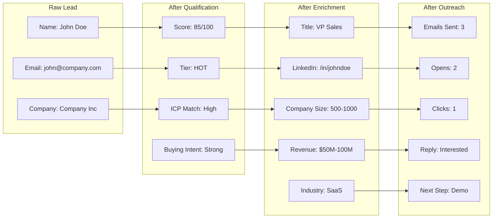

## Task Orchestration Flow

### Task Lifecycle

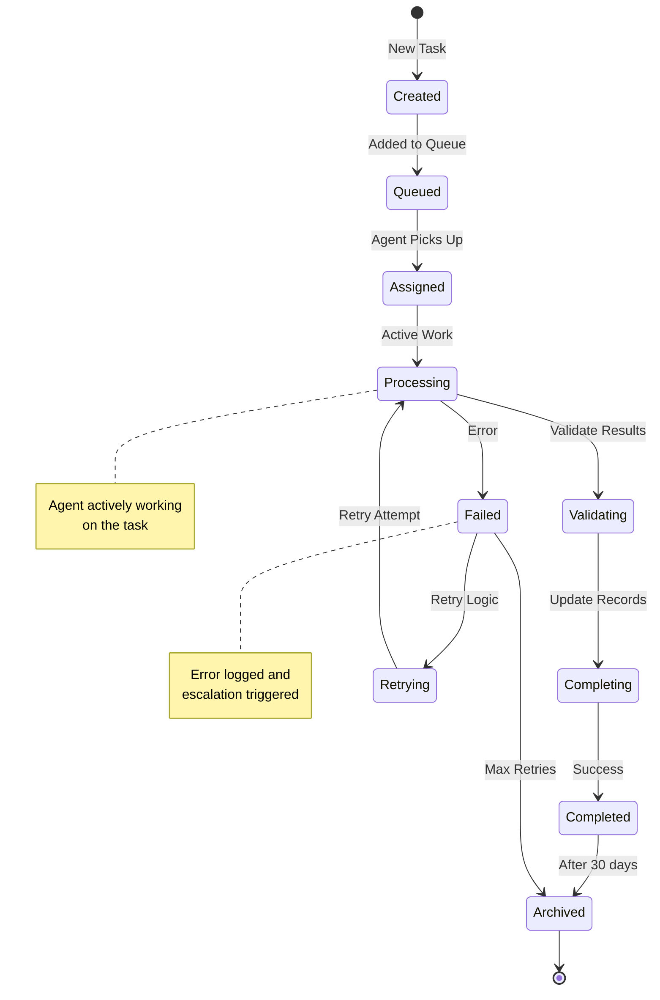

### Task Routing Logic

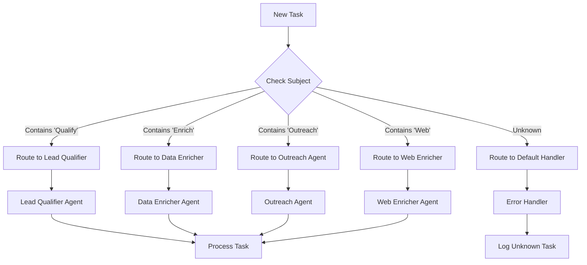

## Data Enrichment Flow

### Multi-Source Enrichment

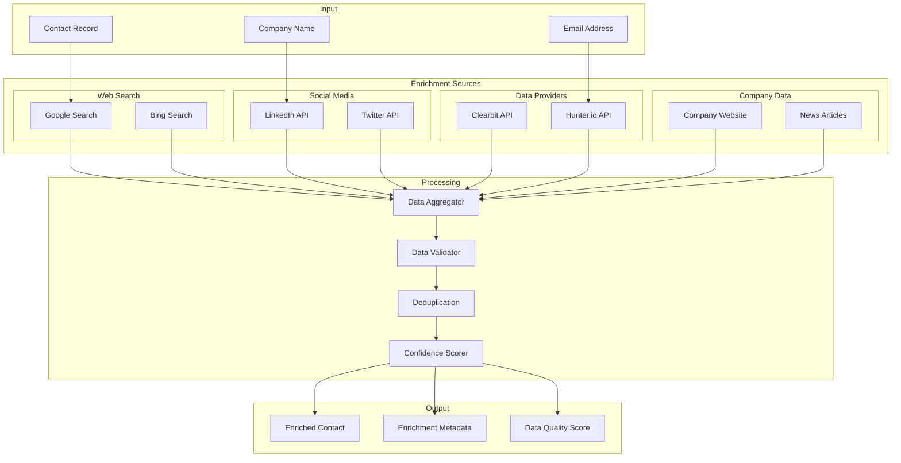

### Data Validation Pipeline

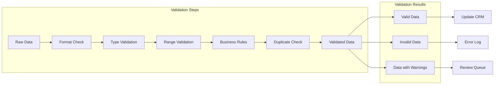

## Outreach Campaign Flow

### Email Generation and Personalization

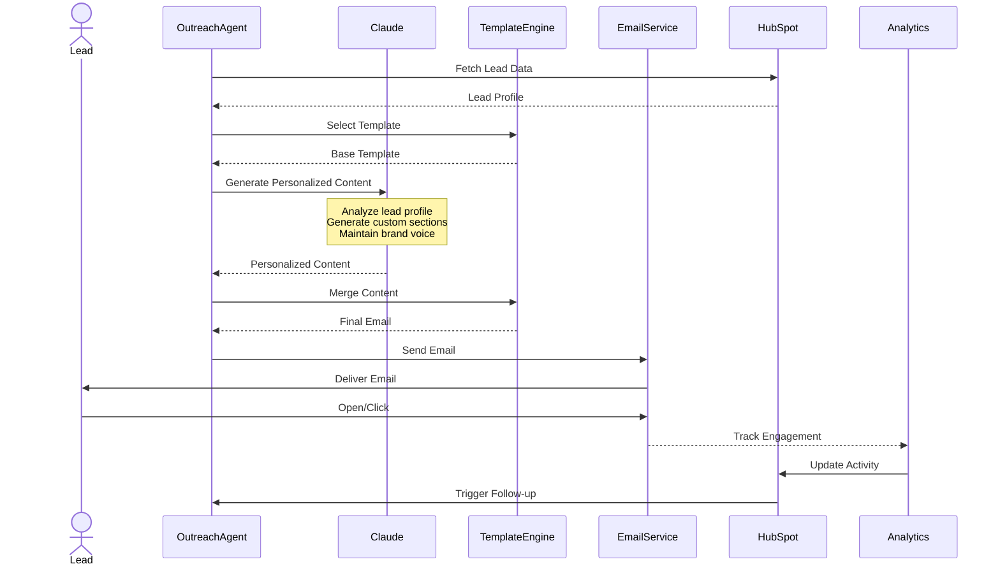

### Campaign State Machine

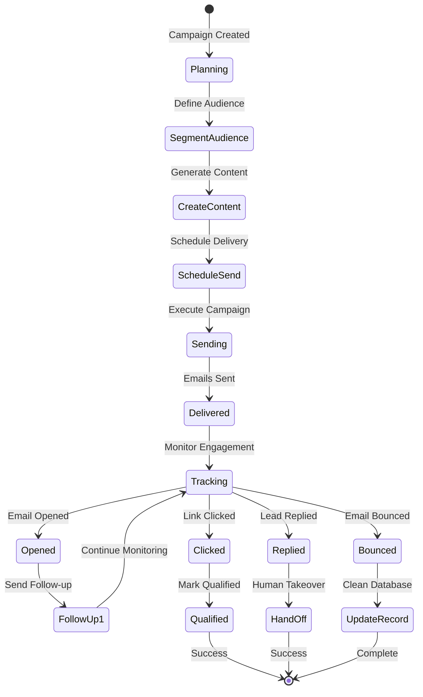

## State Management Flow

### System State Synchronization

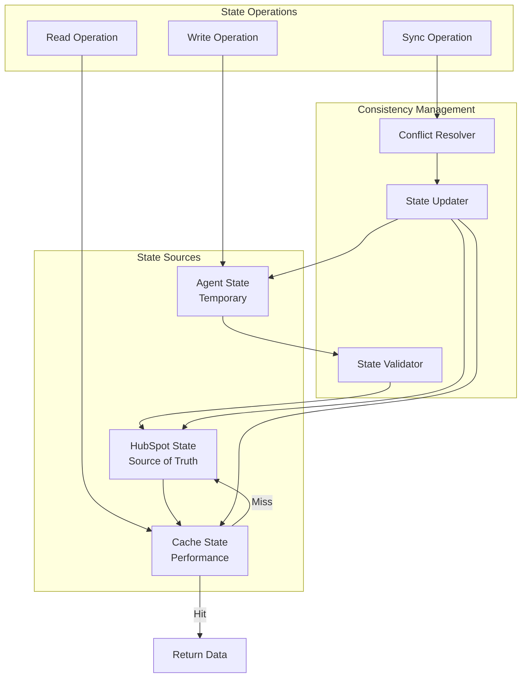

### Transaction Flow

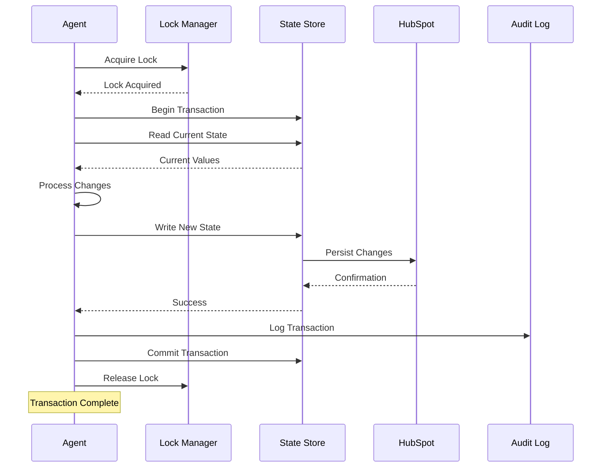

## Error Recovery Flow

### Error Handling Strategy

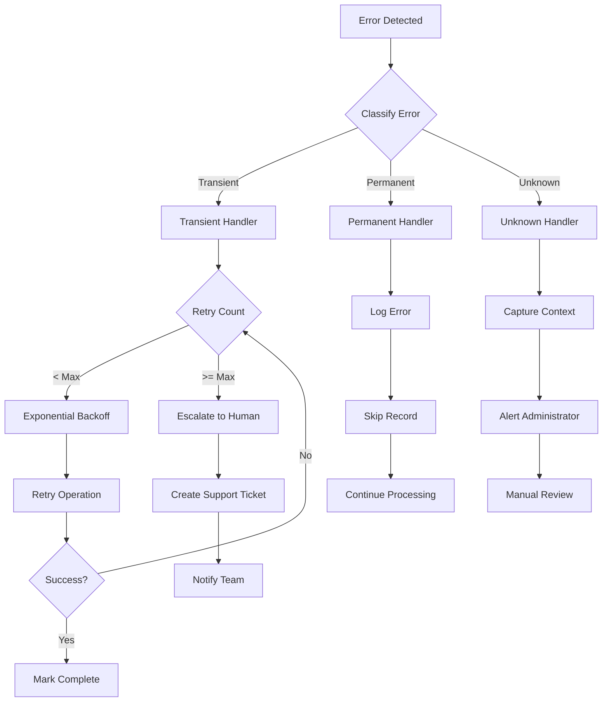

### Retry Logic

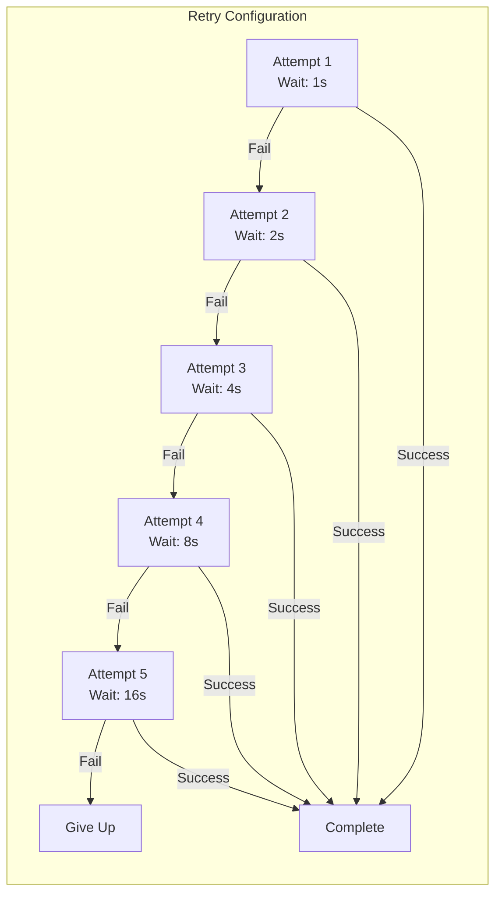

## Analytics Data Flow

### Metrics Collection and Aggregation

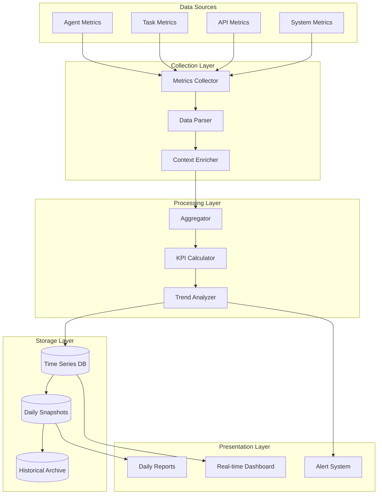

### Performance Metrics Flow

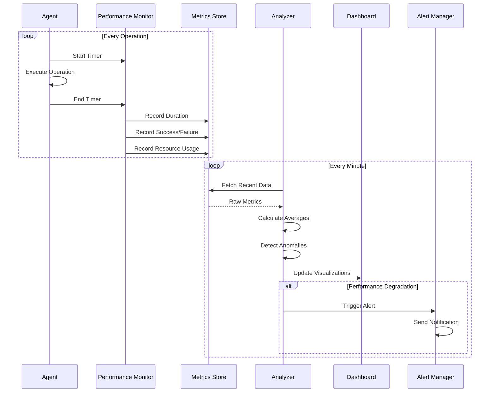

### Data Retention Policy

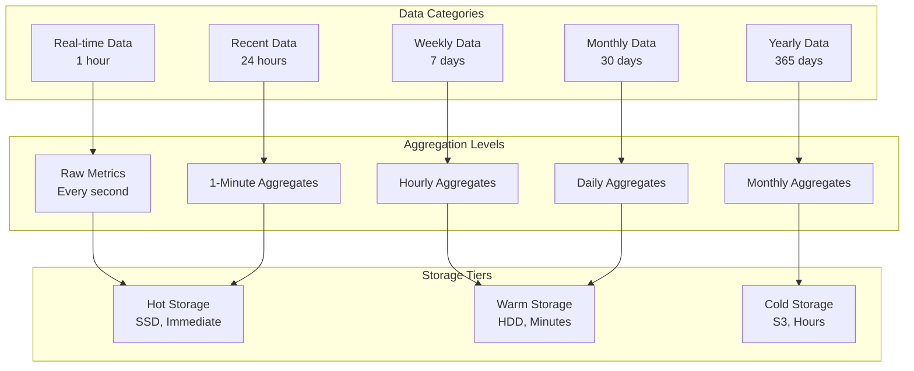

---

## Related Documents

- [System Context](./system-context.md) - System overview
- [Container Architecture](./container-architecture.md) - Container structure
- [Component Diagrams](./component-diagrams.md) - Component details
- [Deployment Architecture](./deployment-architecture.md) - Infrastructure setup

[⬆️ Back to top](#-table-of-contents)

---

[⬅️ Deployment Architecture](./deployment-architecture.md) | [⬆️ Diagrams](./index.md) | [➡️ System Context](./system-context.md)