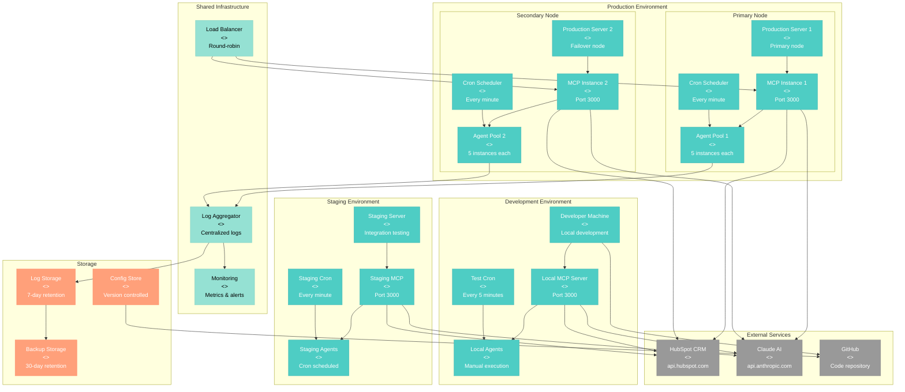
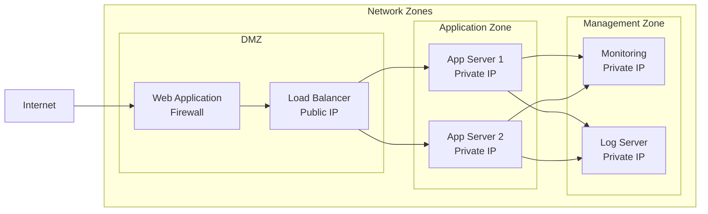
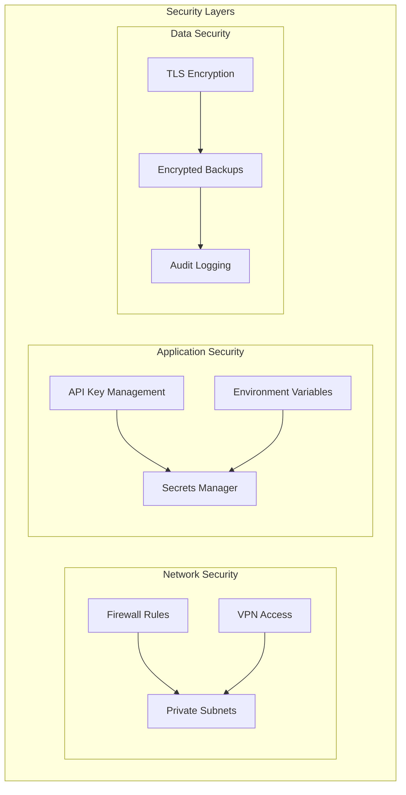
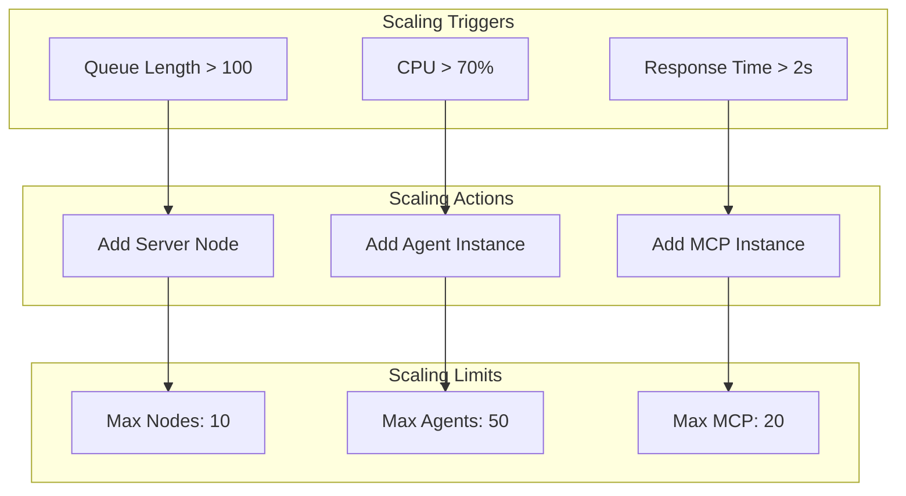
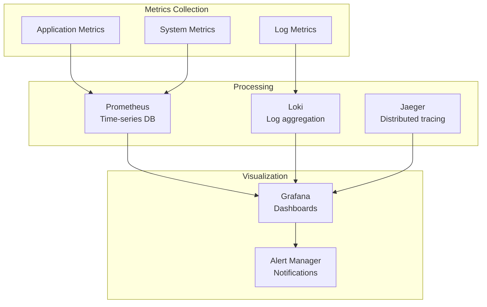
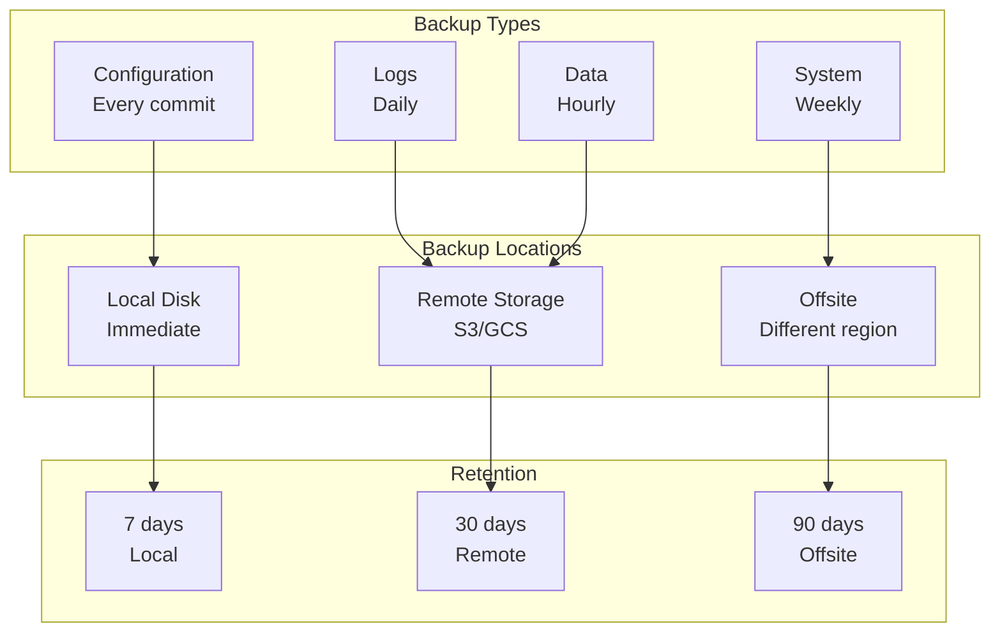
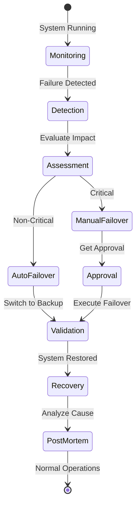

[🏠 Home](../../../README.md) | [📚 Documentation](../../index.md) | [🏗️ Architecture](../../architecture/index.md) | [📊 Diagrams](./index.md)

---

# Deployment Architecture Diagram

**Author:** AI Architecture Assistant  
**Last Updated:** 2025-08-18  
**Version:** 1.0.0

## 📑 Table of Contents
1. [Overview](#overview)
2. [Deployment Topology](#deployment-topology)
3. [Infrastructure Components](#infrastructure-components)
4. [Environment Configuration](#environment-configuration)
5. [Scaling Strategy](#scaling-strategy)
6. [Deployment Process](#deployment-process)
7. [Monitoring & Operations](#monitoring--operations)
8. [Disaster Recovery](#disaster-recovery)
9. [Related Documents](#related-documents)

---

## Overview

This document describes the deployment architecture of the AI Sales Agent Swarm, including infrastructure topology, scaling strategies, and operational considerations.

## Deployment Topology



## Infrastructure Components

### Server Specifications

#### Development Environment
```yaml
Machine:
  Type: Developer Workstation
  OS: macOS/Linux
  CPU: 2+ cores
  RAM: 8GB minimum
  Storage: 20GB available
  Network: Broadband internet
  
Software:
  - Node.js 18+
  - Bash 4+
  - Python 3.9+
  - Git
  - Cron
```

#### Staging Environment
```yaml
Server:
  Type: Virtual Machine
  Provider: AWS EC2 / DigitalOcean
  Instance: t3.medium or equivalent
  OS: Ubuntu 22.04 LTS
  CPU: 2 vCPUs
  RAM: 4GB
  Storage: 40GB SSD
  Network: 100 Mbps
  
Software Stack:
  - Node.js 18+
  - PM2 for process management
  - Nginx for reverse proxy
  - Cron for scheduling
  - Filebeat for log shipping
```

#### Production Environment
```yaml
Primary Node:
  Type: Dedicated VM/Container
  Provider: AWS EC2 / GCP Compute
  Instance: t3.large or equivalent
  OS: Ubuntu 22.04 LTS
  CPU: 4 vCPUs
  RAM: 8GB
  Storage: 100GB SSD
  Network: 1 Gbps
  
Secondary Node:
  Type: Identical to Primary
  Purpose: High availability
  Location: Different availability zone
  
Load Balancer:
  Type: HAProxy / AWS ALB
  Algorithm: Round-robin
  Health Checks: Every 30 seconds
  Failover: Automatic
```

### Network Architecture



### Security Configuration



## Environment Configuration

### Environment Variables

```bash
# Development
export HUBSPOT_API_KEY="dev-key-xxx"
export CLAUDE_API_KEY="dev-key-yyy"
export MCP_PORT="3000"
export LOG_LEVEL="debug"
export ENVIRONMENT="development"

# Staging
export HUBSPOT_API_KEY="stage-key-xxx"
export CLAUDE_API_KEY="stage-key-yyy"
export MCP_PORT="3000"
export LOG_LEVEL="info"
export ENVIRONMENT="staging"

# Production
export HUBSPOT_API_KEY="prod-key-xxx"
export CLAUDE_API_KEY="prod-key-yyy"
export MCP_PORT="3000"
export LOG_LEVEL="warning"
export ENVIRONMENT="production"
export ENABLE_MONITORING="true"
export ENABLE_BACKUP="true"
```

### Cron Configuration

```cron
# Development (manual testing)
*/5 * * * * /path/to/agents/task_monitor.sh

# Staging (integration testing)
* * * * * /path/to/agents/task_monitor.sh
*/15 * * * * /path/to/scripts/health_check.sh

# Production (full automation)
* * * * * /path/to/agents/task_monitor.sh
*/5 * * * * /path/to/scripts/health_check.sh
*/10 * * * * /path/to/scripts/metrics_collector.sh
0 * * * * /path/to/scripts/log_rotation.sh
0 2 * * * /path/to/scripts/backup.sh
```

## Scaling Strategy

### Horizontal Scaling



### Vertical Scaling

| Component | Initial | Scale Up | Maximum |
|-----------|---------|----------|---------|
| CPU | 2 cores | 4 cores | 16 cores |
| RAM | 4 GB | 8 GB | 32 GB |
| Storage | 40 GB | 100 GB | 1 TB |
| Network | 100 Mbps | 1 Gbps | 10 Gbps |

### Auto-Scaling Rules

```yaml
AutoScaling:
  Metrics:
    - Name: CPU_Utilization
      Threshold: 70%
      Duration: 5 minutes
      Action: Scale Up
    
    - Name: Queue_Length
      Threshold: 100 tasks
      Duration: 2 minutes
      Action: Add Agent
    
    - Name: Response_Time
      Threshold: 2000ms
      Duration: 3 minutes
      Action: Add MCP Instance
  
  Cooldown:
    ScaleUp: 300 seconds
    ScaleDown: 600 seconds
  
  Limits:
    MinInstances: 1
    MaxInstances: 10
```

## Deployment Process

### CI/CD Pipeline

```mermaid
graph LR
    subgraph "Development"
        Code[Code Changes]
        Test[Local Tests]
        Commit[Git Commit]
    end
    
    subgraph "CI Pipeline"
        Build[Build]
        UnitTest[Unit Tests]
        IntTest[Integration Tests]
        Package[Package]
    end
    
    subgraph "CD Pipeline"
        DeployStage[Deploy Staging]
        TestStage[Test Staging]
        Approve[Manual Approval]
        DeployProd[Deploy Production]
    end
    
    Code --> Test
    Test --> Commit
    Commit --> Build
    Build --> UnitTest
    UnitTest --> IntTest
    IntTest --> Package
    Package --> DeployStage
    DeployStage --> TestStage
    TestStage --> Approve
    Approve --> DeployProd
```



### Deployment Scripts

```bash
#!/bin/bash
# deploy.sh - Deployment script

ENVIRONMENT=$1
VERSION=$2

# Pre-deployment checks
check_health() {
    curl -f http://localhost:3000/health || exit 1
}

# Backup current version
backup_current() {
    tar -czf backup-$(date +%Y%m%d-%H%M%S).tar.gz ./
}

# Deploy new version
deploy() {
    git fetch origin
    git checkout $VERSION
    npm install
    pm2 restart all
}

# Post-deployment validation
validate() {
    sleep 10
    check_health
    run_smoke_tests
}

# Rollback on failure
rollback() {
    git checkout previous-version
    pm2 restart all
}

# Main deployment flow
backup_current
deploy || rollback
validate || rollback
```

## Monitoring & Operations

### Monitoring Stack



### Key Metrics

| Metric | Target | Alert Threshold |
|--------|--------|-----------------|
| Uptime | 99.9% | < 99.5% |
| Response Time | < 1s | > 2s |
| Error Rate | < 1% | > 5% |
| Task Processing | < 2 min | > 5 min |
| API Rate Limit | < 80% | > 90% |
| CPU Usage | < 60% | > 80% |
| Memory Usage | < 70% | > 85% |
| Disk Usage | < 80% | > 90% |

### Operational Runbooks

```yaml
Runbooks:
  - Name: High CPU Usage
    Symptoms:
      - CPU > 80% for 5 minutes
      - Slow response times
    Actions:
      1. Check running processes
      2. Identify resource-heavy tasks
      3. Scale horizontally if needed
      4. Optimize problematic code
    
  - Name: API Rate Limiting
    Symptoms:
      - 429 errors from HubSpot
      - Task processing delays
    Actions:
      1. Check current API usage
      2. Implement backoff strategy
      3. Distribute load across time
      4. Request higher limits if needed
    
  - Name: Agent Failure
    Symptoms:
      - Tasks not being processed
      - Error logs showing crashes
    Actions:
      1. Check agent logs
      2. Restart failed agents
      3. Investigate root cause
      4. Deploy fix if needed
```

## Disaster Recovery

### Backup Strategy



### Recovery Procedures

| Scenario | RTO | RPO | Procedure |
|----------|-----|-----|-----------|
| Agent Crash | 1 min | 0 | Automatic restart via supervisor |
| Server Failure | 5 min | 1 min | Failover to secondary node |
| Data Corruption | 30 min | 1 hour | Restore from hourly backup |
| Complete Outage | 1 hour | 1 hour | Full system restore |
| Region Failure | 4 hours | 1 day | Deploy to new region |

### Failover Process



---

## Related Documents

- [System Context](./system-context.md) - System overview
- [Container Architecture](./container-architecture.md) - Application containers
- [Component Diagrams](./component-diagrams.md) - Component details
- [Data Flow Diagrams](./data-flow.md) - Data movement

[⬆️ Back to top](#-table-of-contents)

---

[⬅️ Component Diagrams](./component-diagrams.md) | [⬆️ Diagrams](./index.md) | [➡️ Data Flow](./data-flow.md)