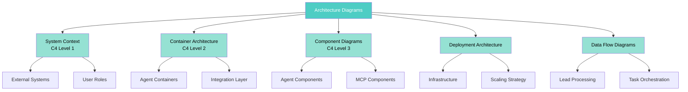

[🏠 Home](../../../README.md) | [📚 Documentation](../../index.md) | [🏗️ Architecture Hub](../README.md)

---

# Architecture Diagrams

**Purpose:** Comprehensive visual documentation of the AI Sales Agent Swarm system architecture

## 📑 Quick Navigation

### 📖 Essential Reading (Start Here)
1. [System Context Diagram](./system-context.md) - High-level system overview (C4 Level 1)
2. [Container Architecture](./container-architecture.md) - Major components and containers (C4 Level 2)
3. [Data Flow Diagrams](./data-flow.md) - How data moves through the system

### 🔧 Detailed Architecture
- [Component Diagrams](./component-diagrams.md) - Internal component structure (C4 Level 3)
- [Deployment Architecture](./deployment-architecture.md) - Infrastructure and deployment topology

### 🎯 By Topic
- **System Design:** [System Context](./system-context.md), [Container Architecture](./container-architecture.md)
- **Components:** [Component Diagrams](./component-diagrams.md)
- **Infrastructure:** [Deployment Architecture](./deployment-architecture.md)
- **Data:** [Data Flow Diagrams](./data-flow.md)

## 📊 Documentation Map



## 🔍 Find What You Need

| Looking for... | Go to... |
|---------------|----------|
| System overview | [System Context Diagram](./system-context.md) |
| Application structure | [Container Architecture](./container-architecture.md) |
| Component details | [Component Diagrams](./component-diagrams.md) |
| Infrastructure setup | [Deployment Architecture](./deployment-architecture.md) |
| Data movement | [Data Flow Diagrams](./data-flow.md) |
| Agent interactions | [Component Diagrams](./component-diagrams.md#component-interactions) |
| Scaling information | [Deployment Architecture](./deployment-architecture.md#scaling-strategy) |
| Error handling | [Data Flow Diagrams](./data-flow.md#error-recovery-flow) |

## 📈 Architecture Overview

### System Characteristics
- **Architecture Style:** Event-driven, Task-based orchestration
- **Communication:** Asynchronous via HubSpot tasks
- **Integration:** Model Context Protocol (MCP)
- **Deployment:** Distributed agents with centralized orchestration
- **Scalability:** Horizontal scaling through stateless agents

### Technology Stack Summary
```yaml
Languages:
  - Shell Scripting (Bash)
  - JavaScript/Node.js
  - Python
  - AppleScript

Key Technologies:
  - HubSpot CRM (Task orchestration)
  - Claude AI (Intelligence layer)
  - MCP Server (Integration layer)
  - Cron (Scheduling)
  - Puppeteer (Web automation)

Infrastructure:
  - Linux/macOS
  - File-based logging
  - Git version control
  - JSON configuration
```

### Design Principles
1. **Simplicity First** - Shell scripts over complex frameworks
2. **Native Integration** - HubSpot as the message bus
3. **Autonomous Operation** - Self-orchestrating agents
4. **Event-Driven** - Task-based triggering
5. **Stateless Design** - No persistent state outside HubSpot

## 📋 Diagram Types Included

### C4 Model Diagrams
- ✅ **Level 1 - System Context:** Shows system in its environment
- ✅ **Level 2 - Container:** Shows high-level technology choices
- ✅ **Level 3 - Component:** Shows components within containers

### Behavioral Diagrams
- ✅ **Sequence Diagrams:** Message flows between components
- ✅ **State Diagrams:** State transitions for workflows
- ✅ **Activity Diagrams:** Business process flows

### Structural Diagrams
- ✅ **Deployment Diagrams:** Infrastructure topology
- ✅ **Component Diagrams:** Internal structure
- ✅ **Data Flow Diagrams:** Information movement

## 🎨 Diagram Standards

All diagrams follow these conventions:

### Visual Consistency
- **Mermaid syntax** for GitHub native rendering
- **Color coding:**
  - 🔵 Blue: System components
  - 🟢 Teal: Agents
  - 🟠 Orange: Data stores
  - ⚫ Gray: External systems
  - 🟡 Light: Infrastructure

### Notation Standards
- **Actors:** Human users and external systems
- **Participants:** Internal system components
- **Solid lines:** Direct communication
- **Dashed lines:** Asynchronous or indirect

## 📚 Related Documentation

### Architecture Documents
- [System Architecture](../../architecture/SYSTEM_ARCHITECTURE.md) - Detailed architecture documentation
- [Technical Decisions](../../architecture/TECHNICAL_DECISIONS.md) - ADRs and design rationale
- [Component Interactions](../../architecture/COMPONENT_INTERACTIONS.md) - Detailed interaction patterns

### Implementation Guides
- [Setup Guide](../../setup/MCP_SETUP_COMPLETE.md) - Environment setup
- [Quick Start](../../QUICKSTART.md) - Getting started quickly
- [Manual Setup](../../MANUAL-SETUP-GUIDE.md) - Detailed setup instructions

### Analysis & Reports
- [AI Development Report](../../../ULTIMATE_AI_DEVELOPMENT_REPORT.md) - Project metrics and ROI
- [Analysis Results](../../../data/analysis/) - Detailed analysis data

## 🔄 Version History

| Version | Date | Changes | Author |
|---------|------|---------|--------|
| 1.0.0 | 2025-08-18 | Initial diagram creation | AI Architecture Assistant |

---

[🏗️ Architecture Hub](../README.md) | [🗺️ Navigation](../navigation.md) | [📋 Contents](../toc.md) | [➡️ Start: System Context](./system-context.md)