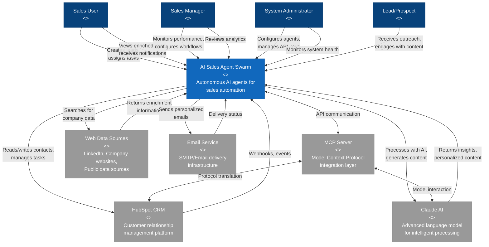
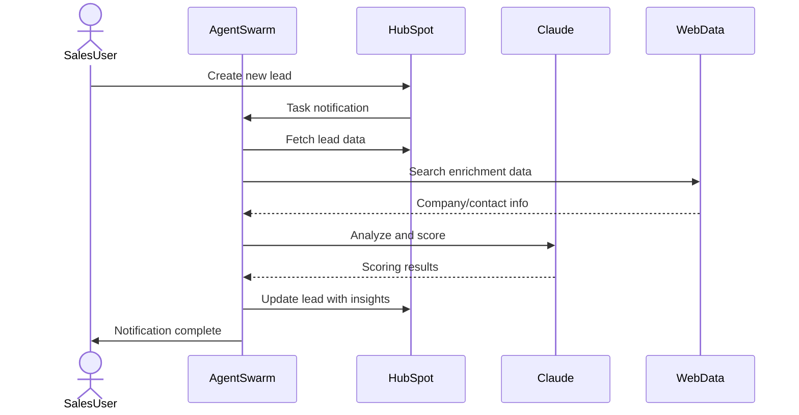
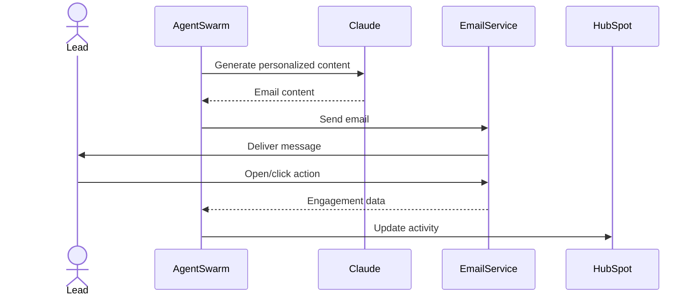
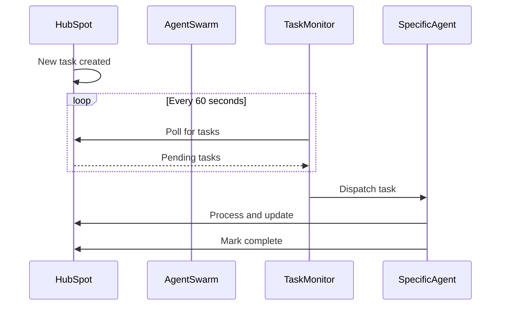

[🏠 Home](../../../README.md) | [📚 Documentation](../../index.md) | [🏗️ Architecture](../../architecture/index.md) | [📊 Diagrams](./index.md)

---

# System Context Diagram (C4 Level 1)

**Author:** AI Architecture Assistant  
**Last Updated:** 2025-08-18  
**Version:** 1.0.0

## 📑 Table of Contents
1. [Overview](#overview)
2. [System Context Diagram](#system-context-diagram)
3. [External Systems](#external-systems)
4. [User Roles](#user-roles)
5. [Key Interactions](#key-interactions)
6. [Related Documents](#related-documents)

---

## Overview

This document provides the highest-level view of the AI Sales Agent Swarm system, showing how it fits into the broader ecosystem and interacts with external users and systems.

## System Context Diagram

## External Systems

### HubSpot CRM
- **Purpose**: Central customer data repository and task management system
- **Integration**: RESTful API via MCP Server
- **Data Exchange**: Contacts, companies, tasks, emails, activities
- **Authentication**: Private App Token

### Claude AI
- **Purpose**: Intelligent text processing and content generation
- **Integration**: API via MCP Server
- **Capabilities**: Lead scoring, email personalization, data analysis
- **Model**: Claude 3 Opus

### MCP Server
- **Purpose**: Protocol abstraction and integration layer
- **Technology**: Model Context Protocol
- **Benefits**: Unified interface for multiple AI models and services

### Web Data Sources
- **Purpose**: External data enrichment
- **Sources**: LinkedIn, company websites, public databases
- **Methods**: Web scraping, API integration
- **Data Types**: Company info, contact details, social profiles

### Email Service
- **Purpose**: Outbound communication delivery
- **Protocol**: SMTP
- **Features**: Template rendering, tracking, bounce handling

## User Roles

### Sales User
- **Primary Actions**:
  - Create and import leads
  - Trigger qualification tasks
  - Review enriched data
  - Monitor outreach campaigns
- **Benefits**: Automated lead processing, enriched insights

### Sales Manager
- **Primary Actions**:
  - Configure scoring criteria
  - Set up workflow rules
  - Monitor team performance
  - Review conversion metrics
- **Benefits**: Team productivity insights, automated workflows

### System Administrator
- **Primary Actions**:
  - Configure agent parameters
  - Manage API credentials
  - Monitor system health
  - Handle integrations
- **Benefits**: Centralized management, system observability

### Lead/Prospect
- **Interactions**:
  - Receives personalized outreach
  - Engages with content
  - Responds to communications
- **Experience**: Relevant, timely, personalized engagement

## Key Interactions

### 1. Lead Processing Flow

### 2. Outreach Automation

### 3. Task Orchestration

---

## Related Documents

- [Container Architecture](./container-architecture.md) - Detailed view of system containers
- [Component Diagrams](./component-diagrams.md) - Internal component structure
- [Deployment Architecture](./deployment-architecture.md) - Infrastructure and deployment
- [Data Flow Diagrams](./data-flow.md) - Data movement and transformations

[⬆️ Back to top](#-table-of-contents)

---

[⬅️ Architecture Index](../../architecture/index.md) | [⬆️ Diagrams](./index.md) | [➡️ Container Architecture](./container-architecture.md)