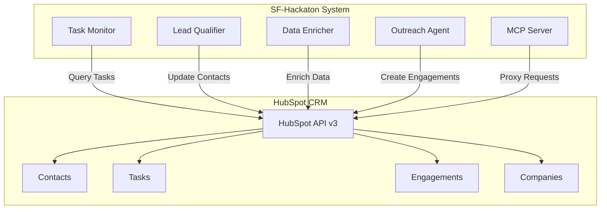
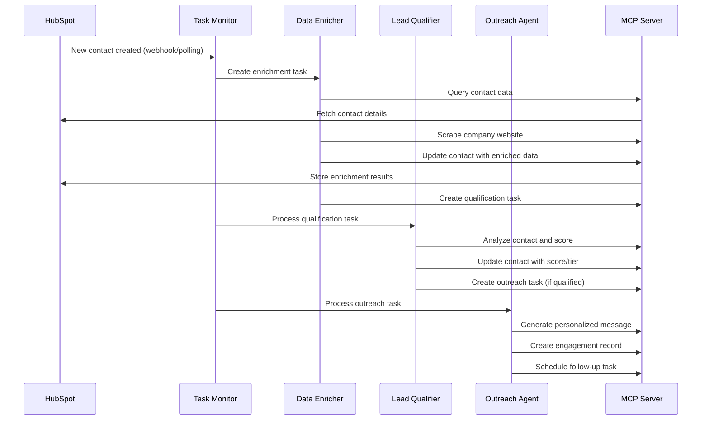

[🏠 Home](../../../README.md) | [📚 Documentation](../../index.md) | [🏗️ Generated Architecture](../index.md)

---

# Integration Points Documentation

**Author:** AI Analysis Engine  
**Generated:** 2025-08-18  
**Version:** 1.0.0  

## 📑 Table of Contents
1. [Executive Summary](#executive-summary)
2. [External System Integrations](#external-system-integrations)
3. [Internal Component Integrations](#internal-component-integrations)
4. [Data Flow Integration Patterns](#data-flow-integration-patterns)
5. [Authentication and Security Integration](#authentication-and-security-integration)
6. [Browser Automation Integration](#browser-automation-integration)
7. [Configuration and Environment Integration](#configuration-and-environment-integration)
8. [Monitoring and Logging Integration](#monitoring-and-logging-integration)
9. [Error Handling and Recovery Integration](#error-handling-and-recovery-integration)
10. [Performance and Scalability Integration](#performance-and-scalability-integration)
11. [Future Integration Roadmap](#future-integration-roadmap)
12. [Related Documents](#related-documents)

---

## Executive Summary

The SF-hackaton system implements a distributed agent architecture with multiple integration points designed for sales automation. The primary integration hub is HubSpot CRM, which serves as both the data store and message queue for agent coordination. The system emphasizes loose coupling through standardized interfaces and file-based configuration.

### Key Integration Characteristics
- **Hub-and-Spoke Architecture:** HubSpot CRM as central integration point
- **Event-Driven Coordination:** Task-based agent orchestration
- **File-Based Configuration:** JSON configuration for loose coupling
- **CLI-Based Communication:** Shell scripts with structured data exchange
- **Browser Automation:** Puppeteer for web data enrichment

---

## External System Integrations

### HubSpot CRM Integration

**Integration Type:** Primary External System  
**Role:** Data persistence, task queue, and event coordination  
**Location:** Core integration across all agent scripts

#### Connection Architecture


#### Integration Points

##### 1. Authentication Integration
```yaml
integration_point:
  name: "HubSpot Authentication"
  method: "Bearer Token (Private App)"
  location: "Environment variable HUBSPOT_ACCESS_TOKEN"
  scope: "crm.objects.contacts.read, crm.objects.contacts.write, crm.objects.tasks.read, crm.objects.tasks.write"
  
  implementation:
    - shell_scripts: "source ~/.zshrc to load token"
    - mcp_config: "Environment variable injection"
    - api_helper: "Authorization header construction"
    
  security_considerations:
    - token_storage: "Environment variable (not secure)"
    - token_rotation: "Manual process required"
    - scope_limitation: "Properly scoped to required permissions"
```

##### 2. Contact Management Integration
```yaml
integration_point:
  name: "Contact Lifecycle Management"
  operations: ["create", "read", "update", "search"]
  data_sync: "Bidirectional"
  
  read_operations:
    - endpoint: "/crm/v3/objects/contacts"
    - fields: ["email", "firstname", "lastname", "company", "jobtitle"]
    - usage: "Agent processing input"
    
  write_operations:
    - endpoint: "/crm/v3/objects/contacts/{id}"
    - fields: ["lead_score", "lead_tier", "enrichment_data"]
    - usage: "AI-generated insights"
    
  search_operations:
    - endpoint: "/crm/v3/objects/contacts/search"
    - filters: "Property-based and text search"
    - usage: "Lead discovery and matching"
```

##### 3. Task Queue Integration
```yaml
integration_point:
  name: "Task-Based Agent Coordination"
  pattern: "Producer-Consumer"
  role: "Message queue replacement"
  
  task_creation:
    - source: "HubSpot workflows, manual creation"
    - format: "Standard HubSpot task object"
    - routing: "Subject-based agent assignment"
    
  task_processing:
    - discovery: "Polling every minute via cron"
    - assignment: "Automatic based on subject patterns"
    - status_tracking: "IN_PROGRESS → COMPLETED/WAITING"
    
  task_completion:
    - updates: "Status change and completion notes"
    - follow_up: "Automatic next task creation"
    - auditing: "Complete processing history"
```

##### 4. Engagement Tracking Integration
```yaml
integration_point:
  name: "Activity and Communication Tracking"
  purpose: "Audit trail and CRM activity timeline"
  
  engagement_types:
    - NOTE: "AI processing results and enrichment data"
    - EMAIL: "Outreach message logging"
    - TASK: "Follow-up task creation"
    
  data_flow:
    - creation: "Agents create engagements for activities"
    - association: "Link to contacts, companies, deals"
    - timeline: "Chronological activity history in CRM"
```

### Web Data Integration

**Integration Type:** Data Enrichment Sources  
**Role:** External data collection for lead enrichment  
**Location:** `/agents/data_enricher.sh`, `/agents/web_enricher.sh`

#### Browser Automation Integration
```yaml
integration_point:
  name: "Puppeteer Web Automation"
  purpose: "Company and contact data enrichment"
  
  targets:
    - company_websites: "Corporate information scraping"
    - linkedin: "Professional profile verification"
    - google_search: "Company research and competitor analysis"
    
  data_extraction:
    - company_description: "About page content"
    - industry_classification: "Business sector identification"
    - team_size: "Employee count indicators"
    - technology_stack: "Website technology detection"
    - contact_information: "Additional contact details"
    
  integration_challenges:
    - rate_limiting: "Website-specific limits"
    - anti_bot_detection: "CAPTCHA and blocking"
    - data_quality: "Inconsistent website structures"
    - legal_compliance: "Terms of service adherence"
```

#### Screenshot and Visual Integration
```yaml
integration_point:
  name: "Visual Data Capture"
  purpose: "Website appearance and branding analysis"
  
  capture_strategy:
    - full_page_screenshots: "Complete website overview"
    - specific_sections: "Logo, navigation, key content"
    - mobile_responsive: "Different viewport sizes"
    
  storage_integration:
    - local_storage: "screenshots/ directory"
    - naming_convention: "{company_name}_screenshot.png"
    - hubspot_attachment: "Future feature for CRM storage"
```

---

## Internal Component Integrations

### Agent Orchestration Integration

**Integration Pattern:** Event-Driven Task Processing  
**Coordination Method:** Task-based messaging through HubSpot

#### Task Monitor as Integration Hub
```yaml
integration_point:
  name: "Task Monitor Central Orchestration"
  role: "Agent coordination and task distribution"
  location: "/agents/task_monitor.sh"
  
  discovery_integration:
    - schedule: "Cron job every minute"
    - query: "HubSpot tasks with specific criteria"
    - filtering: "Subject-based agent routing"
    
  dispatch_integration:
    - pattern: "Fork and background execution"
    - parameters: "Task ID and JSON data"
    - isolation: "Independent agent processes"
    
  monitoring_integration:
    - logging: "Central task processing log"
    - error_handling: "Failed task marking"
    - cleanup: "Lock file management"
```

#### Agent-to-Agent Communication
```yaml
integration_point:
  name: "Agent Chain Coordination"
  pattern: "Sequential workflow processing"
  
  lead_qualification_chain:
    1. data_enricher: "Enrich contact data"
    2. lead_qualifier: "Score and classify lead"
    3. outreach_agent: "Generate personalized outreach"
    
  integration_mechanism:
    - task_creation: "Agents create follow-up tasks"
    - data_passing: "HubSpot contact updates"
    - state_management: "Task status progression"
    
  coordination_rules:
    - priority_handling: "HOT leads get immediate attention"
    - error_propagation: "Failed tasks create review tasks"
    - workflow_branching: "Score-based routing decisions"
```

### Model Context Protocol (MCP) Integration

**Integration Type:** AI Service Abstraction Layer  
**Role:** Unified interface to AI capabilities and external services

#### MCP Server Architecture
```yaml
integration_point:
  name: "MCP Service Layer"
  purpose: "AI capability abstraction and standardization"
  
  server_integration:
    hubspot_mcp:
      - package: "@modelcontextprotocol/server-hubspot"
      - capabilities: ["contacts", "tasks", "emails", "workflows"]
      - authentication: "HUBSPOT_ACCESS_TOKEN passthrough"
      
    puppeteer_mcp:
      - package: "@modelcontextprotocol/server-puppeteer"
      - capabilities: ["navigation", "interaction", "scraping"]
      - browser_control: "Chrome DevTools Protocol"
      
  integration_benefits:
    - standardization: "Consistent API across different services"
    - abstraction: "Hide service complexity from agents"
    - reliability: "Built-in error handling and retries"
    - extensibility: "Easy addition of new capabilities"
```

#### Claude Engineering CLI Integration
```yaml
integration_point:
  name: "Natural Language AI Interface"
  purpose: "Human-like task processing instructions"
  
  integration_pattern:
    - input: "Natural language prompts"
    - processing: "AI interpretation and tool selection"
    - output: "Structured responses or confirmations"
    
  prompt_standardization:
    - prefix: "Using HubSpot MCP tools" or "Using Puppeteer MCP tools"
    - structure: "Step-by-step instructions"
    - format: "Explicit response format requirements"
    
  response_handling:
    - json_responses: "Structured data for further processing"
    - confirmations: "Simple 'OK' for status updates"
    - error_responses: "Descriptive error messages"
```

---

## Data Flow Integration Patterns

### Lead Processing Pipeline Integration



### Configuration Integration Flow

```yaml
integration_pattern:
  name: "Configuration-Driven Integration"
  approach: "File-based configuration with runtime loading"
  
  configuration_sources:
    - mcp_config: "MCP server and capability definitions"
    - task_templates: "Standardized task creation patterns"
    - workflow_triggers: "Event-based automation rules"
    - agent_identity: "AI user permissions and settings"
    
  integration_mechanism:
    - loading: "Runtime file reading (no hot reload)"
    - validation: "Basic JSON syntax validation"
    - distribution: "Shared configuration across agents"
    
  integration_challenges:
    - consistency: "Manual synchronization required"
    - validation: "No schema validation implemented"
    - versioning: "No configuration version control"
```

---

## Authentication and Security Integration

### Token Management Integration

```yaml
integration_point:
  name: "Centralized Token Management"
  current_state: "Environment variable based"
  security_level: "Basic"
  
  token_distribution:
    - storage: "~/.zshrc environment file"
    - loading: "source ~/.zshrc in each script"
    - scope: "System-wide availability"
    
  integration_weaknesses:
    - persistence: "Tokens stored in plain text"
    - rotation: "Manual token updates required"
    - auditing: "No token usage tracking"
    - revocation: "No automatic token invalidation"
    
  recommended_improvements:
    - secret_management: "HashiCorp Vault or AWS Secrets"
    - automatic_rotation: "OAuth refresh token flow"
    - least_privilege: "Per-agent token scoping"
```

### Permission Integration

```yaml
integration_point:
  name: "Role-Based Access Control"
  implementation: "HubSpot user permissions"
  
  ai_agent_permissions:
    contacts: ["read", "write", "delete"]
    tasks: ["read", "write", "complete"]
    emails: ["send", "read"]
    workflows: ["trigger", "read"]
    activities: ["create", "read"]
    
  integration_enforcement:
    - api_level: "HubSpot API permission validation"
    - application_level: "No additional enforcement"
    - auditing: "HubSpot activity logs"
```

---

## Browser Automation Integration

### Puppeteer Integration Architecture

```yaml
integration_point:
  name: "Browser Automation Service"
  technology: "Puppeteer + Chrome DevTools Protocol"
  
  integration_layers:
    mcp_layer:
      - server: "@modelcontextprotocol/server-puppeteer"
      - abstraction: "High-level browser operations"
      - error_handling: "Built-in retry and recovery"
      
    chrome_layer:
      - executable: "/Applications/Google Chrome.app/Contents/MacOS/Google Chrome"
      - protocol: "Chrome DevTools Protocol over WebSocket"
      - features: "Full browser automation capabilities"
      
    website_layer:
      - targets: "Company websites, LinkedIn, Google"
      - interactions: "Navigation, form filling, data extraction"
      - challenges: "Anti-bot detection, rate limiting"
```

### Web Data Extraction Integration

```yaml
integration_point:
  name: "Structured Data Extraction"
  approach: "DOM-based content extraction"
  
  extraction_strategies:
    company_analysis:
      - about_page: "Company description and mission"
      - contact_page: "Additional contact information"
      - team_page: "Employee count and key personnel"
      - technology: "Website framework and tools"
      
    linkedin_analysis:
      - profile_verification: "Job title and experience confirmation"
      - company_size: "Employee count from company page"
      - industry_classification: "LinkedIn industry tags"
      
    search_analysis:
      - competitor_research: "Industry landscape analysis"
      - news_mentions: "Recent company updates"
      - social_presence: "Social media activity"
```

---

## Configuration and Environment Integration

### Environment Configuration Integration

```yaml
integration_point:
  name: "Environment-Based Configuration"
  pattern: "Twelve-Factor App methodology (partial)"
  
  environment_variables:
    HUBSPOT_ACCESS_TOKEN:
      - purpose: "HubSpot API authentication"
      - scope: "All agents and MCP servers"
      - security: "Plain text (insecure)"
      
    PUPPETEER_EXECUTABLE_PATH:
      - purpose: "Chrome browser location"
      - scope: "Puppeteer MCP server"
      - portability: "macOS-specific path"
      
  integration_mechanism:
    - loading: "source ~/.zshrc in shell scripts"
    - distribution: "Environment inheritance"
    - validation: "Runtime existence checks"
```

### File-Based Configuration Integration

```yaml
integration_point:
  name: "JSON Configuration Management"
  approach: "Static file-based configuration"
  
  configuration_files:
    mcp_hubspot_config.json:
      - purpose: "MCP server definitions and capabilities"
      - consumers: "Claude Engineering CLI"
      - update_frequency: "Manual, infrequent"
      
    task_templates.json:
      - purpose: "Standardized task creation patterns"
      - consumers: "All agent scripts"
      - update_frequency: "When new task types added"
      
    workflow_triggers.json:
      - purpose: "Event-based automation rules"
      - consumers: "Future webhook handlers"
      - update_frequency: "When business rules change"
      
  integration_pattern:
    - access: "Direct file reading at runtime"
    - caching: "No caching implemented"
    - validation: "Basic JSON syntax only"
    - versioning: "Git-based version control"
```

---

## Monitoring and Logging Integration

### Logging Integration Architecture

```yaml
integration_point:
  name: "Distributed Logging System"
  approach: "File-based logging with standardized format"
  
  log_aggregation:
    central_logs:
      - task_monitor.log: "Central orchestration events"
      - cron.log: "Scheduled execution tracking"
      
    agent_logs:
      - lead_qualifier.log: "Lead scoring and classification"
      - outreach_agent.log: "Message generation and sending"
      - data_enricher.log: "Data collection and enrichment"
      
  log_format_integration:
    - timestamp: "YYYY-MM-DD HH:MM:SS format"
    - level: "INFO, ERROR, WARN implied by context"
    - agent: "Source agent identification"
    - task_id: "Traceability to HubSpot tasks"
    - message: "Human-readable event description"
```

### Audit Trail Integration

```yaml
integration_point:
  name: "Activity Audit Trail"
  implementation: "HubSpot engagement records + local logs"
  
  hubspot_auditing:
    - engagements: "AI activities as CRM engagements"
    - contact_updates: "Property change history"
    - task_progression: "Status change tracking"
    
  local_auditing:
    - file_logs: "Detailed processing steps"
    - error_tracking: "Failure analysis and recovery"
    - performance_metrics: "Processing time tracking"
    
  integration_gaps:
    - correlation: "Manual correlation between systems"
    - retention: "No automated log rotation"
    - alerting: "No proactive monitoring"
```

---

## Error Handling and Recovery Integration

### Error Propagation Integration

```yaml
integration_point:
  name: "Multi-Layer Error Handling"
  strategy: "Graceful degradation with human escalation"
  
  error_layers:
    api_level:
      - hubspot_errors: "Rate limiting, authentication, validation"
      - handling: "Basic retry with exponential backoff"
      - escalation: "Task status change to WAITING"
      
    agent_level:
      - processing_errors: "Data parsing, logic failures"
      - handling: "Log error and exit with failure code"
      - escalation: "Task marked for manual review"
      
    system_level:
      - infrastructure_errors: "Network, disk, permission issues"
      - handling: "Process termination and cron retry"
      - escalation: "System administrator notification"
```

### Recovery Integration Patterns

```yaml
integration_point:
  name: "Automated Recovery Mechanisms"
  implementation: "Task-based retry and human escalation"
  
  retry_strategies:
    transient_failures:
      - network_errors: "Automatic retry on next cron cycle"
      - rate_limits: "Backoff and retry with task status change"
      - timeout_errors: "Immediate retry with different approach"
      
    persistent_failures:
      - data_quality: "Mark for human review with context"
      - authentication: "Alert for token refresh"
      - configuration: "System administrator notification"
      
  recovery_coordination:
    - task_status: "WAITING status for retryable failures"
    - human_review: "HIGH priority tasks for manual intervention"
    - escalation_path: "Clear ownership and responsibility"
```

---

## Performance and Scalability Integration

### Concurrent Processing Integration

```yaml
integration_point:
  name: "Parallel Agent Execution"
  pattern: "Fork-based concurrency with background processing"
  
  concurrency_model:
    - task_monitor: "Single instance with lock file"
    - agents: "Multiple concurrent instances per agent type"
    - mcp_servers: "Shared service instances"
    
  resource_coordination:
    - hubspot_api: "Shared rate limit across all agents"
    - browser_instances: "Multiple Chrome processes"
    - file_system: "Append-only log files (safe)"
    
  scalability_constraints:
    - api_limits: "HubSpot rate limiting (100 req/10s)"
    - memory_usage: "Chrome browser memory consumption"
    - file_descriptors: "Open file handles for logs"
```

### Rate Limiting Integration

```yaml
integration_point:
  name: "API Rate Limit Management"
  current_state: "No proactive rate limiting"
  
  rate_limit_sources:
    hubspot_api:
      - burst_limit: "100 requests per 10 seconds"
      - daily_limit: "250,000 requests per day"
      - enforcement: "HTTP 429 responses"
      
    website_scraping:
      - vary_by_site: "Site-specific limits and policies"
      - detection_risk: "IP blocking for aggressive scraping"
      - compliance: "robots.txt and terms of service"
      
  integration_improvements_needed:
    - request_queuing: "Throttle requests to stay under limits"
    - backoff_strategies: "Exponential backoff on rate limit hits"
    - load_balancing: "Distribute requests across time"
```

---

## Future Integration Roadmap

### Phase 1: Reliability Improvements (Q1)

```yaml
immediate_integrations:
  webhook_support:
    - purpose: "Real-time event processing"
    - integration: "HubSpot webhook → HTTP endpoint → agent trigger"
    - benefits: "Reduced latency, better responsiveness"
    
  error_recovery:
    - purpose: "Automated failure recovery"
    - integration: "Enhanced retry logic with backoff"
    - benefits: "Improved system reliability"
    
  monitoring_dashboard:
    - purpose: "System health visibility"
    - integration: "Log aggregation → metrics → dashboard"
    - benefits: "Proactive issue detection"
```

### Phase 2: Scalability Enhancements (Q2)

```yaml
scalability_integrations:
  message_queue:
    - technology: "Redis or RabbitMQ"
    - integration: "Replace HubSpot task-based coordination"
    - benefits: "Better throughput, reliability"
    
  database_integration:
    - technology: "PostgreSQL or MongoDB"
    - integration: "Local data caching and processing"
    - benefits: "Reduced API dependency, better performance"
    
  load_balancing:
    - technology: "nginx + multiple agent instances"
    - integration: "Horizontal scaling of agent processing"
    - benefits: "Higher concurrent processing capacity"
```

### Phase 3: Advanced Features (Q3)

```yaml
advanced_integrations:
  ai_model_integration:
    - technology: "OpenAI API, Claude API"
    - integration: "Direct AI model access for better personalization"
    - benefits: "Improved message quality, advanced analysis"
    
  crm_expansion:
    - technology: "Salesforce, Pipedrive adapters"
    - integration: "Multi-CRM support with unified interface"
    - benefits: "Broader market applicability"
    
  analytics_platform:
    - technology: "Elastic Stack, Grafana"
    - integration: "Advanced analytics and reporting"
    - benefits: "Business intelligence, performance optimization"
```

---

## Related Documents

- [API Contracts](./api-contracts.md) - Detailed API specifications for integrations
- [Data Schemas](./data-schemas.md) - Data structure definitions for integration points  
- [Protocols](./protocols.md) - Communication protocol specifications
- [System Architecture](../../architecture/SYSTEM_ARCHITECTURE.md) - Overall system design
- [Component Interactions](../components/interaction-sequences.md) - Detailed interaction flows

---

[⬅️ Data Schemas](./data-schemas.md) | [⬆️ Top](#integration-points-documentation) | [➡️ Protocols](./protocols.md)