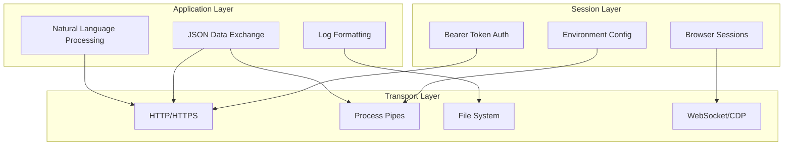
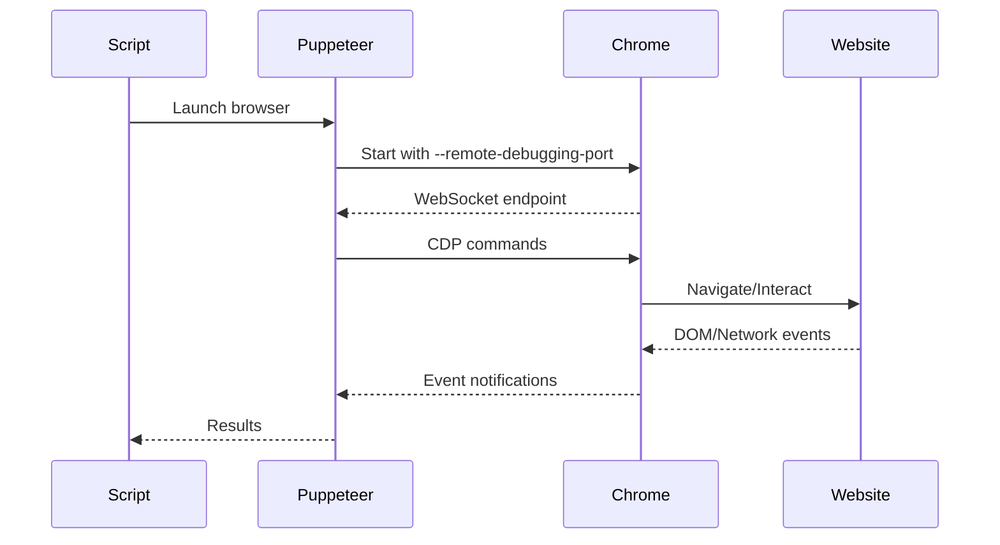
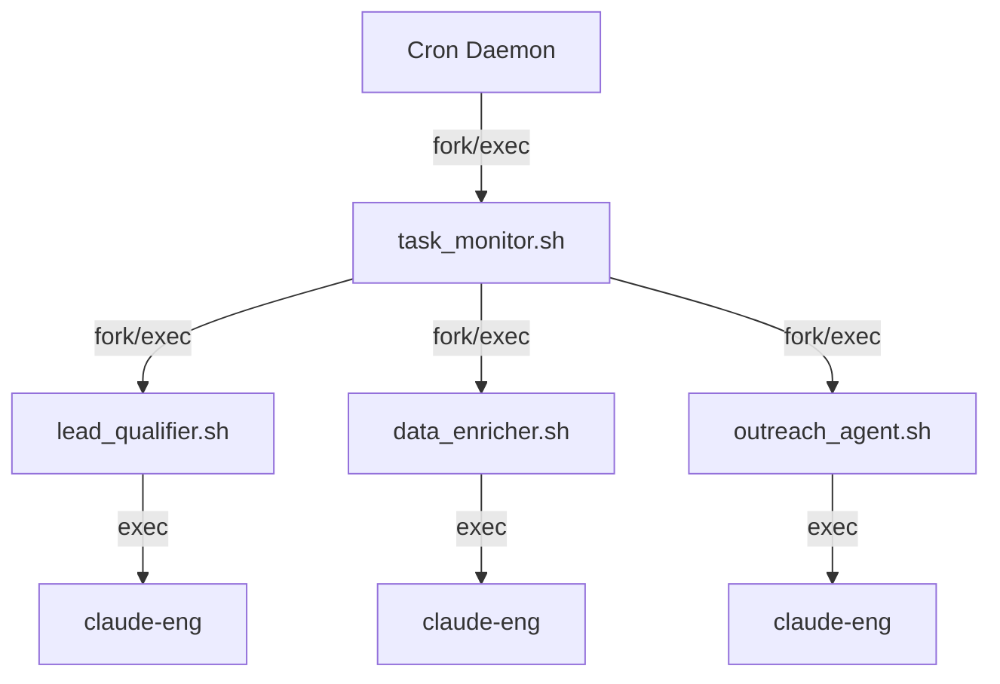

[🏠 Home](../../../README.md) | [📚 Documentation](../../index.md) | [🏗️ Generated Architecture](../index.md)

---

# Protocol Analysis Documentation

**Author:** AI Analysis Engine  
**Generated:** 2025-08-18  
**Version:** 1.0.0  

## 📑 Table of Contents
1. [Protocol Overview](#protocol-overview)
2. [REST API Protocol](#rest-api-protocol)
3. [Shell Command Protocol](#shell-command-protocol)
4. [Chrome DevTools Protocol](#chrome-devtools-protocol)
5. [File-Based Protocol](#file-based-protocol)
6. [Process Communication Protocol](#process-communication-protocol)
7. [Protocol Characteristics](#protocol-characteristics)
8. [Protocol Evolution](#protocol-evolution)
9. [Related Documents](#related-documents)

---

## Protocol Overview

The system employs a multi-protocol architecture optimized for simplicity and reliability over performance. Each protocol serves a specific purpose in the agent swarm ecosystem.

### Protocol Stack



---

## REST API Protocol

### HubSpot API v3 Protocol Specification

**Protocol Type:** RESTful HTTP  
**Transport:** HTTPS/TLS 1.2+  
**Port:** 443 (standard)  

#### Request Structure

```http
METHOD /crm/v3/objects/{objectType} HTTP/1.1
Host: api.hubapi.com
Authorization: Bearer {ACCESS_TOKEN}
Content-Type: application/json
Accept: application/json

{
  "properties": {
    "property_name": "value"
  },
  "associations": [...]
}
```

#### Response Structure

```http
HTTP/1.1 200 OK
Content-Type: application/json
X-HubSpot-Correlation-Id: {uuid}
X-HubSpot-RateLimit-Daily: 250000
X-HubSpot-RateLimit-Daily-Remaining: 249999

{
  "id": "contact_id",
  "properties": {...},
  "createdAt": "2025-01-01T00:00:00Z",
  "updatedAt": "2025-01-01T00:00:00Z"
}
```

#### Protocol Characteristics

| Aspect | Implementation |
|--------|---------------|
| Idempotency | PATCH operations are idempotent |
| Pagination | Cursor-based with `after` parameter |
| Filtering | Property-based filters in query params |
| Sorting | `sorts` parameter with field and direction |
| Rate Limiting | 100 requests/10 seconds burst |
| Error Format | Standardized JSON error responses |
| Versioning | URL path versioning (/v3/) |

#### Error Response Protocol

```json
{
  "status": "error",
  "message": "Error description",
  "correlationId": "uuid",
  "category": "VALIDATION_ERROR",
  "errors": [
    {
      "message": "Field-specific error",
      "property": "fieldName"
    }
  ]
}
```

---

## Shell Command Protocol

### Command Execution Protocol

**Protocol Type:** Unix Process Communication  
**IPC Method:** stdin/stdout/stderr pipes  
**Data Format:** Text streams with JSON payloads  

#### Command Pattern

```bash
# Pattern 1: Direct execution with JSON response
command --option value | jq '.field'

# Pattern 2: Background execution with logging
command "$ARG1" "$ARG2" >> "$LOG_FILE" 2>&1 &

# Pattern 3: Piped command chain
source_command | filter_command | processing_command
```

#### Agent Communication Protocol

```bash
# Parent → Child Communication
./agent_script.sh "$TASK_ID" "$TASK_JSON_DATA"

# Child → Parent Communication (via exit codes)
exit 0  # Success
exit 1  # Failure
exit 2  # Retry needed
```

#### Data Serialization

| Direction | Method | Format |
|-----------|--------|--------|
| Input | Command args | Positional parameters |
| Input | Environment | Variable export |
| Output | stdout | JSON or plain text |
| Errors | stderr | Log formatted text |
| Status | Exit code | Integer 0-255 |

---

## Chrome DevTools Protocol

### Puppeteer/CDP Implementation

**Protocol Type:** WebSocket-based CDP  
**Transport:** WebSocket over localhost  
**Default Port:** 9222 (configurable)  

#### Connection Flow



#### CDP Message Format

```json
{
  "id": 1,
  "method": "Page.navigate",
  "params": {
    "url": "https://example.com"
  }
}
```

#### Response Format

```json
{
  "id": 1,
  "result": {
    "frameId": "frame-id",
    "loaderId": "loader-id"
  }
}
```

#### Supported CDP Domains

| Domain | Purpose | Methods Used |
|--------|---------|--------------|
| Page | Navigation | navigate, reload |
| DOM | Element access | querySelector, getDocument |
| Input | User simulation | dispatchMouseEvent, insertText |
| Runtime | JS execution | evaluate, callFunctionOn |
| Network | Request interception | enable, setRequestInterception |

---

## File-Based Protocol

### Configuration File Protocol

**Protocol Type:** Static file reading  
**Format:** JSON  
**Encoding:** UTF-8  
**Update Method:** Manual file modification  

#### File Access Pattern

```javascript
// Read pattern
const config = JSON.parse(fs.readFileSync('config.json', 'utf8'));

// Shell read pattern
CONFIG=$(cat config.json | jq '.field')
```

#### Configuration Schema

```json
{
  "$schema": "http://json-schema.org/draft-07/schema#",
  "type": "object",
  "properties": {
    "mcp_servers": {
      "type": "object",
      "additionalProperties": {
        "type": "object",
        "properties": {
          "command": {"type": "string"},
          "args": {"type": "array"},
          "env": {"type": "object"}
        }
      }
    }
  }
}
```

### Log File Protocol

**Protocol Type:** Append-only text  
**Format:** Plain text with timestamps  
**Rotation:** None (manual required)  

#### Log Entry Format

```
YYYY-MM-DD HH:MM:SS: [LEVEL] Component: Message
```

Example:
```
2025-12-07 10:30:45: [INFO] TaskMonitor: Processing task 12345
2025-12-07 10:30:46: [ERROR] LeadQualifier: Failed to fetch contact
```

---

## Process Communication Protocol

### Inter-Process Communication

**Protocol Type:** Unix IPC  
**Methods:** Pipes, signals, exit codes  

#### Process Hierarchy



#### Signal Handling

| Signal | Action | Usage |
|--------|--------|-------|
| SIGTERM | Graceful shutdown | Stop processing |
| SIGKILL | Force termination | Emergency stop |
| SIGCHLD | Child exit | Process cleanup |
| SIGUSR1 | Custom | Reload config |

#### Exit Code Protocol

| Code | Meaning | Action |
|------|---------|--------|
| 0 | Success | Continue |
| 1 | General error | Log and skip |
| 2 | Configuration error | Alert admin |
| 3 | Network error | Retry later |
| 4 | Auth error | Refresh token |
| 5+ | Custom errors | Agent-specific |

---

## Protocol Characteristics

### Comparison Matrix

| Protocol | Latency | Throughput | Reliability | Complexity |
|----------|---------|------------|-------------|------------|
| REST API | Medium (100-500ms) | Medium | High | Low |
| Shell Command | Low (1-10ms) | Low | Medium | Low |
| CDP/WebSocket | Low (10-50ms) | High | Medium | High |
| File I/O | Very Low (<1ms) | High | High | Very Low |
| Process IPC | Very Low (<1ms) | Medium | High | Medium |

### Protocol Selection Criteria

| Use Case | Recommended Protocol | Reasoning |
|----------|---------------------|-----------|
| CRM Operations | REST API | Native integration |
| Agent Orchestration | Shell/Process | Simple, reliable |
| Browser Automation | CDP | Required for DOM access |
| Configuration | File-based | Static, versioned |
| Logging | File append | Simple, persistent |
| Real-time Events | Not implemented | Would need WebSocket |

---

## Protocol Evolution

### Current State (v1.x)
- Synchronous REST API calls
- Polling-based task monitoring
- File-based configuration
- Manual credential management

### Proposed Evolution (v2.x)
```yaml
improvements:
  - name: Webhook Support
    protocol: HTTP POST callbacks
    benefit: Real-time event handling
    
  - name: Message Queue
    protocol: AMQP or Kafka
    benefit: Reliable async processing
    
  - name: gRPC Services
    protocol: HTTP/2 + Protobuf
    benefit: Efficient service communication
    
  - name: WebSocket Events
    protocol: WSS
    benefit: Real-time UI updates
```

### Migration Path

1. **Phase 1:** Add webhook endpoints for HubSpot events
2. **Phase 2:** Implement message queue for agent communication
3. **Phase 3:** Convert heavy REST calls to gRPC
4. **Phase 4:** Add WebSocket for real-time monitoring

---

## Related Documents

- [Communication Interfaces](./communication-interfaces.md) - Interface specifications
- [Integration Points](./integration-points.md) - External integrations
- [Technical Decisions](../../architecture/TECHNICAL_DECISIONS.md) - Architecture rationale

---

[⬅️ Communication Interfaces](./communication-interfaces.md) | [⬆️ Top](#protocol-analysis-documentation) | [➡️ Integration Points](./integration-points.md)