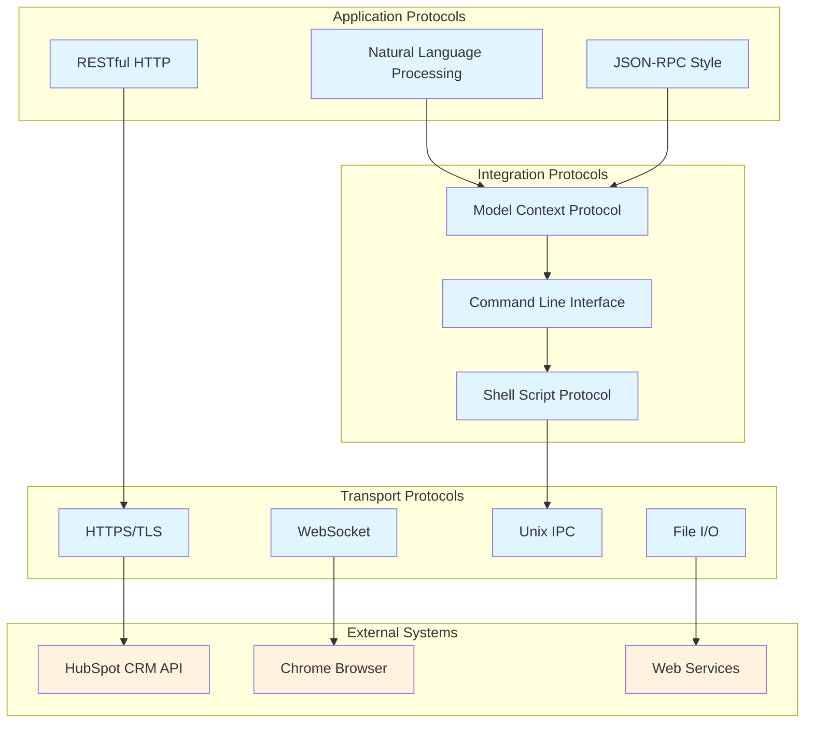
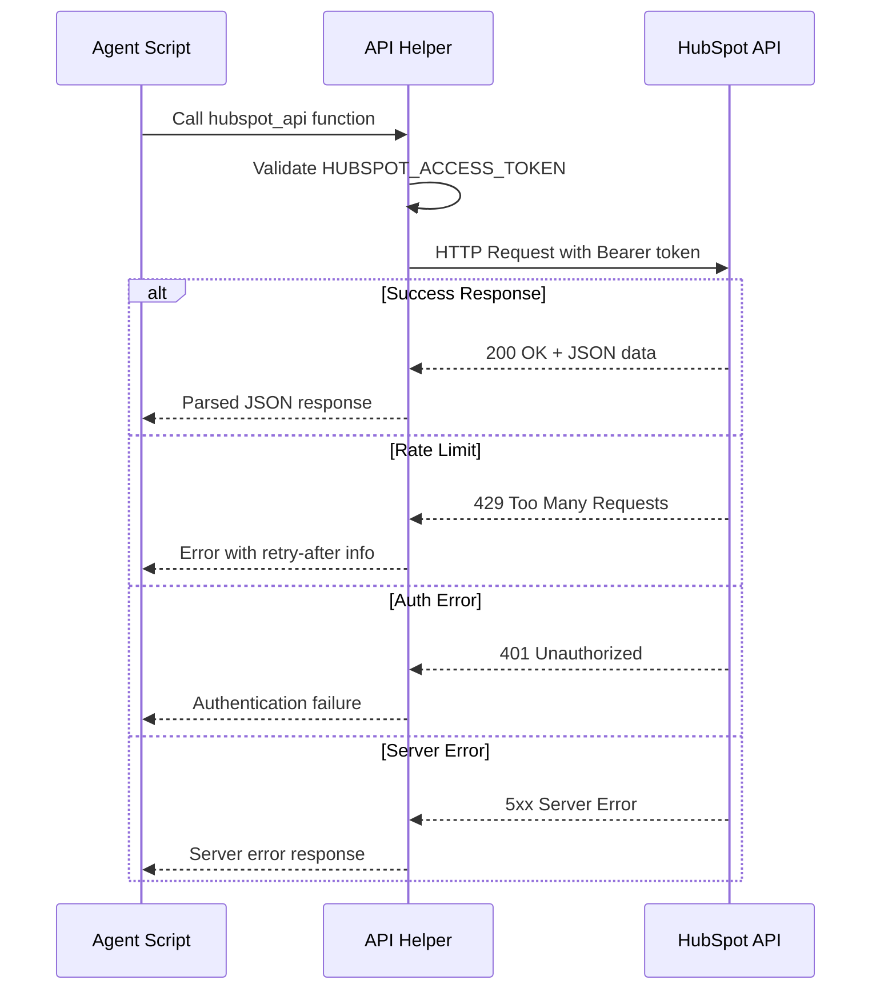
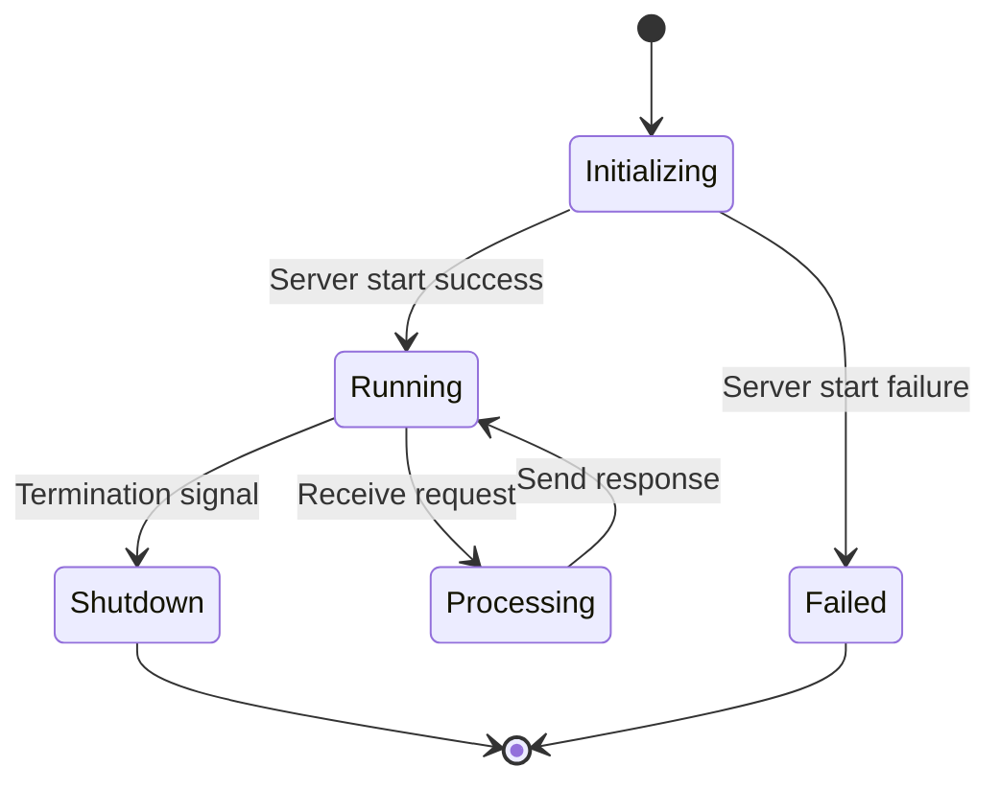
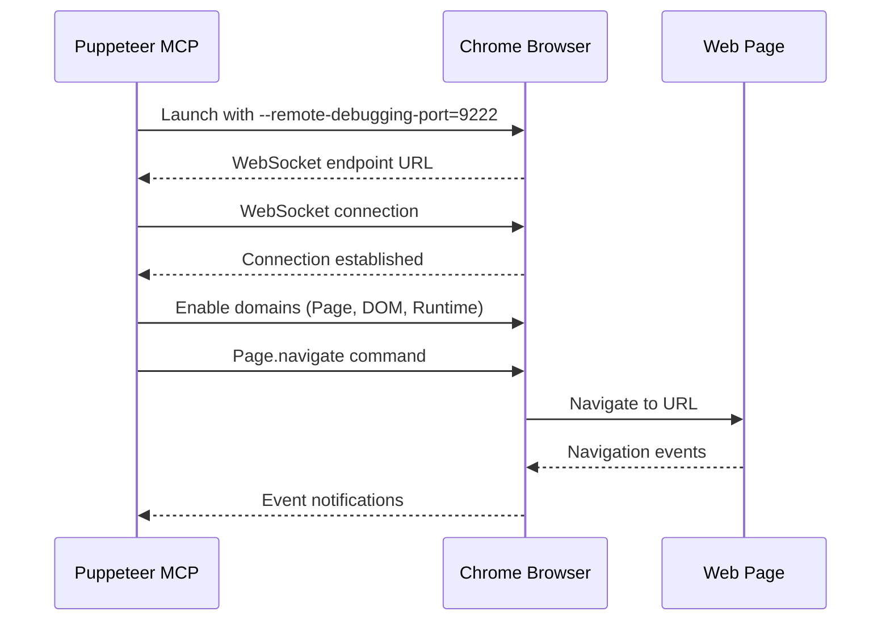
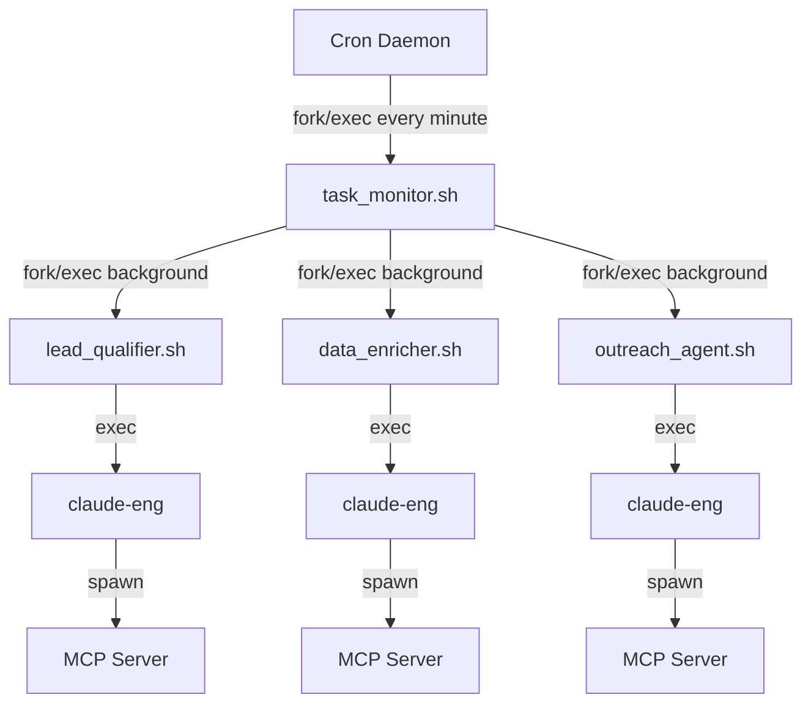
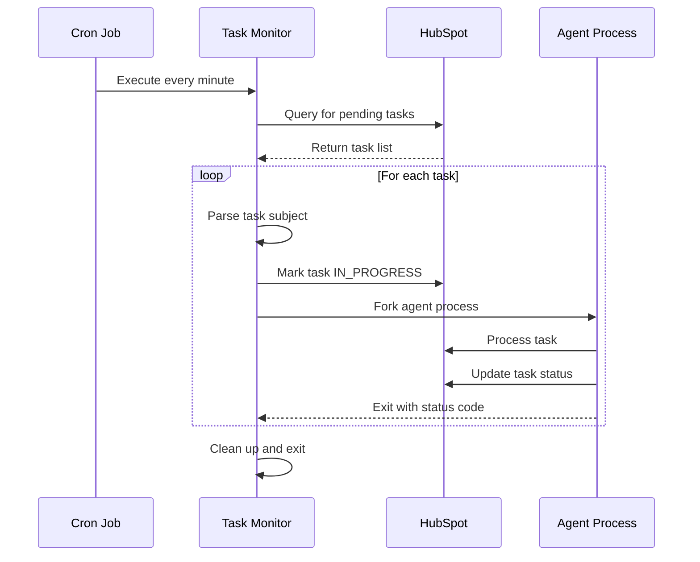

[🏠 Home](../../../README.md) | [📚 Documentation](../../index.md) | [🏗️ Generated Architecture](../index.md)

---

# Communication Protocols Documentation

**Author:** AI Analysis Engine  
**Generated:** 2025-08-18  
**Version:** 1.0.0  

## 📑 Table of Contents
1. [Executive Summary](#executive-summary)
2. [Protocol Architecture Overview](#protocol-architecture-overview)
3. [HTTP/REST Protocol Implementation](#httprest-protocol-implementation)
4. [Model Context Protocol (MCP) Specification](#model-context-protocol-mcp-specification)
5. [Shell Command Protocol](#shell-command-protocol)
6. [Chrome DevTools Protocol Integration](#chrome-devtools-protocol-integration)
7. [File-Based Protocol Patterns](#file-based-protocol-patterns)
8. [Inter-Process Communication Protocols](#inter-process-communication-protocols)
9. [Event-Driven Protocol Patterns](#event-driven-protocol-patterns)
10. [Protocol Security and Authentication](#protocol-security-and-authentication)
11. [Protocol Performance Characteristics](#protocol-performance-characteristics)
12. [Protocol Evolution Strategy](#protocol-evolution-strategy)
13. [Related Documents](#related-documents)

---

## Executive Summary

The SF-hackaton system employs a multi-protocol architecture optimized for simplicity, reliability, and maintainability. The protocol stack spans from low-level HTTP/REST communications with HubSpot to high-level natural language interfaces with AI systems. Each protocol layer serves specific purposes while maintaining loose coupling and clear separation of concerns.

### Protocol Stack Summary
- **Application Layer:** Natural language AI processing, JSON data exchange
- **Integration Layer:** Model Context Protocol (MCP) for service abstraction
- **Transport Layer:** HTTP/HTTPS, WebSocket (CDP), Unix IPC
- **Security Layer:** Bearer token authentication, TLS encryption
- **Physical Layer:** File system, network interfaces, process pipes

---

## Protocol Architecture Overview

### Multi-Protocol Communication Model



### Protocol Interaction Matrix

| Source | Target | Protocol | Pattern | Data Format | Security |
|--------|--------|----------|---------|-------------|----------|
| Agents | HubSpot API | HTTP/REST | Request-Response | JSON | Bearer Token |
| Agents | Claude CLI | Shell Exec | Command-Response | Text/JSON | None |
| Claude CLI | MCP Server | IPC | RPC-style | JSON | None |
| MCP Server | HubSpot API | HTTP/REST | Request-Response | JSON | Bearer Token |
| Puppeteer | Chrome | WebSocket/CDP | Event-Driven | JSON | None |
| Task Monitor | Agents | Process Fork | Fire-and-Forget | Args | None |
| Components | Config Files | File I/O | Read-Only | JSON | File Permissions |
| Cron | Task Monitor | Process Exec | Scheduled | None | None |

---

## HTTP/REST Protocol Implementation

### HubSpot API v3 Protocol

**Transport:** HTTPS/TLS 1.2+  
**Port:** 443 (standard HTTPS)  
**Base URL:** `https://api.hubapi.com`

#### Protocol Headers
```http
# Standard Request Headers
Authorization: Bearer {HUBSPOT_ACCESS_TOKEN}
Content-Type: application/json
Accept: application/json
User-Agent: SF-Hackaton/1.8.0

# Standard Response Headers
Content-Type: application/json
X-HubSpot-Correlation-Id: {uuid}
X-HubSpot-RateLimit-Daily: 250000
X-HubSpot-RateLimit-Daily-Remaining: 249999
X-HubSpot-RateLimit-Secondly: 100
X-HubSpot-RateLimit-Secondly-Remaining: 99
```

#### Request/Response Protocol Flow



#### REST Resource Protocols

##### Contact Resource Protocol
```yaml
resource: /crm/v3/objects/contacts
methods: [GET, POST, PATCH, DELETE]

GET_protocol:
  query_parameters:
    - limit: "1-100 (default: 10)"
    - after: "pagination cursor"
    - properties: "comma-separated field list"
    - archived: "boolean (default: false)"
  
  response_structure:
    - results: "array of contact objects"
    - paging: "pagination metadata"
    - total: "total count (if available)"

POST_protocol:
  request_body:
    - properties: "required contact fields"
    - associations: "optional related objects"
  
  response_structure:
    - id: "generated contact ID"
    - properties: "created contact data"
    - createdAt: "timestamp"

PATCH_protocol:
  path_parameter: "/{contactId}"
  request_body:
    - properties: "fields to update"
  
  response_structure:
    - id: "contact ID"
    - properties: "updated contact data"
    - updatedAt: "timestamp"
```

##### Task Resource Protocol
```yaml
resource: /crm/v3/objects/tasks
methods: [GET, POST, PATCH]

search_protocol:
  endpoint: "/crm/v3/objects/tasks/search"
  request_body:
    filterGroups:
      - filters:
          - propertyName: "hs_task_status"
            operator: "EQ"
            value: "NOT_STARTED"
    sorts:
      - propertyName: "createdate"
        direction: "DESCENDING"
    limit: 100
    
  response_structure:
    - results: "matching task objects"
    - total: "total match count"
    - paging: "pagination if needed"
```

#### Error Handling Protocol

```yaml
error_protocol:
  status_codes:
    400: "Bad Request - validation error"
    401: "Unauthorized - invalid/expired token"
    403: "Forbidden - insufficient permissions"
    404: "Not Found - resource doesn't exist"
    409: "Conflict - duplicate or constraint violation"
    429: "Too Many Requests - rate limit exceeded"
    500: "Internal Server Error"
    503: "Service Unavailable - temporary outage"
    
  error_response_format:
    status: "error"
    message: "human-readable description"
    correlationId: "uuid for tracking"
    category: "error classification"
    errors: "array of field-specific errors"
    
  retry_protocol:
    429_handling: "exponential backoff with jitter"
    5xx_handling: "immediate retry up to 3 attempts"
    network_errors: "linear backoff with timeout"
```

---

## Model Context Protocol (MCP) Specification

### MCP Architecture Protocol

**Protocol Type:** JSON-RPC inspired service protocol  
**Transport:** Node.js process communication  
**Data Format:** JSON messages

#### MCP Server Lifecycle Protocol



#### MCP Request/Response Protocol

```json
{
  "protocol_specification": {
    "request_format": {
      "method": "string - tool/capability name",
      "params": "object - method-specific parameters", 
      "id": "string - request identifier (optional)"
    },
    "response_format": {
      "result": "any - success response data",
      "error": {
        "code": "number - error code",
        "message": "string - error description",
        "data": "any - additional error context"
      }
    }
  }
}
```

#### HubSpot MCP Tool Protocol

**Server:** `@modelcontextprotocol/server-hubspot`  
**Capabilities:** contacts, tasks, emails, workflows

```yaml
tool_protocols:
  hubspot-list-objects:
    parameters:
      - objectType: "contacts|tasks|companies|deals"
      - limit: "number (1-100)"
      - properties: "array of property names"
      - archived: "boolean"
    
    response:
      - results: "array of HubSpot objects"
      - paging: "pagination metadata"
    
    protocol_notes:
      - rate_limiting: "Inherits HubSpot API limits"
      - authentication: "Uses HUBSPOT_ACCESS_TOKEN"
      - error_handling: "Wraps HubSpot API errors"
  
  hubspot-search-objects:
    parameters:
      - objectType: "string"
      - filterGroups: "array of filter specifications"
      - query: "string for text search"
      - sorts: "array of sort specifications"
      - limit: "number"
    
    response:
      - results: "filtered object array"
      - total: "match count"
    
    protocol_features:
      - complex_filtering: "Boolean logic with AND/OR"
      - text_search: "Cross-property text matching"
      - sorting: "Multiple field sorting"
  
  hubspot-batch-update-objects:
    parameters:
      - objectType: "string"
      - inputs: "array of update specifications"
    
    response:
      - results: "updated object array"
      - errors: "array of failed updates"
    
    protocol_constraints:
      - batch_size: "Maximum 100 objects per request"
      - atomicity: "No transaction support"
      - ordering: "No guaranteed update order"
  
  hubspot-create-engagement:
    parameters:
      - type: "NOTE|TASK|EMAIL"
      - ownerId: "number"
      - associations: "object with related IDs"
      - metadata: "type-specific engagement data"
    
    response:
      - engagement: "created engagement object"
    
    protocol_usage:
      - activity_logging: "Track AI agent activities"
      - crm_timeline: "Maintain audit trail"
      - user_visibility: "Show AI actions in CRM"
```

#### Puppeteer MCP Tool Protocol

**Server:** `@modelcontextprotocol/server-puppeteer`  
**Capabilities:** Browser control, web scraping

```yaml
tool_protocols:
  mcp__puppeteer__puppeteer_navigate:
    parameters:
      - url: "string - target URL"
      - launchOptions: "object - Chrome launch options"
      - allowDangerous: "boolean - security override"
    
    response:
      - success: "boolean"
      - error: "string if failed"
    
    protocol_behavior:
      - new_context: "Creates new browser context"
      - security: "Restricted by allowDangerous flag"
      - timeout: "Default 30 seconds"
  
  mcp__puppeteer__puppeteer_evaluate:
    parameters:
      - script: "string - JavaScript to execute"
    
    response:
      - result: "any - script return value"
    
    protocol_capabilities:
      - dom_access: "Full DOM manipulation"
      - return_serialization: "JSON-serializable results only"
      - execution_context: "Page context execution"
  
  mcp__puppeteer__puppeteer_fill:
    parameters:
      - selector: "string - CSS selector"
      - value: "string - input value"
    
    response:
      - success: "boolean"
    
    protocol_features:
      - element_waiting: "Waits for element availability"
      - form_interaction: "Handles various input types"
      - error_recovery: "Retry on element not found"
  
  mcp__puppeteer__puppeteer_screenshot:
    parameters:
      - name: "string - screenshot identifier"
      - selector: "string - element selector (optional)"
      - width: "number - viewport width"
      - height: "number - viewport height"
    
    response:
      - path: "string - saved screenshot path"
      - encoded: "string - base64 data (if requested)"
    
    protocol_options:
      - full_page: "Capture entire page vs viewport"
      - element_specific: "Screenshot specific elements"
      - format_support: "PNG, JPEG formats"
```

---

## Shell Command Protocol

### Command Execution Protocol

**Transport:** Unix process pipes (stdin/stdout/stderr)  
**Data Passing:** Command-line arguments and environment variables  
**Concurrency:** Fork-based parallel execution

#### Agent Invocation Protocol

```bash
# Protocol pattern
./agent_script.sh "$TASK_ID" "$TASK_DATA"

# Parameter protocol
$1: Task ID (string) - HubSpot task identifier
$2: Task Data (JSON string) - Complete task object

# Environment protocol
source ~/.zshrc  # Load environment variables
HUBSPOT_ACCESS_TOKEN: Authentication token
SCRIPT_DIR: Agent script directory
LOG_FILE: Agent-specific log file path
```

#### Exit Code Protocol

```yaml
exit_code_protocol:
  success_codes:
    0: "Complete success - task finished successfully"
  
  error_codes:
    1: "General error - task failed, needs manual review"
    2: "Configuration error - setup/config problem"
    3: "Network error - API or connectivity issue"
    4: "Authentication error - token invalid/expired"
    5: "Data error - invalid/missing data"
    6: "Resource error - rate limit/quota exceeded"
    
  protocol_handling:
    parent_script: "Check exit code and log appropriately"
    task_status: "Update HubSpot task based on exit code"
    retry_logic: "Certain codes trigger automatic retry"
```

#### Command Pipeline Protocol

```bash
# Pattern 1: Direct command execution
command_with_args | jq '.field' | processing_script

# Pattern 2: Background execution with logging  
command "$ARG1" "$ARG2" >> "$LOG_FILE" 2>&1 &

# Pattern 3: Conditional execution chain
command1 && command2 || error_handler

# Pattern 4: Process substitution
while read -r line; do process_line "$line"; done < <(data_source)
```

#### Claude Engineering CLI Protocol

```yaml
cli_protocol:
  command_format: "~/claude-eng --mcp-config <path> --print '<prompt>'"
  
  parameter_protocol:
    mcp_config: "Path to MCP configuration JSON"
    print: "Natural language instruction"
    mcp: "Direct MCP server selection (alternative)"
    
  input_protocol:
    prompt_structure:
      - prefix: "Using [MCP_SERVER] MCP tools"
      - instructions: "Step-by-step numbered instructions" 
      - format_spec: "Response format requirements"
      - constraints: "Data validation rules"
    
    prompt_examples:
      - "Using HubSpot MCP tools, search for tasks..."
      - "Using Puppeteer MCP tools, navigate to..."
      - "Return as JSON object with fields..."
      - "Only return JSON, no other text."
  
  output_protocol:
    success_responses:
      - structured_data: "JSON objects when requested"
      - confirmations: "OK, COMPLETED, SUCCESS"
      - text_responses: "Human-readable descriptions"
    
    error_responses:
      - error_description: "Plain text error explanation"
      - context_data: "Additional debugging information"
      - recovery_suggestions: "How to resolve the issue"
```

---

## Chrome DevTools Protocol Integration

### CDP Protocol Implementation

**Transport:** WebSocket over localhost  
**Port:** 9222 (default, configurable)  
**Protocol Version:** Chrome DevTools Protocol v1.3

#### Connection Establishment Protocol



#### CDP Message Protocol

```json
{
  "cdp_message_format": {
    "command": {
      "id": "number - unique request ID",
      "method": "string - domain.method format",
      "params": "object - method-specific parameters"
    },
    "response": {
      "id": "number - matching request ID", 
      "result": "object - success response data",
      "error": {
        "code": "number - error code",
        "message": "string - error description"
      }
    },
    "event": {
      "method": "string - event type",
      "params": "object - event data"
    }
  }
}
```

#### Domain-Specific Protocols

##### Page Domain Protocol
```yaml
page_domain:
  methods:
    Page.navigate:
      params:
        - url: "string - target URL"
        - referrer: "string - optional referrer"
        - transitionType: "string - navigation type"
      
      response:
        - frameId: "string - frame identifier"
        - loaderId: "string - loader identifier"
      
      events:
        - Page.frameNavigated: "Navigation completion"
        - Page.loadEventFired: "Page load finished"
    
    Page.reload:
      params:
        - ignoreCache: "boolean - bypass cache"
        - scriptToEvaluateOnLoad: "string - auto-execute script"
      
      response:
        - success: "boolean"
```

##### DOM Domain Protocol  
```yaml
dom_domain:
  methods:
    DOM.getDocument:
      params: {}
      response:
        - root: "object - document node"
    
    DOM.querySelector:
      params:
        - nodeId: "number - parent node ID"
        - selector: "string - CSS selector"
      
      response:
        - nodeId: "number - found element ID"
    
    DOM.getOuterHTML:
      params:
        - nodeId: "number - element ID"
      
      response:
        - outerHTML: "string - element HTML"
```

##### Runtime Domain Protocol
```yaml
runtime_domain:
  methods:
    Runtime.evaluate:
      params:
        - expression: "string - JavaScript code"
        - returnByValue: "boolean - serialize result"
        - awaitPromise: "boolean - wait for promises"
      
      response:
        - result: "object - execution result"
        - exceptionDetails: "object - if error occurred"
    
    Runtime.callFunctionOn:
      params:
        - functionDeclaration: "string - function code"
        - objectId: "string - target object"
        - arguments: "array - function arguments"
      
      response:
        - result: "object - function return value"
```

---

## File-Based Protocol Patterns

### Configuration File Protocol

**Format:** JSON  
**Encoding:** UTF-8  
**Access Pattern:** Read-only at runtime

#### File Access Protocol

```yaml
file_protocol:
  read_pattern:
    - validation: "JSON syntax validation on load"
    - caching: "No caching - read on each access"
    - error_handling: "Graceful fallback to defaults"
    - locking: "No file locking implemented"
  
  file_locations:
    - config/: "Application configuration files"
    - logs/: "Runtime log files (append-only)"
    - data/: "Static reference data"
  
  update_protocol:
    - method: "Manual file editing"
    - validation: "No automatic validation"
    - propagation: "Requires application restart"
    - versioning: "Git-based change tracking"
```

#### JSON Schema Protocol

```json
{
  "file_schema_protocol": {
    "structure_validation": {
      "required_fields": "Defined per file type",
      "optional_fields": "Graceful handling of missing fields",
      "type_validation": "Basic type checking only",
      "constraint_validation": "No advanced constraints"
    },
    "error_handling": {
      "syntax_errors": "Application startup failure",
      "missing_files": "Use built-in defaults",
      "permission_errors": "Runtime error with clear message"
    }
  }
}
```

### Log File Protocol

**Format:** Plain text with structured timestamps  
**Access Pattern:** Append-only writes  
**Rotation:** Manual (no automatic rotation)

#### Log Entry Protocol

```bash
# Standard log entry format
echo "$(date): [LEVEL] Component: Message" >> "$LOG_FILE"

# Protocol examples
echo "$(date): Starting task monitor scan..." >> "$LOG_FILE"
echo "$(date): Processing task 12345: Qualify Lead" >> "$LOG_FILE"
echo "$(date): ERROR: Failed to connect to HubSpot API" >> "$LOG_FILE"
echo "$(date): SUCCESS: Task completed successfully" >> "$LOG_FILE"
```

#### Log Management Protocol

```yaml
log_protocol:
  file_naming:
    - pattern: "{component}.log"
    - examples: ["task_monitor.log", "lead_qualifier.log"]
    - location: "logs/ directory"
  
  write_protocol:
    - method: "Append redirection (>>)"
    - concurrency: "Multiple processes may write simultaneously"
    - buffering: "OS-level buffering"
    - flushing: "Automatic on process termination"
  
  rotation_protocol:
    - automatic: "None implemented"
    - manual: "System administrator responsibility"
    - retention: "No automatic cleanup"
    - compression: "Not implemented"
```

---

## Inter-Process Communication Protocols

### Process Hierarchy Protocol

**Model:** Fork-based process spawning  
**Communication:** Command-line arguments and exit codes  
**Coordination:** File-based locking

#### Process Lifecycle Protocol



#### Process Coordination Protocol

```yaml
coordination_protocol:
  lock_file_protocol:
    - file: "/tmp/task_monitor.lock"
    - content: "Process PID"
    - cleanup: "Trap signal handler"
    - timeout: "Check if PID still running"
  
  process_communication:
    - parent_to_child: "Command-line arguments"
    - child_to_parent: "Exit codes"
    - sibling_communication: "Through HubSpot CRM"
    - error_propagation: "Log files and task status"
  
  resource_sharing:
    - hubspot_api: "Shared rate limits"
    - log_files: "Concurrent append access"
    - configuration: "Read-only shared access"
```

#### Signal Handling Protocol

```bash
# Signal handler protocol
trap "rm -f $LOCK_FILE" EXIT
trap "echo 'Interrupted' >> $LOG_FILE; exit 1" INT TERM

# Process monitoring protocol
if [ -f "$LOCK_FILE" ]; then
    pid=$(cat "$LOCK_FILE")
    if ps -p $pid > /dev/null 2>&1; then
        echo "Process already running (PID: $pid)"
        exit 0
    fi
fi
```

---

## Event-Driven Protocol Patterns

### Task-Based Event Protocol

**Pattern:** Polling-based event discovery  
**Frequency:** Every minute via cron  
**Coordination:** HubSpot task status changes

#### Event Discovery Protocol

```yaml
event_discovery:
  polling_mechanism:
    - schedule: "* * * * * (every minute)"
    - query: "HubSpot tasks with specific criteria"
    - filtering: "Status and subject-based filtering"
    - deduplication: "Process ID tracking"
  
  event_types:
    - new_contact: "Contact creation triggers enrichment"
    - form_submission: "Lead qualification trigger"
    - score_threshold: "Outreach opportunity trigger"
    - manual_task: "Human-created task processing"
  
  event_routing:
    - subject_parsing: "Extract agent type from subject"
    - priority_handling: "High priority tasks first"
    - load_balancing: "Round-robin agent assignment"
```

#### Event Processing Protocol



### Webhook Protocol (Future)

**Status:** Not currently implemented  
**Purpose:** Real-time event processing

```yaml
future_webhook_protocol:
  implementation:
    - endpoint: "POST /webhook/hubspot"
    - authentication: "HMAC signature validation"
    - payload: "HubSpot event object"
    - response: "HTTP 200 acknowledgment"
  
  event_types:
    - contact.creation: "New contact added"
    - contact.propertyChange: "Contact updated"
    - deal.stageChange: "Deal progression"
    - form.submission: "Form filled out"
  
  processing_flow:
    - receive: "HTTP POST from HubSpot"
    - validate: "Signature and payload validation"
    - route: "Event type to agent mapping"
    - process: "Asynchronous agent execution"
    - respond: "Success acknowledgment"
```

---

## Protocol Security and Authentication

### Authentication Protocol Stack

#### Bearer Token Protocol

```yaml
bearer_token_protocol:
  standard: "RFC 6750 - OAuth 2.0 Bearer Token Usage"
  implementation: "HubSpot Private App token"
  
  header_format:
    Authorization: "Bearer {HUBSPOT_ACCESS_TOKEN}"
  
  token_characteristics:
    - format: "pat-na-{random_string}"
    - scope: "Defined during Private App creation"
    - expiration: "No automatic expiration"
    - revocation: "Manual through HubSpot interface"
  
  security_considerations:
    - storage: "Plain text in environment variables (INSECURE)"
    - transmission: "HTTPS only (secure)"
    - logging: "Not logged in application logs (secure)"
    - rotation: "Manual process (operational risk)"
```

#### TLS/SSL Protocol

```yaml
tls_protocol:
  version: "TLS 1.2 minimum, TLS 1.3 preferred"
  cipher_suites: "Modern cipher suites (managed by OS/browser)"
  certificate_validation: "Standard CA validation"
  
  hubspot_api:
    - endpoint: "api.hubapi.com"
    - certificate: "Valid CA-signed certificate"
    - hsts: "HTTP Strict Transport Security enabled"
  
  security_characteristics:
    - man_in_middle: "Protected by TLS"
    - eavesdropping: "Encrypted in transit"
    - certificate_pinning: "Not implemented"
```

### Security Protocol Gaps

```yaml
security_gaps:
  authentication:
    - token_storage: "Plain text environment variables"
    - token_rotation: "No automatic rotation"
    - credential_exposure: "Possible in process lists"
  
  authorization:
    - principle_of_least_privilege: "Overly broad token scopes"
    - access_control: "No fine-grained permissions"
    - audit_trail: "Limited access logging"
  
  data_protection:
    - data_at_rest: "No encryption for local files"
    - data_in_memory: "No memory protection"
    - data_in_logs: "Possible PII exposure"
```

---

## Protocol Performance Characteristics

### Latency Analysis

```yaml
protocol_latency:
  hubspot_api:
    - typical_latency: "100-300ms"
    - p95_latency: "500ms"
    - timeout: "30 seconds"
    - factors: "Network, HubSpot server load, request complexity"
  
  mcp_communication:
    - typical_latency: "10-50ms"
    - p95_latency: "100ms"
    - timeout: "No explicit timeout"
    - factors: "Process spawning, JSON parsing"
  
  shell_execution:
    - typical_latency: "1-10ms"
    - p95_latency: "50ms"
    - timeout: "Varies by command"
    - factors: "Process creation, argument parsing"
  
  browser_automation:
    - typical_latency: "1-5 seconds"
    - p95_latency: "10 seconds"
    - timeout: "30 seconds"
    - factors: "Page load, DOM parsing, network requests"
```

### Throughput Characteristics

```yaml
protocol_throughput:
  hubspot_api:
    - rate_limit: "100 requests per 10 seconds"
    - daily_limit: "250,000 requests per day"
    - burst_capacity: "Limited by rate limiting"
    - bottleneck: "HubSpot imposed limits"
  
  concurrent_processing:
    - task_monitor: "Single instance with lock"
    - agents: "Multiple concurrent processes"
    - mcp_servers: "Shared service instances"
    - browser_instances: "Multiple Chrome processes"
  
  scalability_limits:
    - memory: "Chrome browser memory usage"
    - file_descriptors: "Open log files and network connections"
    - cpu: "JSON parsing and process creation"
```

### Protocol Optimization Strategies

```yaml
optimization_strategies:
  caching:
    - contact_data: "Cache frequently accessed contacts"
    - configuration: "Cache config files in memory"
    - api_responses: "Cache immutable HubSpot data"
  
  batching:
    - hubspot_updates: "Batch contact property updates"
    - task_processing: "Process multiple tasks per cycle"
    - log_writes: "Buffer log entries"
  
  connection_pooling:
    - http_connections: "Reuse HTTP connections to HubSpot"
    - browser_instances: "Reuse browser contexts"
    - mcp_servers: "Long-running server processes"
```

---

## Protocol Evolution Strategy

### Current State Assessment (v1.x)

```yaml
current_protocols:
  strengths:
    - simplicity: "Easy to understand and debug"
    - reliability: "Well-tested HTTP/REST patterns"
    - modularity: "Clear separation of concerns"
    - maintainability: "Straightforward shell script logic"
  
  weaknesses:
    - performance: "Polling-based inefficiencies"
    - scalability: "Single-threaded task processing"
    - security: "Plain text credential storage"
    - monitoring: "Limited observability"
```

### Evolution Roadmap

#### Phase 1: Reliability Improvements (Q1 2025)

```yaml
phase_1_protocols:
  webhook_integration:
    - protocol: "HTTP POST webhook endpoints"
    - benefits: "Real-time event processing"
    - implementation: "Express.js webhook server"
  
  enhanced_error_handling:
    - protocol: "Exponential backoff retry"
    - benefits: "Better resilience to transient failures"
    - implementation: "Enhanced shell script error handling"
  
  monitoring_protocol:
    - protocol: "Structured logging with correlation IDs"
    - benefits: "Better debugging and observability"
    - implementation: "JSON-structured log entries"
```

#### Phase 2: Performance Enhancements (Q2 2025)

```yaml
phase_2_protocols:
  message_queue:
    - protocol: "AMQP or Redis pub/sub"
    - benefits: "Asynchronous task processing"
    - implementation: "Replace HubSpot task polling"
  
  connection_pooling:
    - protocol: "HTTP/2 multiplexing"
    - benefits: "Reduced connection overhead"
    - implementation: "Enhanced HTTP client libraries"
  
  caching_layer:
    - protocol: "Redis or in-memory caching"
    - benefits: "Reduced API calls and latency"
    - implementation: "Cache contact and configuration data"
```

#### Phase 3: Advanced Features (Q3 2025)

```yaml
phase_3_protocols:
  grpc_services:
    - protocol: "gRPC with Protocol Buffers"
    - benefits: "Efficient service communication"
    - implementation: "Replace JSON-based MCP"
  
  streaming_protocols:
    - protocol: "WebSocket or Server-Sent Events"
    - benefits: "Real-time UI updates"
    - implementation: "Live dashboard and monitoring"
  
  security_enhancements:
    - protocol: "OAuth 2.0 with PKCE"
    - benefits: "Improved authentication security"
    - implementation: "Replace static bearer tokens"
```

### Protocol Migration Strategy

```yaml
migration_approach:
  backward_compatibility:
    - maintain_existing: "Keep current protocols during transition"
    - gradual_migration: "Component-by-component updates"
    - fallback_mechanisms: "Graceful degradation to old protocols"
  
  testing_strategy:
    - protocol_validation: "Automated protocol compliance testing"
    - performance_testing: "Load testing for new protocols"
    - integration_testing: "Cross-protocol compatibility"
  
  rollout_plan:
    - development: "Prototype new protocols in dev environment"
    - staging: "Full integration testing"
    - production: "Phased rollout with monitoring"
```

---

## Related Documents

- [API Contracts](./api-contracts.md) - Detailed API specifications for each protocol
- [Data Schemas](./data-schemas.md) - Data format specifications for protocol messages
- [Integration Points](./integration-points.md) - How protocols enable system integration
- [Communication Interfaces](./communication-interfaces.md) - Technical interface details
- [System Architecture](../../architecture/SYSTEM_ARCHITECTURE.md) - Overall system design context

---

[⬅️ Integration Points](./integration-points.md) | [⬆️ Top](#communication-protocols-documentation) | [➡️ Related Documents](#related-documents)