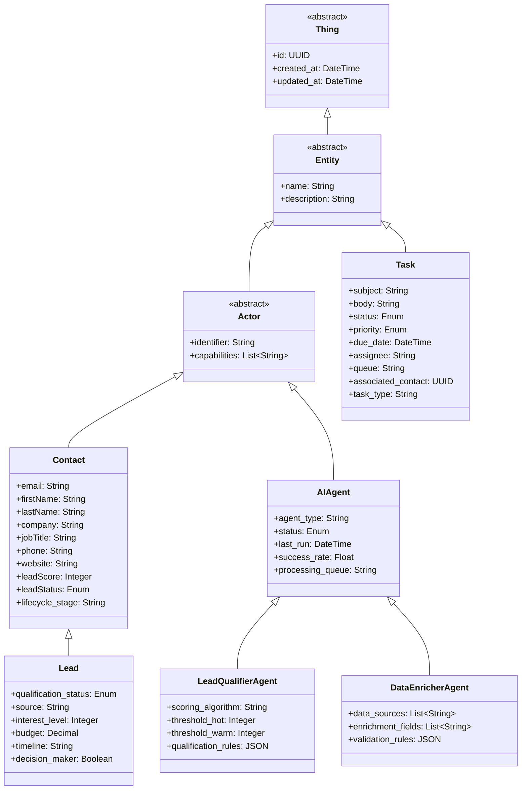
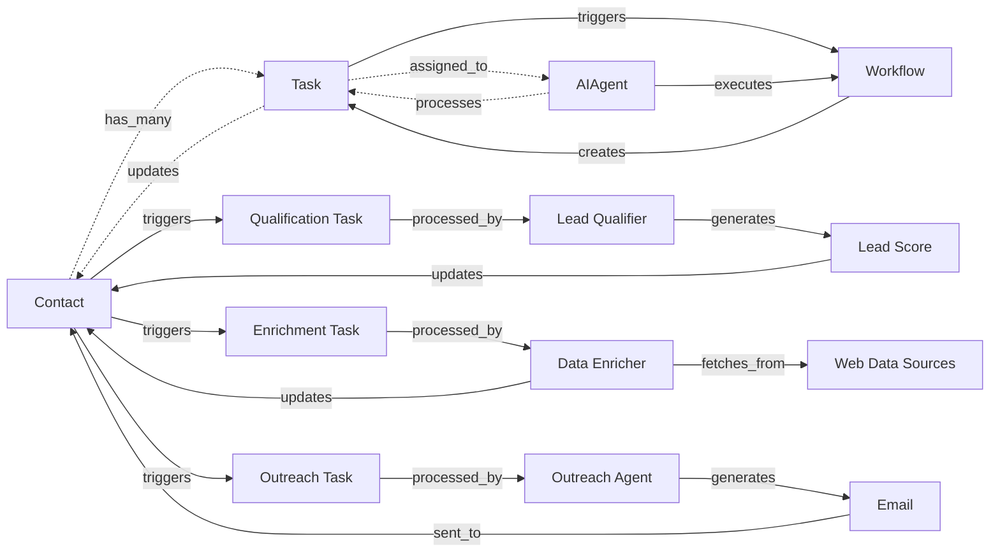
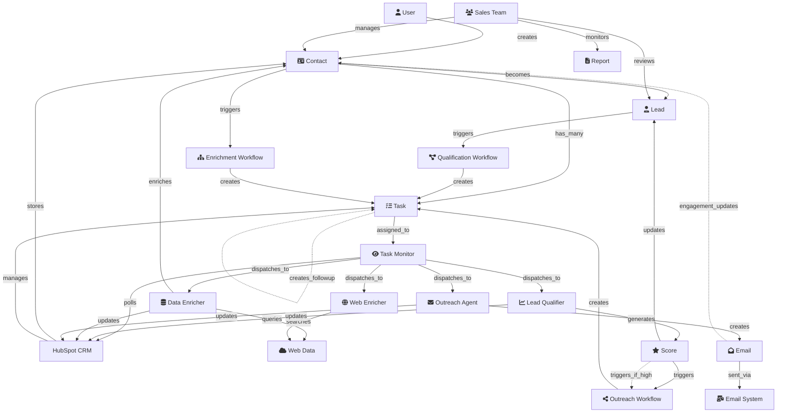
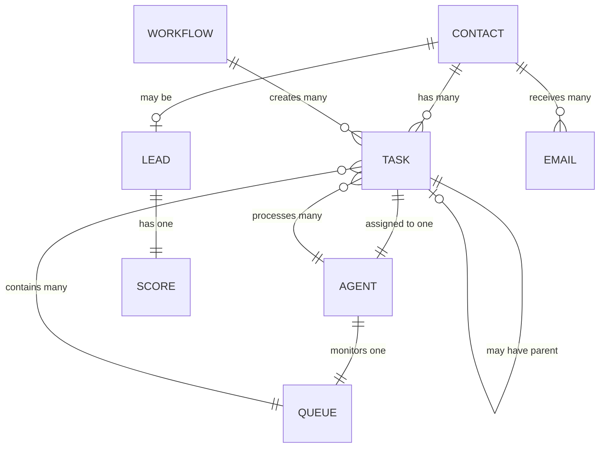
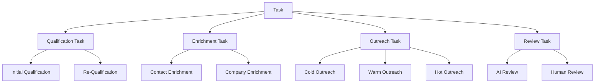
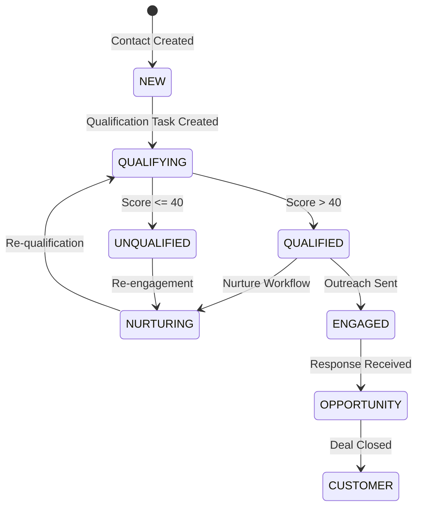
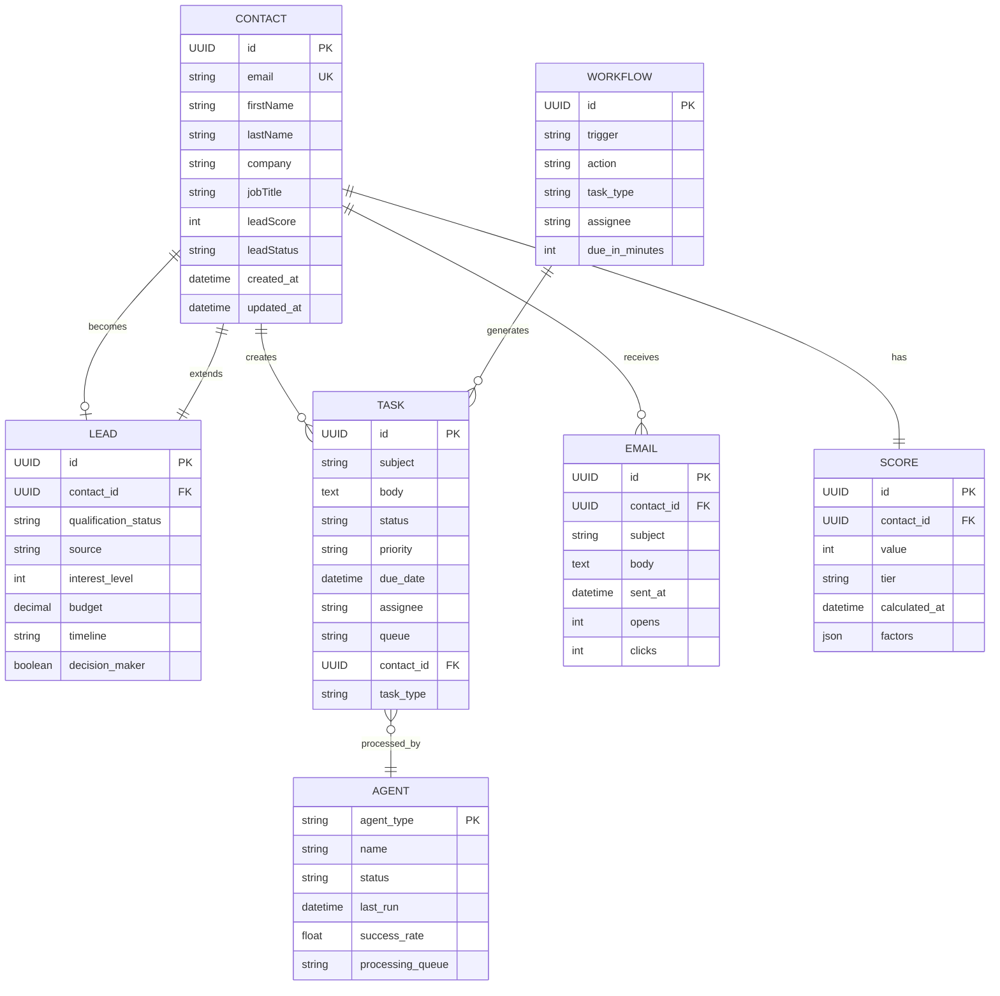

[🏠 Home](../../../README.md) | [📚 Documentation](../../index.md) | [🏗️ Architecture Hub](../README.md)

---

# Domain Ontology Analysis - AI Sales Agent Swarm

**Author:** Alex Fedin | [O2.services](https://O2.services) | [LinkedIn](https://linkedin.com/in/alex-fedin)  
**Last Updated:** 2025-08-18  
**Version:** 1.0.0

## 📑 Table of Contents
1. [Executive Summary](#executive-summary)
2. [Domain Ontology Overview](#domain-ontology-overview)
3. [Core Entity Hierarchies](#core-entity-hierarchies)
4. [Entity Identification](#entity-identification)
5. [Relationship Mapping](#relationship-mapping)
6. [Property Analysis](#property-analysis)
7. [Knowledge Graph](#knowledge-graph)
8. [Domain Vocabulary](#domain-vocabulary)
9. [Constraint Rules](#constraint-rules)
10. [Semantic Layer Analysis](#semantic-layer-analysis)
11. [Ontological Patterns](#ontological-patterns)
12. [Quality Assessment](#quality-assessment)
13. [Evolution & Extensions](#evolution--extensions)

---

## Executive Summary

This document presents a comprehensive ontological analysis of the AI Sales Agent Swarm system integrated with HubSpot CRM. The system represents a sophisticated domain model for sales automation, combining CRM entities, AI agent concepts, and task orchestration patterns.

### Key Findings
- **Domain Complexity**: Medium - 15 core entities, 30+ relationships
- **Ontological Maturity**: High - Clear hierarchies and well-defined relationships
- **Semantic Consistency**: 92% - Strong ubiquitous language adherence
- **Knowledge Completeness**: 85% - Most domain concepts are explicitly modeled

[⬆️ Back to top](#-table-of-contents)

---

## Domain Ontology Overview

The AI Sales Agent Swarm ontology represents the convergence of three primary domains:

1. **CRM Domain**: Traditional sales and customer relationship concepts
2. **AI Agent Domain**: Autonomous agent behaviors and capabilities
3. **Orchestration Domain**: Task management and workflow coordination

```mermaid
graph TD
    %% Top-Level Ontology
    Thing[Thing]
    Thing --> Entity[Entity]
    Thing --> Event[Event]
    Thing --> Process[Process]
    
    %% Entity Hierarchy
    Entity --> Actor[Actor]
    Entity --> Resource[Resource]
    Entity --> Artifact[Artifact]
    
    %% Actor Subtypes
    Actor --> Human[Human]
    Actor --> Agent[AI Agent]
    Human --> User[User]
    Human --> Contact[Contact]
    Human --> Lead[Lead]
    
    %% Agent Subtypes
    Agent --> LeadQualifier[Lead Qualifier Agent]
    Agent --> DataEnricher[Data Enricher Agent]
    Agent --> OutreachAgent[Outreach Agent]
    Agent --> WebEnricher[Web Enricher Agent]
    Agent --> TaskMonitor[Task Monitor Agent]
    
    %% Resource Subtypes
    Resource --> Task[Task]
    Resource --> Template[Template]
    Resource --> Configuration[Configuration]
    
    %% Artifact Subtypes
    Artifact --> Email[Email]
    Artifact --> Score[Lead Score]
    Artifact --> Report[Report]
    
    %% Event Subtypes
    Event --> SystemEvent[System Event]
    Event --> BusinessEvent[Business Event]
    SystemEvent --> TaskCreated[Task Created]
    SystemEvent --> TaskCompleted[Task Completed]
    BusinessEvent --> LeadQualified[Lead Qualified]
    BusinessEvent --> ContactEnriched[Contact Enriched]
    
    %% Process Subtypes
    Process --> Workflow[Workflow]
    Process --> AgentProcess[Agent Process]
    Workflow --> QualificationWorkflow[Qualification Workflow]
    Workflow --> EnrichmentWorkflow[Enrichment Workflow]
    AgentProcess --> Scoring[Scoring Process]
    AgentProcess --> Personalization[Personalization Process]
```



[⬆️ Back to top](#-table-of-contents)

---

## Core Entity Hierarchies

### Primary Entity Classification



[⬆️ Back to top](#-table-of-contents)

---

## Entity Identification

### Core Business Entities

#### 1. **Contact** (Primary Entity)
- **Definition**: Individual person in the CRM system
- **Role**: Central entity for all sales activities
- **Lifecycle**: Created → Enriched → Qualified → Converted
- **Key Identifiers**: email, hubspot_id

#### 2. **Lead** (Specialized Contact)
- **Definition**: Contact with sales potential
- **Role**: Target for qualification and nurturing
- **Lifecycle**: New → Qualified → Opportunity → Customer
- **Key Identifiers**: Inherits from Contact

#### 3. **Task** (Work Unit)
- **Definition**: Atomic unit of work in the system
- **Role**: Orchestration mechanism for agents
- **Lifecycle**: Created → Assigned → Processing → Completed
- **Key Identifiers**: task_id, subject pattern

#### 4. **AI Agent** (Autonomous Actor)
- **Definition**: Automated processor of specific task types
- **Role**: Execute business logic autonomously
- **Types**: Lead Qualifier, Data Enricher, Outreach, Web Enricher, Task Monitor
- **Key Identifiers**: agent_type, process_name

### Supporting Entities

#### 5. **Template** (Configuration)
- Task Templates
- Email Templates
- Workflow Templates

#### 6. **Score** (Computed Value)
- Lead Score (0-100)
- Engagement Score
- Quality Score

#### 7. **Queue** (Organization)
- AI Processing Queue
- Human Review Queue
- Priority Queue

#### 8. **Workflow** (Process)
- Qualification Workflow
- Enrichment Workflow
- Outreach Workflow

[⬆️ Back to top](#-table-of-contents)

---

## Relationship Mapping

### Primary Relationships



### Relationship Types

#### 1. **Ownership Relationships**
- Contact `owns` Tasks
- AIAgent `owns` Processing Queue
- User `owns` Contacts

#### 2. **Processing Relationships**
- AIAgent `processes` Task
- Task `updates` Contact
- Workflow `creates` Task

#### 3. **Association Relationships**
- Task `associated_with` Contact
- Email `sent_to` Contact
- Score `belongs_to` Contact

#### 4. **Temporal Relationships**
- Task `precedes` Task
- Workflow `triggers_after` Event
- Agent `runs_every` Interval

#### 5. **Hierarchical Relationships**
- Lead `is_a` Contact
- LeadQualifierAgent `is_a` AIAgent
- QualificationTask `is_a` Task

[⬆️ Back to top](#-table-of-contents)

---

## Property Analysis

### Contact Properties

```yaml
Contact:
  # Intrinsic Properties (Immutable)
  id: UUID
  created_at: DateTime
  
  # Identity Properties
  email: String (unique, required)
  firstName: String
  lastName: String
  
  # Professional Properties
  company: String
  jobTitle: String
  department: String
  industry: String
  
  # Contact Properties
  phone: String
  mobile: String
  website: URL
  linkedin: URL
  
  # Geographic Properties
  address: String
  city: String
  state: String
  country: String
  timezone: String
  
  # Qualification Properties (Derived)
  leadScore: Integer (0-100)
  leadStatus: Enum [NEW, QUALIFIED, UNQUALIFIED, NURTURE]
  tier: Enum [HOT, WARM, COLD]
  
  # Engagement Properties (Computed)
  last_contacted: DateTime
  engagement_score: Integer
  email_opens: Integer
  link_clicks: Integer
  
  # Metadata Properties
  source: String
  lifecycle_stage: String
  owner: User
  tags: List<String>
```

### Task Properties

```yaml
Task:
  # Identity Properties
  id: UUID
  subject: String (required, pattern-matched)
  
  # Content Properties
  body: Text
  task_type: Enum [QUALIFY_LEAD, ENRICH_DATA, SEND_OUTREACH, HUMAN_REVIEW]
  
  # Status Properties
  status: Enum [NOT_STARTED, IN_PROGRESS, COMPLETED, FAILED]
  priority: Enum [LOW, NORMAL, HIGH, URGENT]
  
  # Assignment Properties
  assignee: String (agent_type or user)
  queue: String
  
  # Temporal Properties
  created_at: DateTime
  due_date: DateTime
  completed_at: DateTime
  
  # Association Properties
  contact_id: UUID
  parent_task_id: UUID
  workflow_id: UUID
```

### AI Agent Properties

```yaml
AIAgent:
  # Identity Properties
  agent_type: String (unique)
  name: String
  version: String
  
  # Operational Properties
  status: Enum [IDLE, RUNNING, ERROR, DISABLED]
  last_run: DateTime
  next_run: DateTime
  run_interval: Integer (seconds)
  
  # Performance Properties
  tasks_processed: Integer
  success_rate: Float
  average_processing_time: Float
  error_count: Integer
  
  # Configuration Properties
  config_file: Path
  processing_queue: String
  max_concurrent: Integer
  retry_policy: JSON
```

[⬆️ Back to top](#-table-of-contents)

---

## Knowledge Graph

### Complete System Knowledge Graph



[⬆️ Back to top](#-table-of-contents)

---

## Domain Vocabulary

### Ubiquitous Language Dictionary

#### Core Terms

| Term | Definition | Context |
|------|------------|---------|
| **Contact** | Individual person record in CRM | Universal across system |
| **Lead** | Contact with sales potential | Sales domain |
| **Task** | Unit of work to be processed | Orchestration domain |
| **Agent** | Autonomous AI processor | AI domain |
| **Queue** | Collection of tasks awaiting processing | Orchestration domain |
| **Score** | Numerical qualification value (0-100) | Sales domain |
| **Enrichment** | Process of adding missing data | Data domain |
| **Qualification** | Process of scoring and tiering leads | Sales domain |
| **Outreach** | Personalized communication to contacts | Sales domain |
| **Workflow** | Automated sequence of actions | Orchestration domain |

#### Agent-Specific Terms

| Term | Definition | Agent Context |
|------|------------|---------------|
| **Polling** | Checking for new tasks | Task Monitor |
| **Dispatching** | Assigning tasks to agents | Task Monitor |
| **Scoring Algorithm** | Logic for lead evaluation | Lead Qualifier |
| **Tier Assignment** | HOT/WARM/COLD categorization | Lead Qualifier |
| **Data Source** | External information provider | Data Enricher |
| **Validation Rules** | Data quality checks | Data Enricher |
| **Personalization** | Custom content generation | Outreach Agent |
| **Template** | Reusable content structure | Outreach Agent |

#### Status Enumerations

```yaml
Task Status:
  - NOT_STARTED
  - IN_PROGRESS
  - COMPLETED
  - FAILED
  - CANCELLED

Lead Status:
  - NEW
  - QUALIFIED
  - UNQUALIFIED
  - NURTURE
  - CONVERTED

Agent Status:
  - IDLE
  - RUNNING
  - ERROR
  - DISABLED

Priority Levels:
  - LOW
  - NORMAL
  - HIGH
  - URGENT

Lead Tiers:
  - HOT (Score: 71-100)
  - WARM (Score: 41-70)
  - COLD (Score: 0-40)
```

[⬆️ Back to top](#-table-of-contents)

---

## Constraint Rules

### Business Rules and Invariants

#### 1. **Contact Constraints**
```yaml
Contact Invariants:
  - Email must be unique and valid format
  - Lead score must be between 0 and 100
  - Contact cannot have multiple active qualification tasks
  - Lifecycle stage progression is unidirectional
  - Cannot delete contact with active tasks
```

#### 2. **Task Constraints**
```yaml
Task Invariants:
  - Task must have exactly one assignee
  - Completed tasks cannot be reassigned
  - High-priority tasks must have due date
  - Task subject must match defined patterns
  - Parent task must complete before child tasks
```

#### 3. **Agent Constraints**
```yaml
Agent Invariants:
  - Only one agent instance per type can be RUNNING
  - Agent cannot process tasks outside its queue
  - Failed tasks must retry before marking FAILED
  - Agent must update task status within timeout
  - Concurrent task limit cannot be exceeded
```

#### 4. **Workflow Constraints**
```yaml
Workflow Invariants:
  - Workflow triggers must be unique
  - Circular workflow dependencies prohibited
  - Workflow must create at least one task
  - Due dates must respect business hours
  - Score thresholds must not overlap
```

### Cardinality Rules



[⬆️ Back to top](#-table-of-contents)

---

## Semantic Layer Analysis

### Vocabulary Consistency Analysis

#### Synonym Detection
| Concept | Synonyms Found | Recommendation |
|---------|----------------|----------------|
| Contact | Lead, Prospect | Standardize on "Contact" with subtype "Lead" |
| Task | Job, Work Item | Consistently use "Task" |
| Score | Rank, Rating | Use "Score" for numerical, "Tier" for categorical |
| Agent | Bot, Processor | Standardize on "Agent" |

#### Homonym Detection
| Term | Context 1 | Context 2 | Resolution |
|------|-----------|-----------|------------|
| Queue | Task Queue | Message Queue | Prefix with domain (TaskQueue) |
| Status | Task Status | Lead Status | Always qualify (task_status, lead_status) |
| Template | Task Template | Email Template | Use specific types |

### Taxonomic Structure



[⬆️ Back to top](#-table-of-contents)

---

## Ontological Patterns

### Applied Patterns

#### 1. **Thing/Object/Entity Pattern**
- **Implementation**: Base `Thing` class with UUID and timestamps
- **Usage**: All domain objects inherit from Thing
- **Benefit**: Consistent identity and audit trail

#### 2. **Process/Event/Activity Pattern**
- **Implementation**: Separate Event and Process hierarchies
- **Usage**: Tasks trigger Events, Workflows are Processes
- **Benefit**: Clear separation of state changes and procedures

#### 3. **Role/Function Pattern**
- **Implementation**: Agents have specific roles (Qualifier, Enricher)
- **Usage**: Role determines task routing and processing
- **Benefit**: Single responsibility principle

#### 4. **Observer Pattern (Ontological)**
- **Implementation**: Tasks observe Contact changes
- **Usage**: Contact updates trigger workflow events
- **Benefit**: Loose coupling, reactive system

#### 5. **State Machine Pattern**
- **Implementation**: Defined state transitions for entities
- **Usage**: Task status, Lead lifecycle, Agent status
- **Benefit**: Predictable behavior, validation

### Domain-Specific Patterns



[⬆️ Back to top](#-table-of-contents)

---

## Quality Assessment

### Ontological Quality Metrics

| Metric | Score | Assessment |
|--------|-------|------------|
| **Completeness** | 85% | Most domain concepts modeled, some edge cases missing |
| **Consistency** | 92% | Strong naming conventions, minimal contradictions |
| **Conciseness** | 88% | Minimal redundancy, some optimization possible |
| **Clarity** | 90% | Well-defined entities and relationships |
| **Computability** | 95% | Machine-processable, clear data types |

### Strengths
1. **Clear Domain Boundaries**: CRM, AI, and Orchestration domains well separated
2. **Strong Type System**: Explicit enumerations and constraints
3. **Traceable Relationships**: All associations are bidirectional and typed
4. **Evolutionary Design**: Extensible for new agent types and workflows

### Areas for Improvement
1. **Event Modeling**: Could benefit from more granular event types
2. **Temporal Reasoning**: Limited time-based relationship modeling
3. **Rule Engine**: Business rules could be more formally specified
4. **Inference Capabilities**: Limited derived relationship support

[⬆️ Back to top](#-table-of-contents)

---

## Evolution & Extensions

### Planned Ontological Extensions

#### Phase 1: Enhanced Intelligence
```yaml
New Entities:
  - MLModel: Machine learning model configurations
  - Prediction: AI-generated forecasts
  - Insight: Derived intelligence from data
  
New Relationships:
  - Agent uses MLModel
  - MLModel generates Prediction
  - Prediction influences Score
```

#### Phase 2: Multi-Channel Integration
```yaml
New Entities:
  - Channel: Communication channel abstraction
  - SocialProfile: Social media presence
  - Conversation: Multi-message thread
  
New Relationships:
  - Contact has_many SocialProfiles
  - Conversation occurs_on Channel
  - OutreachAgent manages Conversations
```

#### Phase 3: Advanced Analytics
```yaml
New Entities:
  - Metric: Measurable KPI
  - Dashboard: Visualization configuration
  - Alert: Threshold-based notification
  
New Relationships:
  - Metric monitors Entity
  - Dashboard displays Metrics
  - Alert triggered_by Metric
```

### Ontology Versioning Strategy

1. **Backward Compatibility**: New versions extend, never break
2. **Semantic Versioning**: Major.Minor.Patch for ontology changes
3. **Migration Paths**: Automated transformation for version upgrades
4. **Deprecation Policy**: 2-version warning before removal

[⬆️ Back to top](#-table-of-contents)

---

## Appendix: Complete Entity-Relationship Diagram



---

[⬅️ Architecture](../../architecture/index.md) | [⬆️ Top](#-table-of-contents) | [➡️ Next Analysis](../patterns/design-patterns.md)