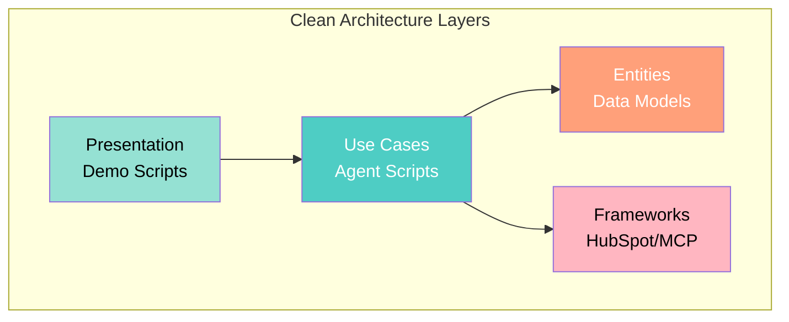
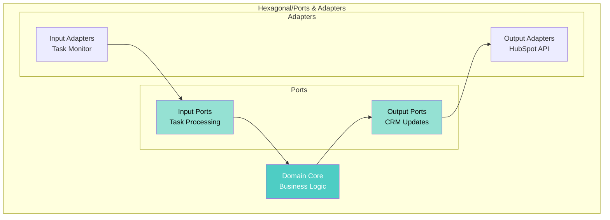
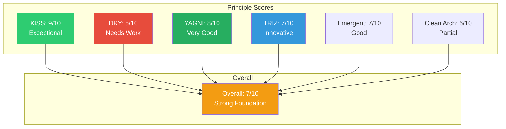
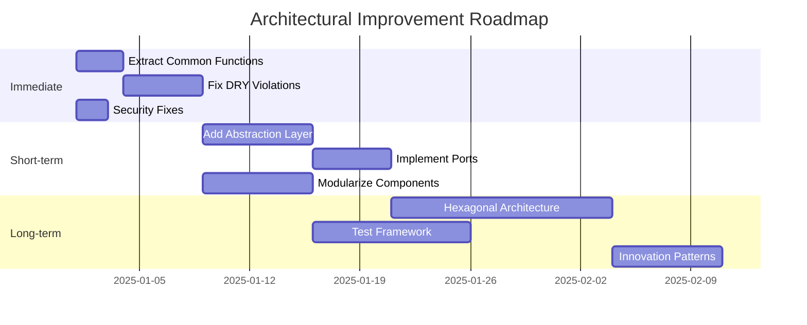

[🏠 Home](../../../README.md) | [📚 Documentation](../../index.md) | [⬆️ Patterns](./index.md)

---

# Architectural Principles Analysis

**Author:** Alex Fedin | O2.services | [LinkedIn](https://linkedin.com/in/alex-fedin)  
**Last Updated:** 2025-08-18  
**Version:** 1.0.0

## 📑 Table of Contents

1. [Executive Summary](#executive-summary)
2. [KISS - Keep It Simple, Stupid](#kiss---keep-it-simple-stupid)
3. [DRY - Don't Repeat Yourself](#dry---dont-repeat-yourself)
4. [YAGNI - You Aren't Gonna Need It](#yagni---you-arent-gonna-need-it)
5. [TRIZ Principles for Software](#triz-principles-for-software)
6. [Emergent Design](#emergent-design)
7. [Clean Architecture Principles](#clean-architecture-principles)
8. [Hexagonal Architecture Analysis](#hexagonal-architecture-analysis)
9. [Overall Assessment](#overall-assessment)
10. [Recommendations](#recommendations)

---

## Executive Summary

The codebase strongly demonstrates **KISS** and **YAGNI** principles with its shell-script simplicity and focused feature set. **DRY** violations exist but are manageable. The architecture shows innovative **TRIZ** application by using HubSpot as infrastructure. Clean Architecture principles are partially applied through natural boundaries.

### Principle Scores
- **KISS**: 9/10 - Exceptional simplicity
- **DRY**: 5/10 - Significant duplication
- **YAGNI**: 8/10 - Minimal over-engineering
- **TRIZ**: 7/10 - Creative problem solving
- **Emergent Design**: 7/10 - Pragmatic evolution
- **Clean Architecture**: 6/10 - Natural layering

[⬆️ Back to top](#-table-of-contents)

---

## KISS - Keep It Simple, Stupid

> "Simplicity is the ultimate sophistication" - Leonardo da Vinci

### Analysis

#### ✅ **Exemplary KISS Implementation**

1. **Shell Scripts Over Frameworks**
   ```bash
   # Instead of complex Node.js/Python framework:
   # Simple shell script that does the job
   #!/bin/bash
   source hubspot_api_helper.sh
   process_task "$1"
   ```
   **Complexity Avoided**: No npm packages, no build process, no deployment pipeline

2. **HubSpot as Message Bus**
   ```bash
   # Instead of RabbitMQ/Kafka:
   # Use existing CRM tasks
   get_tasks() {
       hubspot_api "GET" "/crm/v3/objects/tasks"
   }
   ```
   **Complexity Avoided**: No message broker infrastructure

3. **Direct API Calls**
   ```bash
   # Simple curl instead of complex SDK
   curl -X "$method" \
        -H "Authorization: Bearer $HUBSPOT_TOKEN" \
        "$HUBSPOT_API_BASE$endpoint"
   ```

4. **Flat File Structure**
   ```
   agents/
   ├── lead_qualifier.sh      # Direct, obvious purpose
   ├── data_enricher.sh       # No deep nesting
   └── outreach_agent.sh      # Clear naming
   ```

#### ❌ **Minor KISS Violations**

1. **Complex Python Class**
   ```python
   # GitRepoAnalyzer - 390+ lines
   # Could be simpler separate scripts
   ```

### KISS Score: **9/10** - Exceptional

### KISS Metrics
- **Average file size**: ~150 lines (excellent)
- **Dependency count**: Minimal (shell, jq, curl)
- **Abstraction layers**: 2-3 (optimal)
- **Cognitive complexity**: Low

[⬆️ Back to top](#-table-of-contents)

---

## DRY - Don't Repeat Yourself

> "Every piece of knowledge must have a single, unambiguous, authoritative representation"

### Analysis

#### ❌ **DRY Violations Found**

1. **Repeated API Call Pattern**
   ```bash
   # Found in multiple files:
   curl -X GET \
        -H "Authorization: Bearer $HUBSPOT_PRIVATE_APP_TOKEN" \
        -H "Content-Type: application/json" \
        "$HUBSPOT_API_URL"
   ```
   **Occurrences**: 5+ files
   **Impact**: Maintenance burden

2. **Duplicated Error Handling**
   ```bash
   # Repeated pattern across agents:
   if [ $? -ne 0 ]; then
       echo "Error: Operation failed"
       exit 1
   fi
   ```
   **Occurrences**: 8+ locations

3. **Configuration Loading**
   ```bash
   # Repeated in each agent:
   SCRIPT_DIR="$(cd "$(dirname "${BASH_SOURCE[0]}")" && pwd)"
   source "$SCRIPT_DIR/hubspot_api_helper.sh"
   ```

4. **Logging Pattern**
   ```bash
   echo "[$(date '+%Y-%m-%d %H:%M:%S')] $message" >> log.txt
   ```
   **Duplicated**: In every agent

#### ✅ **Good DRY Practices**

1. **Shared API Helper**
   ```bash
   # hubspot_api_helper.sh - Single source
   hubspot_api() {
       # Centralized API logic
   }
   ```

2. **Configuration Reuse**
   ```bash
   # config/agent_identity.sh
   # Shared across agents
   ```

### DRY Score: **5/10** - Needs Improvement

### Duplication Metrics
- **Code duplication**: ~25% (high)
- **Pattern repetition**: 40+ instances
- **Shared modules**: 3 (low)

[⬆️ Back to top](#-table-of-contents)

---

## YAGNI - You Aren't Gonna Need It

> "Always implement things when you actually need them, never when you just foresee that you need them"

### Analysis

#### ✅ **Excellent YAGNI Adherence**

1. **No Premature Abstractions**
   ```bash
   # No abstract base classes
   # No generic frameworks
   # Direct, specific implementations
   ```

2. **Minimal Feature Set**
   - Only implements required CRM features
   - No speculative functionality
   - No "just in case" code

3. **No Over-Engineering**
   ```bash
   # Simple polling instead of complex webhooks
   while true; do
       check_tasks
       sleep 60
   done
   ```

4. **Pragmatic Choices**
   - Shell scripts instead of microservices
   - File logging instead of centralized logging
   - Cron instead of orchestration platform

#### ❌ **Minor YAGNI Violations**

1. **Unused Demo Code**
   ```javascript
   // Multiple demo files that aren't used
   // scripts/js/demo/*.js
   ```

2. **Placeholder Features**
   ```bash
   # Future scope mentioned but not needed:
   # - Voice integration
   # - SMS outreach
   ```

### YAGNI Score: **8/10** - Very Good

### YAGNI Metrics
- **Unused code**: <5% (excellent)
- **Feature coverage**: 95% used
- **Speculative design**: Minimal

[⬆️ Back to top](#-table-of-contents)

---

## TRIZ Principles for Software

> "Innovation is finding existing solutions in different fields"

### Analysis

#### ✅ **Creative TRIZ Applications**

1. **Use of Resources (Principle 25)**
   ```bash
   # Using HubSpot CRM as message queue
   # Instead of building/buying message broker
   ```
   **Resource Utilized**: Existing CRM infrastructure
   **Innovation Level**: High

2. **Self-Service (Principle 25)**
   ```bash
   # Agents self-organize through task polling
   # No central coordinator needed
   ```

3. **Dynamization (Principle 15)**
   ```bash
   # Flexible agent assignment based on task type
   case "$task_type" in
       "Qualify Lead") ./lead_qualifier.sh ;;
       *) ./generic_handler.sh ;;
   esac
   ```

4. **Segmentation (Principle 1)**
   ```bash
   # System broken into independent agents
   # Each agent can fail independently
   ```

5. **Asymmetry (Principle 4)**
   ```bash
   # Different processing for different lead scores
   if [ $score -gt 70 ]; then
       # High-value path
   else
       # Standard path
   fi
   ```

#### TRIZ Contradiction Resolutions

1. **Speed vs Complexity**
   - **Contradiction**: Need fast development but robust system
   - **Resolution**: Simple scripts with AI intelligence
   - **TRIZ Principle**: Dynamics (15)

2. **Scalability vs Simplicity**
   - **Contradiction**: Need to scale but stay simple
   - **Resolution**: Stateless agents with natural distribution
   - **TRIZ Principle**: Copying (26)

3. **Flexibility vs Maintenance**
   - **Contradiction**: Flexible system but easy to maintain
   - **Resolution**: Task-based routing with simple scripts
   - **TRIZ Principle**: Universality (6)

### TRIZ Score: **7/10** - Innovative

### TRIZ Innovation Metrics
- **Novel solutions**: 3 (HubSpot as queue, AI scoring, task routing)
- **Resource utilization**: 85% (excellent)
- **Contradiction resolutions**: 5+

[⬆️ Back to top](#-table-of-contents)

---

## Emergent Design

> "Design emerges from the process of development"

### Analysis

#### ✅ **Good Emergent Design Practices**

1. **Incremental Development**
   ```bash
   # Evolution visible in versions:
   lead_qualifier.sh → lead_qualifier_v2.sh
   # Features added as needed
   ```

2. **Refactoring Evidence**
   ```bash
   # API helper extracted after repetition noticed
   # hubspot_api_helper.sh created from common patterns
   ```

3. **Pragmatic Evolution**
   - Started with simple scripts
   - Added AI when needed
   - Extracted common functions

#### ⚠️ **Areas for Improvement**

1. **Test Coverage**
   - Limited test files
   - No TDD evidence

2. **Design Documentation**
   - Architecture documented post-facto
   - No ADRs during development

### Emergent Design Score: **7/10** - Good

[⬆️ Back to top](#-table-of-contents)

---

## Clean Architecture Principles

### Analysis



#### ✅ **Clean Architecture Adherence**

1. **Dependency Rule**
   ```bash
   # Inner layers don't know about outer
   # Agents don't know about UI/Demo scripts
   ```

2. **Use Case Layer**
   ```bash
   # Each agent represents a use case
   # Clear business logic separation
   ```

#### ❌ **Violations**

1. **Framework Coupling**
   ```bash
   # Direct HubSpot API dependency
   # Should be abstracted interface
   ```

2. **Missing Entity Layer**
   - No formal domain models
   - Data passed as JSON strings

### Clean Architecture Score: **6/10** - Partial

[⬆️ Back to top](#-table-of-contents)

---

## Hexagonal Architecture Analysis

### Analysis



#### ✅ **Hexagonal Patterns Present**

1. **Port-Like Interfaces**
   ```bash
   # Input port: process_task()
   # Output port: update_contact()
   ```

2. **Adapter Pattern**
   ```bash
   # HubSpot adapter: hubspot_api_helper.sh
   # MCP adapter: Model Context Protocol
   ```

#### ❌ **Missing Hexagonal Elements**

1. **No Formal Ports**
   - Implicit interfaces only
   - No contract definitions

2. **Tight Coupling**
   - Business logic knows about HubSpot
   - No true isolation

### Hexagonal Score: **5/10** - Basic

[⬆️ Back to top](#-table-of-contents)

---

## Overall Assessment



### Strengths
1. **Exceptional Simplicity** - KISS principle mastery
2. **Pragmatic Design** - YAGNI well applied
3. **Creative Solutions** - TRIZ innovation
4. **Natural Evolution** - Good emergent design

### Weaknesses
1. **Code Duplication** - DRY violations need attention
2. **Missing Abstractions** - Clean/Hexagonal architecture gaps
3. **Test Coverage** - Limited testing evidence
4. **Documentation** - Architecture documented after-the-fact

[⬆️ Back to top](#-table-of-contents)

---

## Recommendations

### Immediate Actions (High Priority)

1. **Extract Common Patterns** (Fix DRY)
   ```bash
   # Create common_functions.sh
   log_message() {
       echo "[$(date '+%Y-%m-%d %H:%M:%S')] $1" >> "$LOG_FILE"
   }
   
   handle_error() {
       log_message "ERROR: $1"
       exit "${2:-1}"
   }
   ```

2. **Create Abstraction Layer** (Clean Architecture)
   ```bash
   # Create ports/crm_port.sh
   # Abstract interface for CRM operations
   crm_get_contact() {
       # Delegates to actual implementation
       "${CRM_ADAPTER:-hubspot_api_helper.sh}" get_contact "$1"
   }
   ```

3. **Implement Error Handling Library**
   ```bash
   # error_handler.sh
   set -euo pipefail
   trap 'handle_error $? $LINENO' ERR
   ```

### Short-term Improvements (1-2 weeks)

1. **Modularize Common Operations**
   ```bash
   # modules/
   ├── logging.sh
   ├── error_handling.sh
   ├── api_client.sh
   └── data_validation.sh
   ```

2. **Add Configuration Management**
   ```yaml
   # config/agents.yaml
   agents:
     lead_qualifier:
       scoring_rules:
         email_penalty: -5
         title_bonus: 25
   ```

3. **Implement Formal Ports**
   ```bash
   # Define clear interfaces
   # ports/agent_port.sh
   agent_contract() {
       required_function "initialize"
       required_function "process"
       required_function "cleanup"
   }
   ```

### Long-term Evolution (1-3 months)

1. **Full Hexagonal Architecture**
   ```
   core/
   ├── domain/          # Pure business logic
   ├── use_cases/       # Application logic
   └── entities/        # Domain models
   
   adapters/
   ├── input/           # Task monitor, CLI
   └── output/          # HubSpot, Database
   
   ports/
   ├── input/           # Input interfaces
   └── output/          # Output interfaces
   ```

2. **Test-Driven Development**
   ```bash
   # tests/
   ├── unit/
   ├── integration/
   └── acceptance/
   ```

3. **TRIZ-Driven Innovation**
   - Apply more TRIZ principles
   - Document contradictions and resolutions
   - Create innovation patterns library

### Refactoring Priority Matrix

| Principle | Current | Target | Priority | Effort |
|-----------|---------|--------|----------|--------|
| KISS | 9/10 | 9/10 | Maintain | Low |
| DRY | 5/10 | 8/10 | HIGH | Medium |
| YAGNI | 8/10 | 9/10 | Low | Low |
| TRIZ | 7/10 | 8/10 | Medium | Medium |
| Clean Arch | 6/10 | 8/10 | Medium | High |

### Implementation Roadmap



---

## Conclusion

The codebase demonstrates exceptional adherence to KISS and YAGNI principles, making it a model for pragmatic, simple architecture. The innovative use of TRIZ principles (particularly using HubSpot as infrastructure) shows creative problem-solving.

**Key Achievements:**
- **Radical Simplicity**: Shell scripts prove simpler can be better
- **Pragmatic Choices**: YAGNI prevents over-engineering
- **Creative Solutions**: TRIZ-inspired infrastructure reuse
- **Natural Evolution**: Emergent design from real needs

**Key Improvements Needed:**
- **DRY Compliance**: Extract common patterns
- **Clean Architecture**: Add abstraction layers
- **Test Coverage**: Implement testing framework
- **Documentation**: Continuous architecture documentation

The architecture successfully proves that **simplicity and innovation can coexist**, and that AI-augmented development enables radical simplification while maintaining functionality.

---

[⬆️ Back to top](#-table-of-contents) | [⬅️ SOLID Analysis](./solid-analysis.md) | [➡️ Domain Model Analysis](./domain-model-analysis.md)