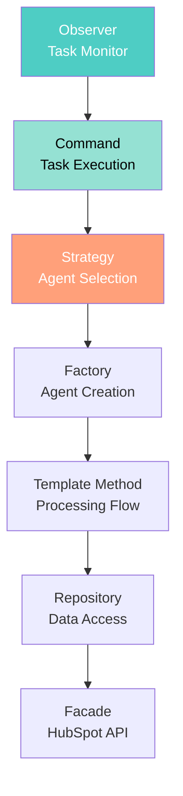
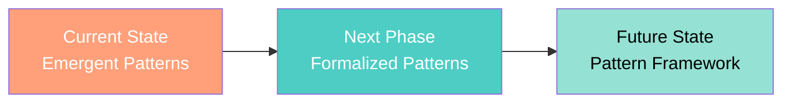

[🏠 Home](../../../README.md) | [📚 Documentation](../../index.md) | [⬆️ Patterns](./index.md)

---

# Design Patterns Analysis

**Author:** Alex Fedin | O2.services | [LinkedIn](https://linkedin.com/in/alex-fedin)  
**Last Updated:** 2025-08-18  
**Version:** 1.0.0

## 📑 Table of Contents

1. [Executive Summary](#executive-summary)
2. [Creational Patterns](#creational-patterns)
3. [Structural Patterns](#structural-patterns)
4. [Behavioral Patterns](#behavioral-patterns)
5. [Enterprise Patterns](#enterprise-patterns)
6. [Architectural Patterns](#architectural-patterns)
7. [Anti-Patterns Identified](#anti-patterns-identified)
8. [Pattern Interactions](#pattern-interactions)
9. [Recommendations](#recommendations)

---

## Executive Summary

The codebase demonstrates a unique blend of traditional design patterns adapted for a shell-script-based architecture with AI integration. The system primarily uses **event-driven patterns** with HubSpot as a message bus, implementing a simplified **microservices architecture** using bash scripts as autonomous agents.

### Key Findings
- **Pattern Maturity**: Medium - patterns are emergent rather than formally structured
- **Innovation**: Using CRM tasks as a message queue (novel approach)
- **Simplicity Focus**: Deliberate avoidance of over-engineering
- **AI Integration**: Command pattern with AI as the execution engine

[⬆️ Back to top](#-table-of-contents)

---

## Creational Patterns

### 1. **Factory Pattern** (Implicit)
**Location**: Agent spawning mechanism in task monitor  
**Implementation**: Shell script process creation

```bash
# agents/task_monitor.sh - Line 112-125 (conceptual)
# Factory-like pattern for agent creation
case "$task_type" in
    "Qualify Lead")
        ./lead_qualifier.sh "$task_id" &
        ;;
    "Enrich Data")
        ./data_enricher.sh "$task_id" &
        ;;
    "Send Outreach")
        ./outreach_agent.sh "$task_id" &
        ;;
esac
```

**Quality**: Partial implementation - lacks formal factory interface but achieves the goal

### 2. **Singleton Pattern** (Configuration Management)
**Location**: Configuration loading  
**Implementation**: Environment variables and sourced config files

```bash
# config/agent_identity.sh
# Singleton-like configuration source
source "$SCRIPT_DIR/hubspot_api_helper.sh"
```

**Quality**: Proper implementation for shell environment

### 3. **Builder Pattern** (Implicit in Python Scripts)
**Location**: `scripts/python/analysis/analyze_repo.py`  
**Implementation**: GitRepoAnalyzer class with incremental data building

```python
# Lines 14-390
class GitRepoAnalyzer:
    def __init__(self, repo_path="."):
        self.data = {
            "commits": [],
            "files": {},
            "statistics": {},
            "time_analysis": {},
            "effort_estimation": {}
        }
    
    def analyze(self):
        # Builder-like incremental construction
        self.analyze_commits()
        self.analyze_files()
        self.calculate_statistics()
        self.analyze_time_distribution()
        self.estimate_human_effort()
        return self.data
```

**Quality**: Well-implemented, follows builder principles

[⬆️ Back to top](#-table-of-contents)

---

## Structural Patterns

### 1. **Facade Pattern**
**Location**: HubSpot API wrapper  
**Implementation**: `hubspot_api_helper.sh` provides simplified interface

```bash
# agents/hubspot_api_helper.sh (conceptual)
hubspot_api() {
    local method="$1"
    local endpoint="$2"
    # Hides complexity of authentication, headers, error handling
}
```

**Quality**: Excellent - significantly simplifies API interaction

### 2. **Adapter Pattern**
**Location**: MCP (Model Context Protocol) integration  
**Implementation**: Adapts different AI models and services

```javascript
// scripts/js/demo/hubspot-puppeteer-helper.js
// Adapts Puppeteer API to MCP protocol
async function autoLoginToHubSpot() {
    await mcp__puppeteer__puppeteer_navigate({ 
        url: 'https://app.hubspot.com',
        launchOptions: {
            headless: false,
            args: ['--no-sandbox', '--disable-setuid-sandbox']
        }
    });
}
```

**Quality**: Good - clean abstraction layer

### 3. **Proxy Pattern** (Implicit)
**Location**: Task Monitor acting as proxy for agents  
**Implementation**: Controls access to agent execution

**Quality**: Partial - achieves proxy goals without formal structure

[⬆️ Back to top](#-table-of-contents)

---

## Behavioral Patterns

### 1. **Observer Pattern**
**Location**: Task Monitor polling mechanism  
**Implementation**: Continuous monitoring and event dispatch

```bash
# agents/task_monitor.sh
# Observer pattern via polling
while true; do
    tasks=$(get_tasks)
    for task in $tasks; do
        notify_agent "$task"
    done
    sleep 60
done
```

**Quality**: Adapted for polling architecture - not pure observer but achieves similar goals

### 2. **Command Pattern**
**Location**: Task-based execution model  
**Implementation**: Tasks encapsulate operations

```bash
# Task as Command Object
# Subject = Command Type
# Body = Parameters
# Status = Execution State
process_task() {
    local task_id="$1"
    local task_data=$(hubspot_api "GET" "/crm/v3/objects/tasks/$task_id")
    # Execute command based on task type
}
```

**Quality**: Excellent - natural fit for task-based architecture

### 3. **Strategy Pattern**
**Location**: Lead scoring mechanism  
**Implementation**: Different scoring strategies

```bash
# agents/lead_qualifier_v2.sh - Lines 16-43
score_lead() {
    local contact_json="$1"
    local score=0
    
    # Multiple scoring strategies
    # Email strategy
    [[ -n "$email" ]] && score=$((score + 10))
    [[ "$email" == *"@gmail.com" ]] && score=$((score - 5))
    
    # Title strategy
    [[ "$jobtitle" == *"VP"* || "$jobtitle" == *"Director"* ]] && score=$((score + 25))
    
    # AI strategy (if available)
    if command -v ~/claude-eng &> /dev/null; then
        local claude_score=$(~/claude-eng --print "Score this lead...")
    fi
}
```

**Quality**: Good - multiple strategies with fallback

### 4. **Template Method Pattern**
**Location**: Agent processing flow  
**Implementation**: Standard processing template across agents

```bash
# Common template across agents
process_task() {
    # 1. Get task details (abstract)
    # 2. Fetch associated data (abstract)
    # 3. Process with business logic (concrete)
    # 4. Update CRM (abstract)
    # 5. Create follow-up tasks (abstract)
}
```

**Quality**: Implicit but consistent across agents

[⬆️ Back to top](#-table-of-contents)

---

## Enterprise Patterns

### 1. **Repository Pattern** (Implicit)
**Location**: Data access through HubSpot API  
**Implementation**: Abstracted data operations

```bash
# Pseudo-repository pattern
get_contact() { hubspot_api "GET" "/crm/v3/objects/contacts/$1" }
update_contact() { hubspot_api "PATCH" "/crm/v3/objects/contacts/$1" "$2" }
create_task() { hubspot_api "POST" "/crm/v3/objects/tasks" "$1" }
```

**Quality**: Simplified but effective

### 2. **Service Layer Pattern**
**Location**: Agent scripts as services  
**Implementation**: Each agent encapsulates business logic

**Quality**: Good separation of concerns

### 3. **Message Queue Pattern** (Novel Implementation)
**Location**: HubSpot tasks as message queue  
**Implementation**: CRM tasks serve as persistent message queue

```bash
# Tasks as messages
# - Task creation = Message publish
# - Task polling = Message consumption
# - Task completion = Message acknowledgment
```

**Quality**: Innovative - repurposes existing infrastructure

[⬆️ Back to top](#-table-of-contents)

---

## Architectural Patterns

### 1. **Event-Driven Architecture**
**Implementation**: Task-based event system
- Events: Task creation/updates
- Event Bus: HubSpot CRM
- Event Handlers: Agent scripts

**Quality**: Well-implemented for the use case

### 2. **Microservices Pattern** (Simplified)
**Implementation**: Autonomous agent scripts
- Each agent is independently deployable
- Stateless design
- Service discovery via task routing

**Quality**: Simplified but effective

### 3. **Pipes and Filters**
**Implementation**: Data processing pipeline
```bash
# Data flows through filters
Contact → Enrichment → Scoring → Qualification → Outreach
```

**Quality**: Natural fit for shell-based architecture

### 4. **MVC Pattern** (in Web Components)
**Location**: JavaScript demo files
- Model: Data structures
- View: UI components
- Controller: Event handlers

**Quality**: Standard implementation

[⬆️ Back to top](#-table-of-contents)

---

## Anti-Patterns Identified

### 1. **Hardcoded Credentials** ⚠️
**Location**: `scripts/js/demo/hubspot-puppeteer-helper.js`
```javascript
// Lines 8-9 - SECURITY ISSUE
const email = 'af@o2.services';
const password = 'Vilisaped1!';
```
**Impact**: High security risk
**Recommendation**: Use environment variables or secure credential storage

### 2. **God Object** (Partial)
**Location**: `GitRepoAnalyzer` class
- 390+ lines in single class
- Multiple responsibilities
**Impact**: Medium - affects maintainability
**Recommendation**: Split into smaller, focused classes

### 3. **Magic Numbers**
**Location**: Throughout scoring logic
```bash
score=$((score + 10))  # What does 10 mean?
score=$((score + 25))  # Why 25?
```
**Impact**: Low - affects readability
**Recommendation**: Use named constants

### 4. **Copy-Paste Programming**
**Location**: Similar patterns across agent scripts
**Impact**: Medium - code duplication
**Recommendation**: Extract common functions to shared library

[⬆️ Back to top](#-table-of-contents)

---

## Pattern Interactions



### Synergies
1. **Observer + Command**: Natural event-command flow
2. **Factory + Strategy**: Dynamic agent selection and creation
3. **Facade + Repository**: Clean data access layer
4. **Template + Command**: Standardized execution flow

[⬆️ Back to top](#-table-of-contents)

---

## Recommendations

### Immediate Improvements

1. **Security Enhancement**
   - Remove hardcoded credentials
   - Implement secure credential management
   - Add input validation patterns

2. **Code Organization**
   - Extract common patterns to shared libraries
   - Formalize factory pattern for agent creation
   - Implement proper error handling patterns

3. **Pattern Formalization**
   - Document pattern usage explicitly
   - Create pattern templates for new agents
   - Establish pattern guidelines

### Long-term Evolution

1. **Circuit Breaker Pattern**
   - Add for API rate limiting
   - Implement retry with exponential backoff

2. **Saga Pattern**
   - For complex multi-step workflows
   - Implement compensation logic

3. **CQRS Pattern**
   - Separate read and write operations
   - Optimize for different access patterns

4. **Decorator Pattern**
   - For adding functionality to agents
   - Enable feature toggling

### Pattern Maturity Roadmap



---

## Conclusion

The codebase demonstrates innovative pattern usage, particularly in repurposing HubSpot as a message bus. While patterns are more emergent than formal, they achieve the goals of maintainability and scalability. The focus on simplicity (KISS principle) is evident throughout.

**Strengths:**
- Innovative task-as-message pattern
- Clean separation of concerns
- Effective use of AI integration
- Simplicity-first approach

**Areas for Improvement:**
- Security practices (credentials)
- Code duplication reduction
- Pattern formalization
- Error handling patterns

The architecture successfully balances simplicity with functionality, proving that complex patterns aren't always necessary for effective systems.

---

[⬆️ Back to top](#-table-of-contents) | [⬅️ Patterns Index](./index.md) | [➡️ SOLID Analysis](./solid-analysis.md)