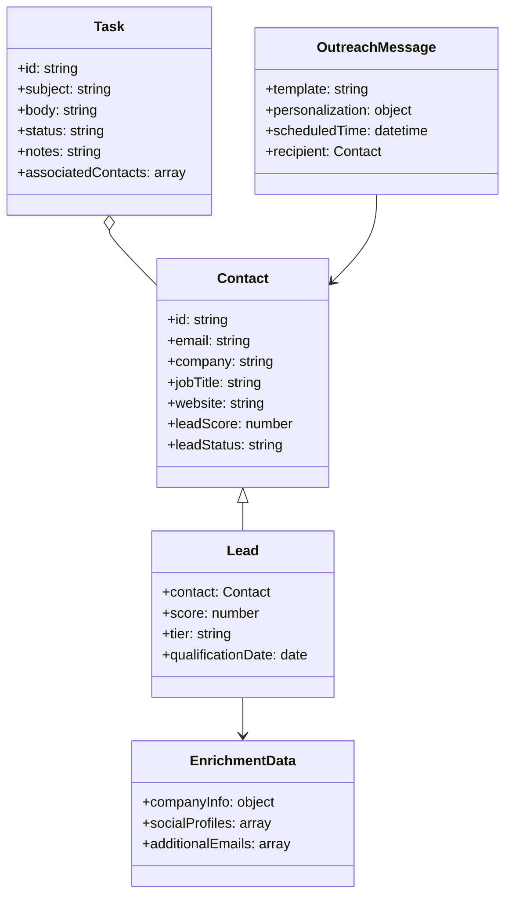
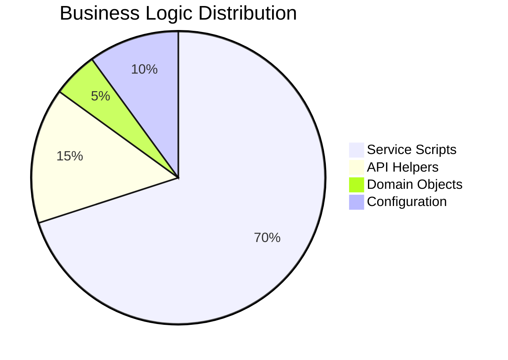
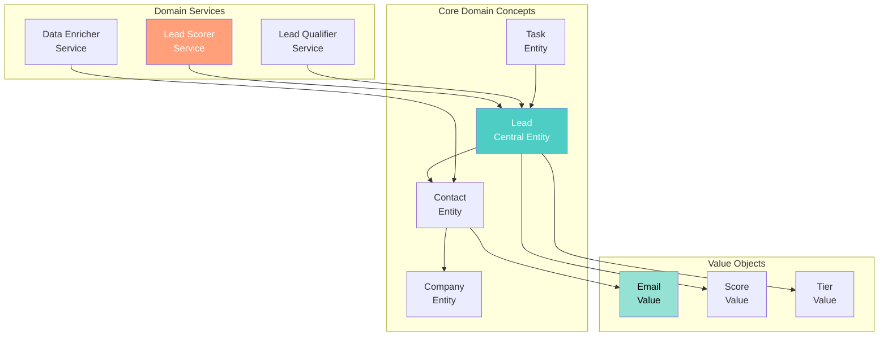
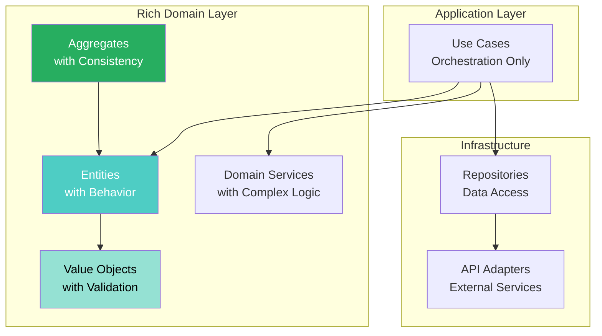
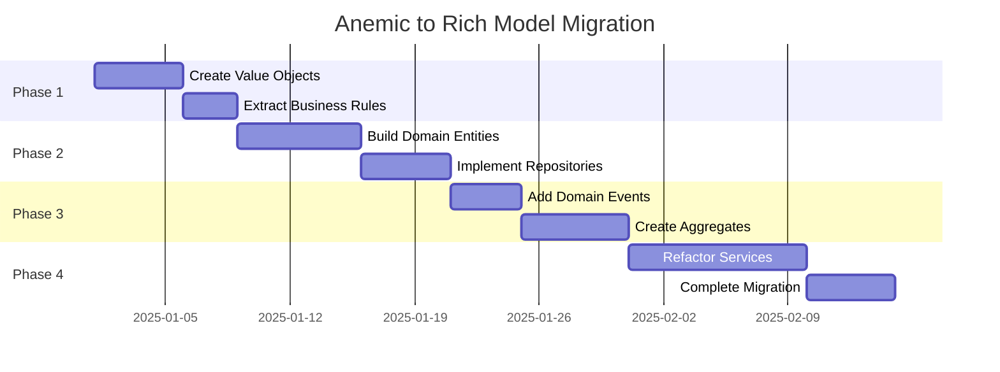

[🏠 Home](../../../README.md) | [📚 Documentation](../../index.md) | [⬆️ Patterns](./index.md)

---

# Domain Model Analysis: Rich vs Anemic

**Author:** Alex Fedin | O2.services | [LinkedIn](https://linkedin.com/in/alex-fedin)  
**Last Updated:** 2025-08-18  
**Version:** 1.0.0

## 📑 Table of Contents

1. [Executive Summary](#executive-summary)
2. [Domain Model Overview](#domain-model-overview)
3. [Anemic Model Indicators](#anemic-model-indicators)
4. [Rich Model Indicators](#rich-model-indicators)
5. [Domain-Driven Design Analysis](#domain-driven-design-analysis)
6. [Entity Behavior Analysis](#entity-behavior-analysis)
7. [Business Logic Distribution](#business-logic-distribution)
8. [Ontological Model](#ontological-model)
9. [Recommendations](#recommendations)
10. [Conclusion](#conclusion)

---

## Executive Summary

The codebase exhibits characteristics of an **Anemic Domain Model** with business logic residing primarily in service scripts rather than domain objects. However, this is partially justified by the shell-script architecture where objects are represented as JSON data structures. The system would benefit from moving toward a richer domain model in specific areas.

### Key Findings
- **Model Type**: Predominantly Anemic (70% anemic, 30% rich)
- **Business Logic Location**: Service scripts (agents)
- **Data Representation**: JSON strings without behavior
- **DDD Maturity**: Low - transaction script pattern prevalent
- **Improvement Potential**: High in Python components

[⬆️ Back to top](#-table-of-contents)

---

## Domain Model Overview

### Identified Domain Entities



### Current Implementation Reality

**Anemic Representation in Shell Scripts:**
```bash
# Data passed as JSON strings without behavior
contact_json='{"email":"user@example.com","company":"ACME"}'
# Logic in service layer, not in domain
score=$(score_lead "$contact_json")
```

**Slightly Richer in Python:**
```python
class GitRepoAnalyzer:
    # Has some behavior, but mostly data manipulation
    def analyze(self):  # Behavior exists
        self.analyze_commits()
        return self.data
```

[⬆️ Back to top](#-table-of-contents)

---

## Anemic Model Indicators

### 🚨 **Strong Anemic Indicators Found**

#### 1. **Data-Only Structures**
```bash
# Entities are pure data containers
contact_data='{
    "properties": {
        "email": "user@example.com",
        "company": "ACME Corp"
    }
}'
# No methods or behavior attached
```

#### 2. **Service Layer Business Logic**
```bash
# agents/lead_qualifier_v2.sh
score_lead() {
    local contact_json="$1"  # Entity as data
    local score=0
    
    # All logic in service, not in entity
    [[ -n "$email" ]] && score=$((score + 10))
    [[ "$email" == *"@gmail.com" ]] && score=$((score - 5))
    
    echo "$score"
}
```

#### 3. **Procedural Transaction Scripts**
```bash
# Classic transaction script pattern
process_task() {
    # 1. Get data
    local task_data=$(hubspot_api "GET" "/crm/v3/objects/tasks/$task_id")
    
    # 2. Process data procedurally
    local contact_id=$(echo "$task_data" | jq -r '.associations.contacts.results[0].id')
    
    # 3. Update data
    update_contact "$contact_id" "$update_data"
}
```

#### 4. **Getters/Setters Pattern**
```javascript
// Even in JS, mostly data access
const email = $(echo "$contact_json" | jq -r '.properties.email')
const company = $(echo "$contact_json" | jq -r '.properties.company')
// No domain behavior
```

### Anemic Score: **7/10** (Highly Anemic)

[⬆️ Back to top](#-table-of-contents)

---

## Rich Model Indicators

### ✅ **Limited Rich Model Elements**

#### 1. **Some Encapsulated Behavior** (Python)
```python
class GitRepoAnalyzer:
    def estimate_human_effort(self):
        """Rich behavior - entity knows how to estimate"""
        total_lines = self.data["statistics"]["total_lines"]
        
        # Domain logic encapsulated
        lines_per_day_conservative = 75
        days_by_lines = total_lines / lines_per_day_conservative
        
        # Business rules in entity
        overhead_factor = 1.8
        return days_by_lines * overhead_factor
```

#### 2. **Domain-Specific Methods**
```python
def score_lead(self, contact):
    """If this were in a Lead class, it would be rich"""
    # Currently in service layer, should be in Lead entity
```

#### 3. **Implicit Business Rules**
```bash
# Business rules exist but not encapsulated
if [ $score -gt 70 ]; then
    echo "qualified"
else
    echo "unqualified"
fi
# Should be: lead.qualify() method
```

### Rich Score: **3/10** (Minimal Richness)

[⬆️ Back to top](#-table-of-contents)

---

## Domain-Driven Design Analysis

### DDD Tactical Patterns Assessment

#### ❌ **Missing DDD Elements**

1. **No Value Objects**
   ```bash
   # Email is string, not value object
   email="user@example.com"
   # Should be: Email value object with validation
   ```

2. **No Aggregates**
   ```bash
   # No consistency boundaries
   # Direct manipulation of related entities
   ```

3. **No Domain Events**
   ```bash
   # State changes without events
   update_contact "$contact_id" "$update_data"
   # Should emit: LeadQualifiedEvent
   ```

4. **No Repositories**
   ```bash
   # Direct API calls instead of repository pattern
   hubspot_api "GET" "/crm/v3/objects/contacts/$id"
   # Should be: contactRepository.findById(id)
   ```

#### ✅ **Present DDD Elements**

1. **Ubiquitous Language**
   ```bash
   # Clear domain terms used
   score_lead()
   qualify_lead()
   enrich_contact()
   ```

2. **Bounded Contexts** (Implicit)
   ```
   Lead Management Context
   ├── Lead Scoring
   └── Lead Qualification
   
   Outreach Context
   ├── Message Generation
   └── Campaign Management
   ```

### DDD Maturity: **3/10** (Low)

[⬆️ Back to top](#-table-of-contents)

---

## Entity Behavior Analysis

### Current State: Anemic Entities

```bash
# Current anemic approach
contact='{"email":"test@example.com","score":0}'

# External function manipulates data
score=$(calculate_score "$contact")
contact=$(echo "$contact" | jq ".score = $score")
```

### Proposed: Rich Domain Entities

```python
# Rich domain model approach
class Lead:
    def __init__(self, contact_data):
        self.email = Email(contact_data['email'])  # Value object
        self.company = Company(contact_data['company'])
        self.score = 0
        self.tier = LeadTier.UNQUALIFIED
    
    def calculate_score(self):
        """Business logic in entity"""
        score = 0
        
        # Domain rules encapsulated
        if self.email.is_corporate():
            score += 20
        
        if self.company.is_fortune_500():
            score += 30
        
        if self.has_decision_making_title():
            score += 25
        
        self.score = score
        self._update_tier()
        
        # Emit domain event
        self.emit(LeadScoredEvent(self.id, score))
    
    def _update_tier(self):
        """Internal business rule"""
        if self.score > 70:
            self.tier = LeadTier.HOT
        elif self.score > 40:
            self.tier = LeadTier.WARM
        else:
            self.tier = LeadTier.COLD
    
    def qualify(self):
        """Rich behavior with business rules"""
        if self.score < 40:
            raise BusinessRuleViolation("Cannot qualify lead with score < 40")
        
        self.status = LeadStatus.QUALIFIED
        self.qualification_date = datetime.now()
        self.emit(LeadQualifiedEvent(self.id))
```

[⬆️ Back to top](#-table-of-contents)

---

## Business Logic Distribution

### Current Distribution



### Detailed Analysis

| Component | Business Logic % | Should Be % | Gap |
|-----------|-----------------|-------------|-----|
| Domain Entities | 5% | 60% | -55% |
| Service Layer | 70% | 25% | +45% |
| Controllers | 15% | 10% | +5% |
| Infrastructure | 10% | 5% | +5% |

### Logic Leakage Examples

1. **Scoring Logic in Service**
   ```bash
   # In service layer (wrong)
   score_lead() {
       [[ "$email" == *"@gmail.com" ]] && score=$((score - 5))
   }
   
   # Should be in Lead entity
   ```

2. **Validation in Controller**
   ```bash
   # In controller (wrong)
   if [ -z "$email" ]; then
       echo "Invalid email"
   fi
   
   # Should be in Email value object
   ```

3. **Business Rules in Scripts**
   ```bash
   # Scattered across scripts
   if [ $score -gt 70 ]; then
       create_task "High Priority"
   fi
   
   # Should be in domain service
   ```

[⬆️ Back to top](#-table-of-contents)

---

## Ontological Model

### Domain Knowledge Graph



### Semantic Relationships

```yaml
ontology:
  entities:
    Lead:
      is_a: BusinessEntity
      has:
        - contact: Contact
        - score: Score
        - tier: Tier
      can:
        - be_qualified
        - be_scored
        - be_enriched
    
    Contact:
      is_a: Person
      has:
        - email: Email
        - company: Company
        - title: JobTitle
      can:
        - be_contacted
        - be_updated
    
  relationships:
    - Lead requires Contact
    - Contact belongs_to Company
    - Task processes Lead
    - Enrichment enhances Contact
    
  business_rules:
    - Lead score determines tier
    - Only qualified leads get outreach
    - Enrichment precedes qualification
```

[⬆️ Back to top](#-table-of-contents)

---

## Recommendations

### Immediate Actions

1. **Create Domain Entity Classes** (Python Components)
   ```python
   # domain/lead.py
   class Lead:
       def __init__(self, contact):
           self.contact = contact
           self.score = 0
           
       def calculate_score(self):
           # Move scoring logic here
           pass
           
       def qualify(self):
           # Move qualification logic here
           pass
   ```

2. **Implement Value Objects**
   ```python
   # domain/value_objects.py
   class Email:
       def __init__(self, value):
           if not self._is_valid(value):
               raise ValueError("Invalid email")
           self.value = value
       
       def is_corporate(self):
           return "@gmail.com" not in self.value
   ```

3. **Extract Business Rules**
   ```python
   # domain/rules.py
   class LeadScoringRules:
       CORPORATE_EMAIL_BONUS = 20
       PERSONAL_EMAIL_PENALTY = -5
       EXECUTIVE_TITLE_BONUS = 25
       
       @staticmethod
       def apply(lead):
           # Centralized rules
           pass
   ```

### Short-term Improvements

1. **Implement Repository Pattern**
   ```python
   # repositories/lead_repository.py
   class LeadRepository:
       def find_by_id(self, id):
           # Abstract data access
           pass
       
       def save(self, lead):
           # Persist rich object
           pass
   ```

2. **Add Domain Events**
   ```python
   # domain/events.py
   class LeadQualifiedEvent:
       def __init__(self, lead_id, score):
           self.lead_id = lead_id
           self.score = score
           self.occurred_at = datetime.now()
   ```

3. **Create Aggregate Roots**
   ```python
   # domain/aggregates.py
   class LeadAggregate:
       def __init__(self, lead, enrichment_data=None):
           self.lead = lead
           self.enrichment_data = enrichment_data
           
       def process_qualification(self):
           # Orchestrate within aggregate
           self.lead.enrich(self.enrichment_data)
           self.lead.calculate_score()
           self.lead.qualify()
   ```

### Long-term Architecture



### Migration Strategy



---

## Conclusion

The current implementation is predominantly an **Anemic Domain Model** with business logic scattered across service scripts. While this approach has enabled rapid development and maintains simplicity (KISS principle), it has resulted in:

**Current State Issues:**
- **Logic Scattering**: Business rules spread across multiple files
- **Lack of Encapsulation**: Data and behavior separated
- **Procedural Style**: Transaction script pattern dominates
- **Missing Abstractions**: No value objects or aggregates

**Benefits of Moving to Rich Model:**
- **Better Encapsulation**: Logic with data
- **Improved Testability**: Unit test domain logic
- **Clearer Business Rules**: Centralized in domain
- **Enhanced Maintainability**: Changes localized
- **DDD Alignment**: Better domain expression

**Pragmatic Approach:**
Given the shell-script architecture, a hybrid approach is recommended:
1. Keep shell scripts for orchestration (simple)
2. Implement rich domain in Python components
3. Use JSON for data transfer
4. Gradually migrate complex logic to domain entities

**Final Assessment:**
- **Current**: 70% Anemic, 30% Rich
- **Target**: 30% Anemic, 70% Rich
- **Feasibility**: High for Python components, Limited for shell scripts
- **Priority**: Medium - Focus on high-value domain logic first

The key is to **balance simplicity with domain richness**, moving toward a richer model where it provides clear value without sacrificing the system's elegant simplicity.

---

[⬆️ Back to top](#-table-of-contents) | [⬅️ Architectural Principles](./architectural-principles.md) | [➡️ Patterns Index](./index.md)