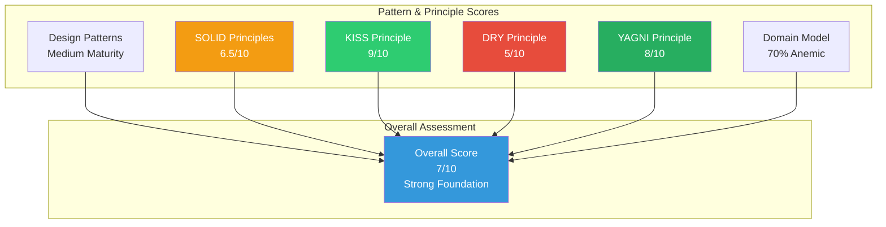
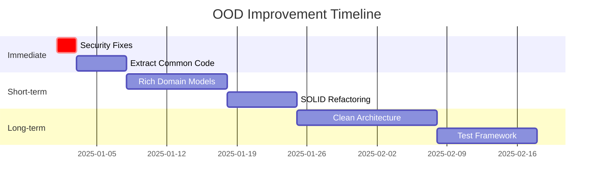
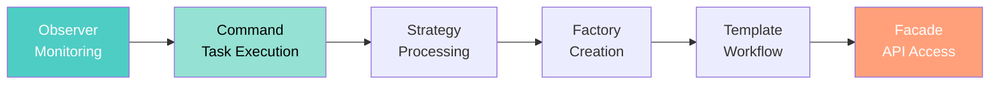

[🏠 Home](../../../README.md) | [📚 Documentation](../../index.md) | [🏗️ Architecture Hub](../README.md)

---

# Object-Oriented Design Patterns & Principles Analysis

**Author:** Alex Fedin | O2.services | [LinkedIn](https://linkedin.com/in/alex-fedin)  
**Last Updated:** 2025-08-18  
**Version:** 1.0.0

## 📑 Quick Navigation

### 📖 Essential Reading (Start Here)
1. [Design Patterns Analysis](./design-patterns.md) - Identified patterns with examples
2. [SOLID Principles Analysis](./solid-analysis.md) - SOLID principle adherence assessment
3. [Architectural Principles](./architectural-principles.md) - KISS, DRY, YAGNI, TRIZ analysis
4. [Domain Model Analysis](./domain-model-analysis.md) - Rich vs Anemic model evaluation

### 🎯 By Topic

- **Design Patterns:** [Creational](./design-patterns.md#creational-patterns), [Structural](./design-patterns.md#structural-patterns), [Behavioral](./design-patterns.md#behavioral-patterns)
- **SOLID Principles:** [SRP](./solid-analysis.md#single-responsibility-principle-srp), [OCP](./solid-analysis.md#openclosed-principle-ocp), [LSP](./solid-analysis.md#liskov-substitution-principle-lsp), [ISP](./solid-analysis.md#interface-segregation-principle-isp), [DIP](./solid-analysis.md#dependency-inversion-principle-dip)
- **Core Principles:** [KISS](./architectural-principles.md#kiss---keep-it-simple-stupid), [DRY](./architectural-principles.md#dry---dont-repeat-yourself), [YAGNI](./architectural-principles.md#yagni---you-arent-gonna-need-it)
- **Advanced Concepts:** [TRIZ](./architectural-principles.md#triz-principles-for-software), [Clean Architecture](./architectural-principles.md#clean-architecture-principles), [DDD](./domain-model-analysis.md#domain-driven-design-analysis)

## 📊 Analysis Summary

## 🔍 Key Findings

### Strengths 💪
- **Exceptional Simplicity**: KISS principle mastery (9/10)
- **Minimal Over-engineering**: Strong YAGNI adherence (8/10)
- **Innovative Patterns**: Novel use of HubSpot as message queue
- **Clear Separation**: Good SRP in agent architecture
- **Natural Boundaries**: Implicit ISP through script separation

### Weaknesses ⚠️
- **Code Duplication**: Significant DRY violations (5/10)
- **Anemic Domain**: 70% anemic model with logic in services
- **Missing Abstractions**: Limited formal interfaces
- **Security Issues**: Hardcoded credentials found
- **Limited Testing**: No TDD evidence

### Opportunities 🚀
- Extract common patterns to shared libraries
- Implement rich domain models in Python components
- Add formal interface definitions
- Create abstraction layers for external dependencies
- Implement comprehensive testing framework

## 📈 Improvement Roadmap

## 📋 Pattern Catalog

### Identified Patterns

| Pattern | Category | Implementation | Quality |
|---------|----------|---------------|---------|
| Factory | Creational | Agent spawning | Partial |
| Singleton | Creational | Configuration | Good |
| Builder | Creational | GitRepoAnalyzer | Good |
| Facade | Structural | HubSpot API | Excellent |
| Adapter | Structural | MCP integration | Good |
| Observer | Behavioral | Task monitoring | Adapted |
| Command | Behavioral | Task execution | Excellent |
| Strategy | Behavioral | Lead scoring | Good |
| Template Method | Behavioral | Agent processing | Implicit |

### Anti-Patterns Found

| Anti-Pattern | Severity | Location | Impact |
|--------------|----------|----------|--------|
| Hardcoded Credentials | HIGH | JS demos | Security risk |
| God Object | MEDIUM | GitRepoAnalyzer | Maintainability |
| Magic Numbers | LOW | Scoring logic | Readability |
| Copy-Paste | MEDIUM | Agent scripts | Duplication |

## 🎯 Recommendations by Priority

### 🔴 Critical (Do Immediately)
1. Remove hardcoded credentials
2. Implement secure credential management
3. Fix security vulnerabilities

### 🟡 High (Next Sprint)
1. Extract common functions (DRY)
2. Create shared libraries
3. Implement error handling patterns

### 🟢 Medium (Next Quarter)
1. Build rich domain models
2. Add abstraction layers
3. Implement repository pattern
4. Create formal interfaces

### 🔵 Low (Future)
1. Full Clean Architecture
2. Complete DDD implementation
3. Advanced TRIZ applications

## 📚 Document Index

| Document | Description | Focus Area |
|----------|-------------|------------|
| [Design Patterns](./design-patterns.md) | Comprehensive pattern analysis | GoF patterns, enterprise patterns |
| [SOLID Analysis](./solid-analysis.md) | SOLID principle compliance | OOP principles adherence |
| [Architectural Principles](./architectural-principles.md) | Core development principles | KISS, DRY, YAGNI, TRIZ |
| [Domain Model Analysis](./domain-model-analysis.md) | Domain modeling assessment | Rich vs Anemic, DDD |

## 🔄 Pattern Interactions

## 📊 Metrics Dashboard

| Metric | Current | Target | Status |
|--------|---------|--------|--------|
| SOLID Score | 6.5/10 | 8/10 | ⚠️ |
| KISS Score | 9/10 | 9/10 | ✅ |
| DRY Score | 5/10 | 8/10 | 🔴 |
| YAGNI Score | 8/10 | 9/10 | ✅ |
| Code Duplication | 25% | <10% | 🔴 |
| Test Coverage | <5% | >80% | 🔴 |
| Rich Domain | 30% | 70% | ⚠️ |

## 🎓 Learning Resources

### Best Practices Applied
- Shell script simplicity over framework complexity
- Task-based message queue using CRM
- AI-assisted processing for complex logic
- Stateless agent design for scalability

### Innovative Approaches
- HubSpot as infrastructure (TRIZ principle)
- CRM tasks as message queue
- Shell scripts as microservices
- AI for business logic

## 🔮 Future Vision

The architecture should evolve toward:
1. **Richer domain models** while maintaining simplicity
2. **Better abstractions** without over-engineering
3. **Formal contracts** while staying flexible
4. **Comprehensive testing** without slowing development
5. **Clean architecture** adapted for shell scripts

---

## Navigation

[🏗️ Architecture Hub](../README.md) | [🗺️ Navigation](../navigation.md) | [📋 Contents](../toc.md) | [🏠 Home](../../../README.md)

---

**Document Version**: 1.0.0  
**Last Updated**: 2025-08-18  
**Next Review**: 2025-09-18