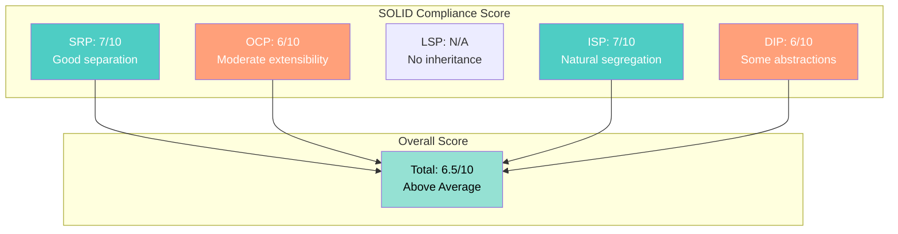

[🏠 Home](../../../README.md) | [📚 Documentation](../../index.md) | [⬆️ Patterns](./index.md)

---

# SOLID Principles Analysis

**Author:** Alex Fedin | O2.services | [LinkedIn](https://linkedin.com/in/alex-fedin)  
**Last Updated:** 2025-08-18  
**Version:** 1.0.0

## 📑 Table of Contents

1. [Executive Summary](#executive-summary)
2. [Single Responsibility Principle (SRP)](#single-responsibility-principle-srp)
3. [Open/Closed Principle (OCP)](#openclosed-principle-ocp)
4. [Liskov Substitution Principle (LSP)](#liskov-substitution-principle-lsp)
5. [Interface Segregation Principle (ISP)](#interface-segregation-principle-isp)
6. [Dependency Inversion Principle (DIP)](#dependency-inversion-principle-dip)
7. [Overall SOLID Score](#overall-solid-score)
8. [Violations and Refactoring Opportunities](#violations-and-refactoring-opportunities)
9. [Recommendations](#recommendations)

---

## Executive Summary

The codebase shows mixed adherence to SOLID principles, with strengths in single responsibility and dependency abstraction, but challenges in formal interface design due to the shell-script architecture. The system scores **6.5/10** overall for SOLID compliance.

### Key Findings
- **SRP**: Good - Each agent has a clear, single purpose
- **OCP**: Moderate - Extension through new agents, but limited polymorphism
- **LSP**: N/A - No formal inheritance in shell scripts
- **ISP**: Implicit - Natural segregation through script boundaries
- **DIP**: Good - Dependencies on abstractions (APIs, not implementations)

[⬆️ Back to top](#-table-of-contents)

---

## Single Responsibility Principle (SRP)

> "A class should have only one reason to change"

### Adherence Analysis

#### ✅ **Good Examples**

1. **Agent Scripts** - Each has single responsibility
   ```bash
   # agents/lead_qualifier_v2.sh
   # Single Responsibility: Qualify leads
   score_lead() {
       # Only scoring logic
   }
   
   # agents/data_enricher.sh
   # Single Responsibility: Enrich contact data
   enrich_contact() {
       # Only enrichment logic
   }
   ```

2. **Python Analysis Scripts**
   ```python
   # scripts/python/analysis/analyze_repo.py
   class GitRepoAnalyzer:
       # Single Responsibility: Analyze git repository
       # (Though class is large, it has one cohesive purpose)
   ```

#### ❌ **Violations**

1. **GitRepoAnalyzer Class** - Multiple responsibilities
   ```python
   class GitRepoAnalyzer:
       def analyze_commits(self)     # Responsibility 1: Commit analysis
       def analyze_files(self)       # Responsibility 2: File analysis
       def calculate_statistics(self) # Responsibility 3: Statistics
       def estimate_human_effort(self) # Responsibility 4: Estimation
       def export_to_json(self)      # Responsibility 5: Data export
   ```
   **Impact**: Medium - Class doing too much
   **Fix**: Split into specialized analyzers

2. **Task Monitor** - Multiple concerns
   ```bash
   # Responsibilities:
   # 1. Polling tasks
   # 2. Routing to agents
   # 3. Managing agent lifecycle
   # 4. Logging
   ```

### SRP Score: **7/10**

[⬆️ Back to top](#-table-of-contents)

---

## Open/Closed Principle (OCP)

> "Software entities should be open for extension but closed for modification"

### Adherence Analysis

#### ✅ **Good Examples**

1. **Agent System** - New agents without modifying core
   ```bash
   # Easy to add new agent without changing existing code
   # Just create new script and update routing rules
   ```

2. **Task Routing** - Extensible pattern matching
   ```bash
   case "$task_type" in
       "Qualify Lead") ./lead_qualifier.sh ;;
       "Enrich Data") ./data_enricher.sh ;;
       # Easy to add new cases
   esac
   ```

#### ❌ **Violations**

1. **Hardcoded Scoring Logic**
   ```bash
   # agents/lead_qualifier_v2.sh
   [[ "$email" == *"@gmail.com" ]] && score=$((score - 5))
   # Modifying scoring requires changing code
   ```
   **Fix**: Configuration-driven scoring rules

2. **Fixed Agent Selection**
   ```bash
   # No plugin architecture for dynamic agent loading
   ```

### OCP Score: **6/10**

[⬆️ Back to top](#-table-of-contents)

---

## Liskov Substitution Principle (LSP)

> "Subtypes must be substitutable for their base types"

### Adherence Analysis

#### 🔍 **Limited Applicability**

Shell scripts don't have formal inheritance, but we can analyze behavioral substitutability:

#### ✅ **Behavioral Consistency**

1. **All Agents Follow Same Contract**
   ```bash
   # Every agent can be called with: ./agent.sh $TASK_ID
   # Every agent returns consistent exit codes
   ```

2. **Standardized API Responses**
   ```bash
   # All API helpers return JSON in same format
   ```

#### ❌ **Potential Issues**

1. **Inconsistent Error Handling**
   ```bash
   # Some agents exit on error, others continue
   # Not truly substitutable
   ```

### LSP Score: **N/A** (Not applicable to shell architecture)

[⬆️ Back to top](#-table-of-contents)

---

## Interface Segregation Principle (ISP)

> "Clients should not be forced to depend on interfaces they don't use"

### Adherence Analysis

#### ✅ **Natural Segregation**

1. **Script Boundaries as Interfaces**
   ```bash
   # Each script exposes minimal interface
   # agents/lead_qualifier.sh - only scoring interface
   # agents/data_enricher.sh - only enrichment interface
   ```

2. **Focused API Helpers**
   ```bash
   # hubspot_api_helper.sh
   get_contact()    # Only for contact operations
   update_contact() # Specific to contacts
   get_tasks()      # Only for task operations
   ```

#### ❌ **Violations**

1. **Monolithic Python Classes**
   ```python
   # GitRepoAnalyzer forces clients to have all methods
   # Even if they only need commit analysis
   ```

### ISP Score: **7/10**

[⬆️ Back to top](#-table-of-contents)

---

## Dependency Inversion Principle (DIP)

> "Depend on abstractions, not concretions"

### Adherence Analysis

#### ✅ **Good Examples**

1. **API Abstraction**
   ```bash
   # Agents depend on hubspot_api_helper abstraction
   source "$SCRIPT_DIR/hubspot_api_helper.sh"
   # Not on direct curl implementations
   ```

2. **Configuration Abstraction**
   ```bash
   # Using environment variables as abstraction
   HUBSPOT_API_KEY="${HUBSPOT_PRIVATE_APP_TOKEN}"
   # Not hardcoded values
   ```

3. **AI Abstraction**
   ```bash
   # Depends on claude-eng interface
   if command -v ~/claude-eng &> /dev/null; then
       # Use AI abstraction
   fi
   ```

#### ❌ **Violations**

1. **Direct File System Dependencies**
   ```bash
   # Direct paths instead of abstracted storage
   echo "..." >> ../logs/agent_activity.log
   ```

2. **Hardcoded External Services**
   ```javascript
   // Direct Puppeteer dependency
   const puppeteer = require('puppeteer-core');
   ```

### DIP Score: **6/10**

[⬆️ Back to top](#-table-of-contents)

---

## Overall SOLID Score



### Scoring Breakdown
- **Single Responsibility**: 7/10 ✅
- **Open/Closed**: 6/10 ⚠️
- **Liskov Substitution**: N/A
- **Interface Segregation**: 7/10 ✅
- **Dependency Inversion**: 6/10 ⚠️

**Overall**: **6.5/10** - Above average SOLID compliance

[⬆️ Back to top](#-table-of-contents)

---

## Violations and Refactoring Opportunities

### Critical Violations

1. **Hardcoded Credentials (DIP Violation)**
   ```javascript
   // BEFORE - scripts/js/demo/hubspot-puppeteer-helper.js
   const email = 'af@o2.services';
   const password = 'Vilisaped1!';
   
   // AFTER - Use dependency injection
   class HubSpotAuthenticator {
       constructor(credentialProvider) {
           this.credentials = credentialProvider.getCredentials();
       }
   }
   ```

2. **God Object (SRP Violation)**
   ```python
   # BEFORE - Single large class
   class GitRepoAnalyzer:
       # 390+ lines, multiple responsibilities
   
   # AFTER - Separated concerns
   class CommitAnalyzer:
       def analyze_commits(self)
   
   class FileAnalyzer:
       def analyze_files(self)
   
   class StatisticsCalculator:
       def calculate_statistics(self)
   
   class EffortEstimator:
       def estimate_effort(self)
   ```

3. **Hardcoded Logic (OCP Violation)**
   ```bash
   # BEFORE - Hardcoded scoring
   [[ "$email" == *"@gmail.com" ]] && score=$((score - 5))
   
   # AFTER - Configuration driven
   source scoring_rules.conf
   apply_email_rules "$email" # Rules loaded from config
   ```

### Medium Priority Refactoring

1. **Extract Common Agent Interface**
   ```bash
   # agent_base.sh - Common interface
   process_task() {
       validate_input "$1"
       fetch_data "$1"
       execute_business_logic "$1"
       update_systems "$1"
       handle_errors
   }
   ```

2. **Implement Strategy Pattern for Scoring**
   ```bash
   # scoring_strategies/
   # ├── email_strategy.sh
   # ├── title_strategy.sh
   # └── company_strategy.sh
   
   load_scoring_strategy "$strategy_name"
   ```

3. **Abstract File System Operations**
   ```bash
   # storage_abstraction.sh
   write_log() {
       local message="$1"
       local storage_backend="${STORAGE_BACKEND:-file}"
       
       case "$storage_backend" in
           file) echo "$message" >> "$LOG_PATH" ;;
           s3) aws s3 cp - "s3://logs/$message" ;;
           *) echo "$message" ;;
       esac
   }
   ```

[⬆️ Back to top](#-table-of-contents)

---

## Recommendations

### Immediate Actions

1. **Security First (DIP)**
   - Move all credentials to environment variables
   - Implement credential provider abstraction
   - Add secret management service integration

2. **Break Down Large Classes (SRP)**
   - Split GitRepoAnalyzer into focused components
   - Each component: <100 lines, single purpose
   - Use composition over large classes

3. **Configuration-Driven Logic (OCP)**
   - Move business rules to configuration
   - Implement rule engine abstraction
   - Enable runtime rule changes

### Short-term Improvements (1-2 weeks)

1. **Formalize Agent Contract**
   ```bash
   # agent_contract.sh
   # Mandatory functions each agent must implement
   initialize_agent()
   process_task()
   cleanup_agent()
   get_agent_status()
   ```

2. **Implement Dependency Injection Container**
   ```bash
   # di_container.sh
   register_service "api_client" "hubspot_api_helper.sh"
   register_service "logger" "file_logger.sh"
   get_service "api_client" # Returns configured instance
   ```

3. **Add Plugin Architecture**
   ```bash
   # plugin_loader.sh
   load_plugins_from "./plugins"
   register_plugin_hooks
   ```

### Long-term Architecture (1-3 months)

1. **Microservices Evolution**
   - Each agent as containerized service
   - Formal API contracts (OpenAPI)
   - Service mesh for communication

2. **Event-Driven Architecture**
   - Implement proper event bus
   - Event sourcing for audit trail
   - CQRS for read/write separation

3. **Formal Interface Definitions**
   ```yaml
   # agent_interface.yaml
   interface: Agent
   version: 1.0.0
   methods:
     - name: processTask
       input: TaskID
       output: Result
     - name: getStatus
       output: Status
   ```

### SOLID Improvement Roadmap


---

## Conclusion

The codebase demonstrates reasonable SOLID principle adherence given its shell-script architecture. The natural boundaries created by separate scripts provide good separation of concerns and interface segregation. However, there are opportunities for improvement in:

1. **Security practices** - Remove hardcoded credentials
2. **Class design** - Break down large classes
3. **Extensibility** - More configuration-driven logic
4. **Abstractions** - Better dependency management

The pragmatic approach taken (simplicity over complexity) is commendable, but some SOLID principles can be better applied without adding unnecessary complexity.

**Key Strengths:**
- Clear agent separation (SRP)
- Natural interface boundaries (ISP)
- API abstractions (DIP)

**Key Weaknesses:**
- Hardcoded business logic (OCP)
- Large classes in Python code (SRP)
- Direct service dependencies (DIP)

With targeted refactoring, the codebase can achieve 8+/10 SOLID compliance while maintaining its simplicity-first philosophy.

---

[⬆️ Back to top](#-table-of-contents) | [⬅️ Design Patterns](./design-patterns.md) | [➡️ Architectural Principles](./architectural-principles.md)