[🏠 Home](../../../README.md) | [📚 Documentation](../../index.md) | [🏗️ Architecture](../../architecture/index.md) | [⬆️ Robustness](./index.md)

---

# Boundary Objects Analysis (ICONIX Process)

**Author:** Alex Fedin | [O2.services](https://O2.services) | [LinkedIn](https://linkedin.com/in/alex-fedin)  
**Last Updated:** 2025-08-18  
**Version:** 1.0.0  
**Methodology:** ICONIX Process

## 📑 Table of Contents

1. [Overview](#overview)
2. [Boundary Objects Definition](#boundary-objects-definition)
3. [Interface Components](#interface-components)
4. [External System Interfaces](#external-system-interfaces)
5. [User Interface Boundaries](#user-interface-boundaries)
6. [API Boundaries](#api-boundaries)
7. [Data Exchange Boundaries](#data-exchange-boundaries)
8. [Boundary Objects Catalog](#boundary-objects-catalog)
9. [Related Components](#related-components)

---

## Overview

In the ICONIX methodology, **Boundary Objects** represent interfaces between the system and external entities (users, systems, or devices). These objects handle input/output operations and act as gatekeepers for the system's internal logic.

### ICONIX Notation in Mermaid
- **Boundary Objects**: Represented with `<<boundary>>` stereotype
- **Interface Points**: Input/output channels
- **External Actors**: System users and external systems

---

## Boundary Objects Definition

### Classification Criteria
1. **User Interface Components**: CLI, web interfaces, notifications
2. **System Interfaces**: API endpoints, external service connectors
3. **Data Interfaces**: File handlers, configuration readers
4. **Communication Interfaces**: Message queues, event handlers

---

## Interface Components

### Human-System Interfaces

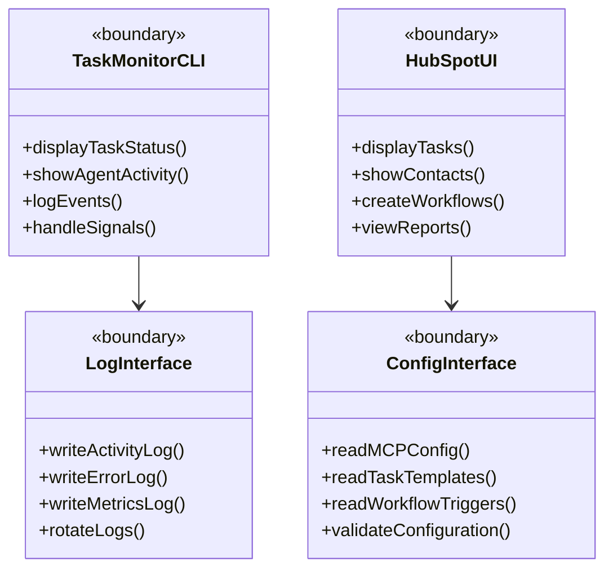

### System-to-System Interfaces

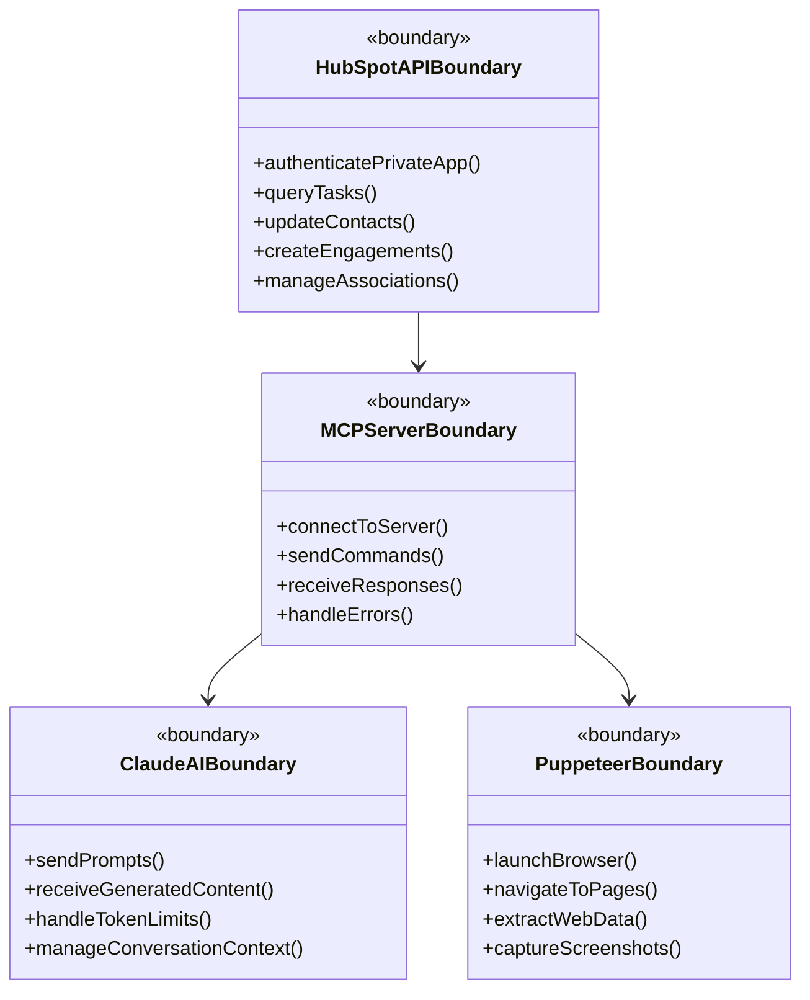

---

## External System Interfaces

### Third-Party Service Boundaries

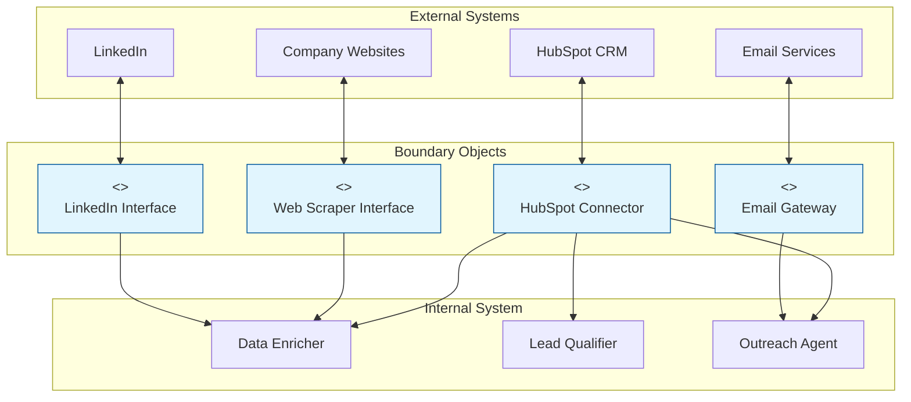

---

## User Interface Boundaries

### Command Line Interfaces

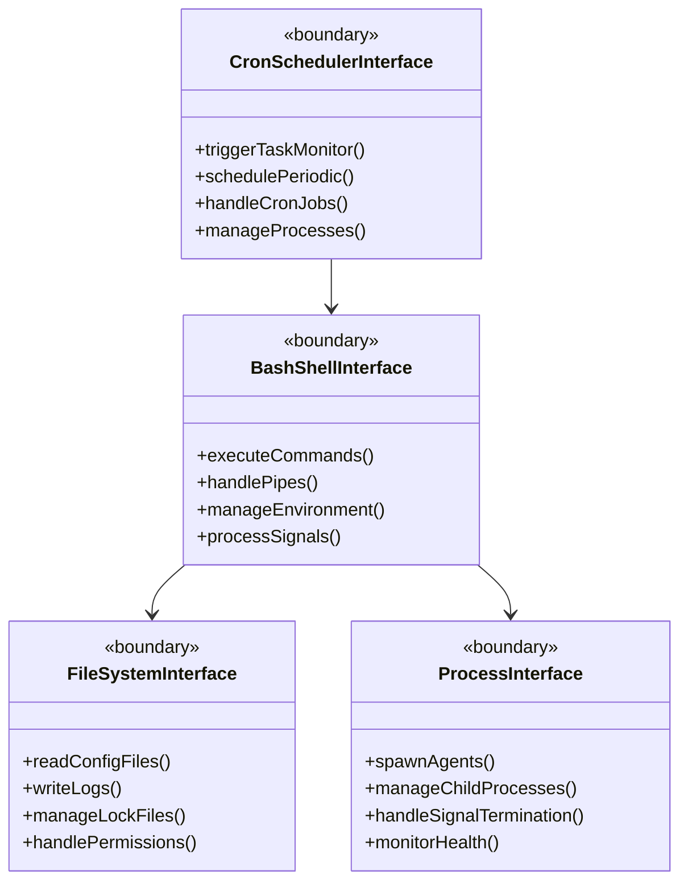

### Notification Boundaries

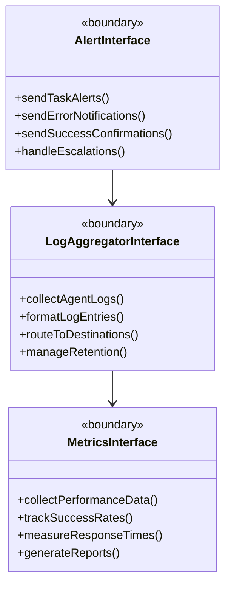

---

## API Boundaries

### REST API Interfaces

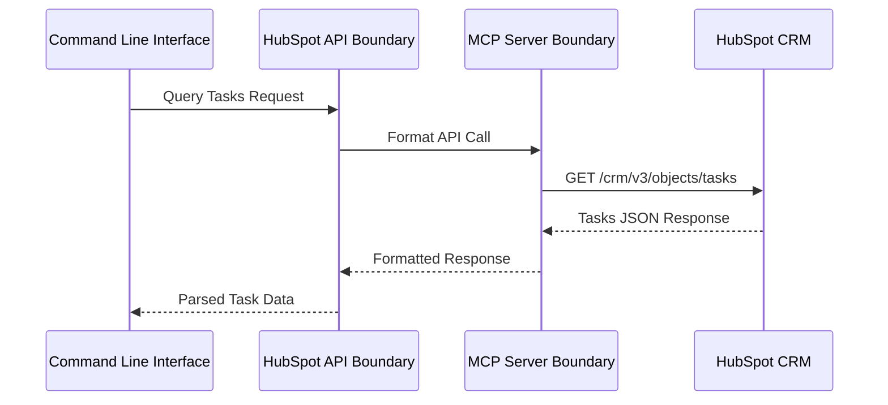

### Authentication Boundaries

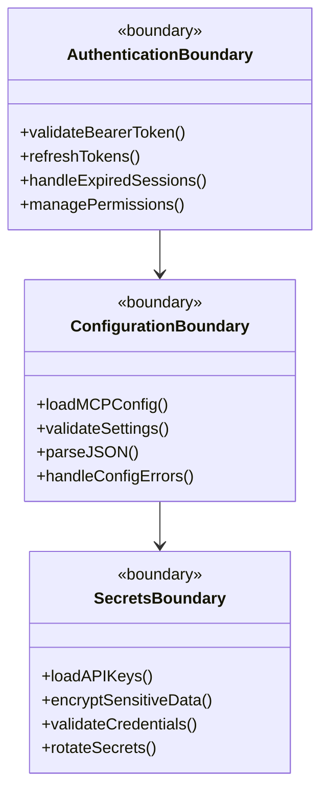

---

## Data Exchange Boundaries

### JSON Data Handlers

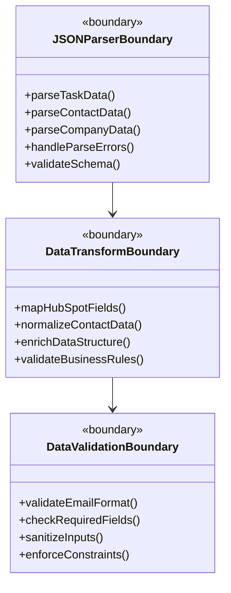

### File System Boundaries

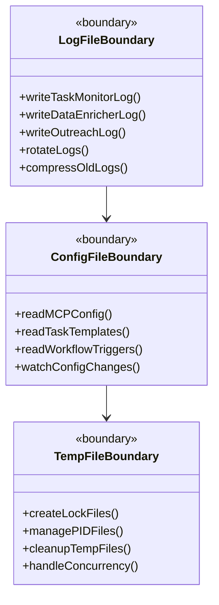

---

## Boundary Objects Catalog

### Complete Boundary Objects List

| Boundary Object | Type | External Entity | Internal Components |
|----------------|------|-----------------|-------------------|
| **HubSpotAPIBoundary** | System API | HubSpot CRM | All Agents |
| **MCPServerBoundary** | Service API | MCP Server | Task Monitor |
| **ClaudeAIBoundary** | AI Service | Claude AI | Lead Qualifier, Outreach Agent |
| **PuppeteerBoundary** | Browser API | Web Browser | Data Enricher |
| **TaskMonitorCLI** | User Interface | System Admin | Task Monitor |
| **CronSchedulerInterface** | System Service | Cron Daemon | Task Monitor |
| **FileSystemInterface** | OS Interface | File System | All Components |
| **LogInterface** | Data Interface | Log Files | All Agents |
| **ConfigInterface** | Data Interface | Config Files | All Agents |
| **AuthenticationBoundary** | Security | Auth Services | API Connectors |
| **JSONParserBoundary** | Data Format | JSON Data | Data Processors |
| **AlertInterface** | Notification | Alert Systems | Error Handlers |

### Boundary Object Dependencies

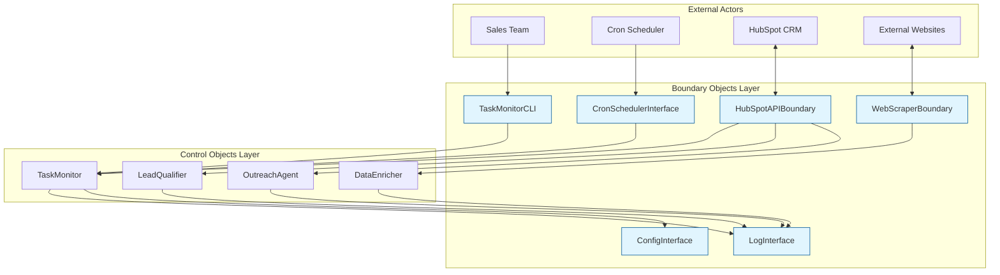

---

## Related Components

### Mapping to Code Components

| Boundary Object | Implementation Files |
|----------------|---------------------|
| **HubSpotAPIBoundary** | `agents/hubspot_api_helper.sh` |
| **TaskMonitorCLI** | `agents/task_monitor.sh` |
| **MCPServerBoundary** | Claude MCP integration calls |
| **ConfigInterface** | `config/*.json`, `config/*.sh` |
| **LogInterface** | `logs/*.log` files |
| **CronSchedulerInterface** | System cron configuration |
| **FileSystemInterface** | Shell script file operations |
| **PuppeteerBoundary** | MCP Puppeteer integration |
| **JSONParserBoundary** | `jq` command usage in scripts |

### Interface Contracts

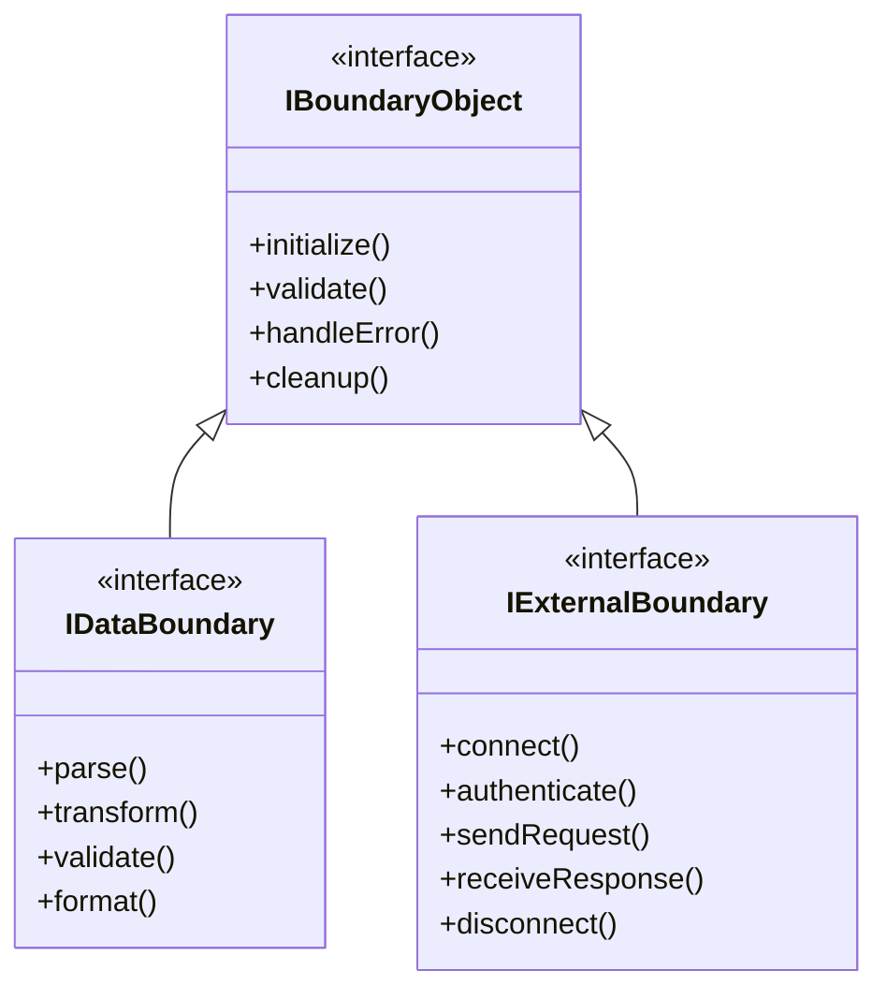

---

[⬆️ Back to top](#-table-of-contents) | [⬅️ Robustness](./index.md) | [➡️ Control Objects](./control-objects.md)