[🏠 Home](../../../README.md) | [📚 Documentation](../../index.md) | [🏗️ Architecture](../../architecture/index.md) | [⬆️ Robustness](./index.md)

---

# Control Objects Analysis (ICONIX Process)

**Author:** Alex Fedin | [O2.services](https://O2.services) | [LinkedIn](https://linkedin.com/in/alex-fedin)  
**Last Updated:** 2025-08-18  
**Version:** 1.0.0  
**Methodology:** ICONIX Process

## 📑 Table of Contents

1. [Overview](#overview)
2. [Control Objects Definition](#control-objects-definition)
3. [Business Logic Controllers](#business-logic-controllers)
4. [Workflow Orchestration](#workflow-orchestration)
5. [Agent Coordination](#agent-coordination)
6. [Process Management](#process-management)
7. [Decision Making Controllers](#decision-making-controllers)
8. [Control Objects Catalog](#control-objects-catalog)
9. [Related Components](#related-components)

---

## Overview

In the ICONIX methodology, **Control Objects** represent the business logic and workflow coordination of the system. They orchestrate interactions between boundary objects and entity objects, implementing use case scenarios and business rules.

### ICONIX Notation in Mermaid
- **Control Objects**: Represented with `<<control>>` stereotype
- **Orchestration**: Workflow and process management
- **Business Logic**: Rules and decision-making processes

---

## Control Objects Definition

### Classification Criteria
1. **Orchestration Controllers**: Coordinate multiple operations
2. **Business Logic Controllers**: Implement domain rules
3. **Process Controllers**: Manage system workflows
4. **Decision Controllers**: Handle conditional logic and routing

---

## Business Logic Controllers

### Lead Management Controllers

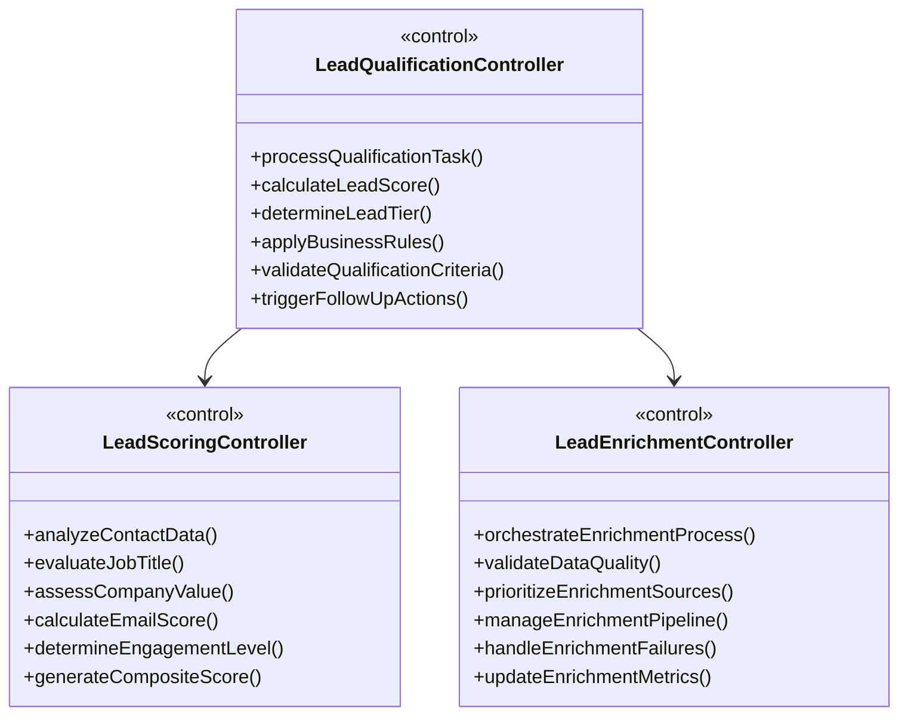

### Campaign Management Controllers

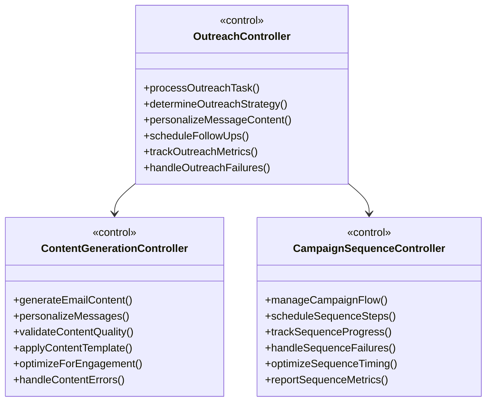

---

## Workflow Orchestration

### Task Orchestration Controller

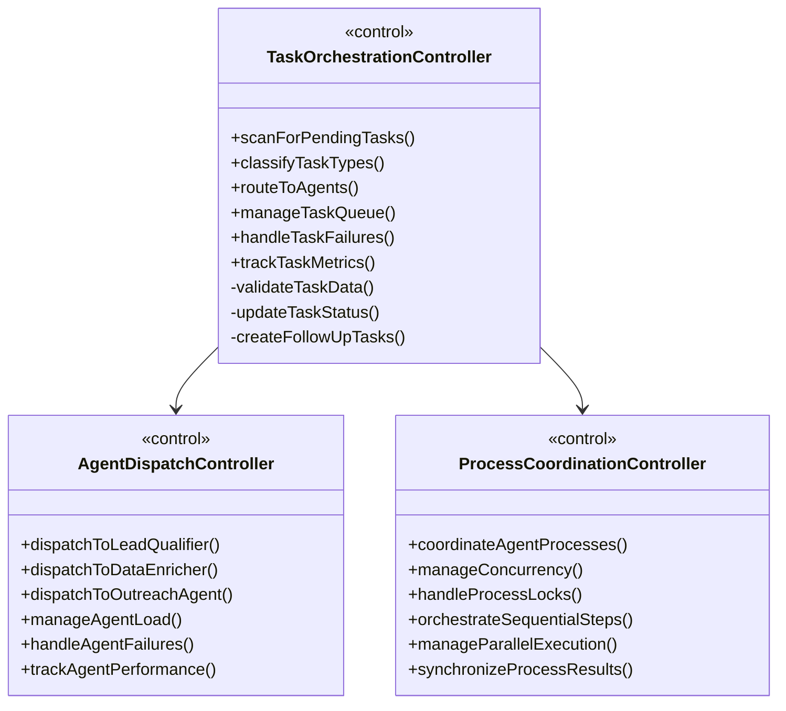

### Workflow Sequence Control

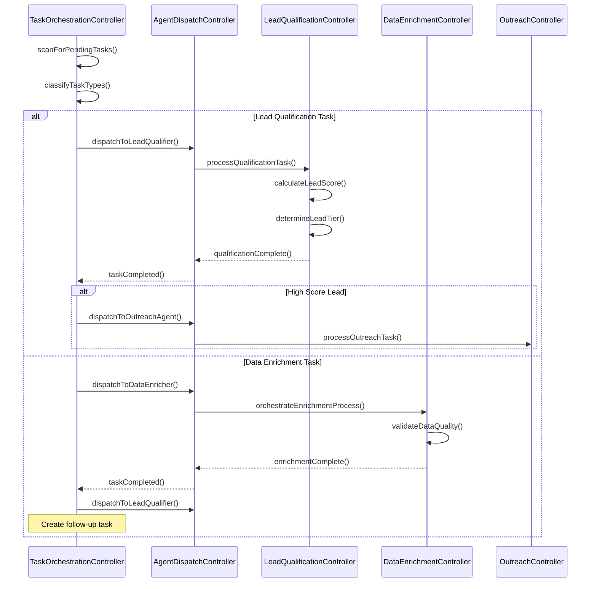

---

## Agent Coordination

### Multi-Agent Coordination Controller

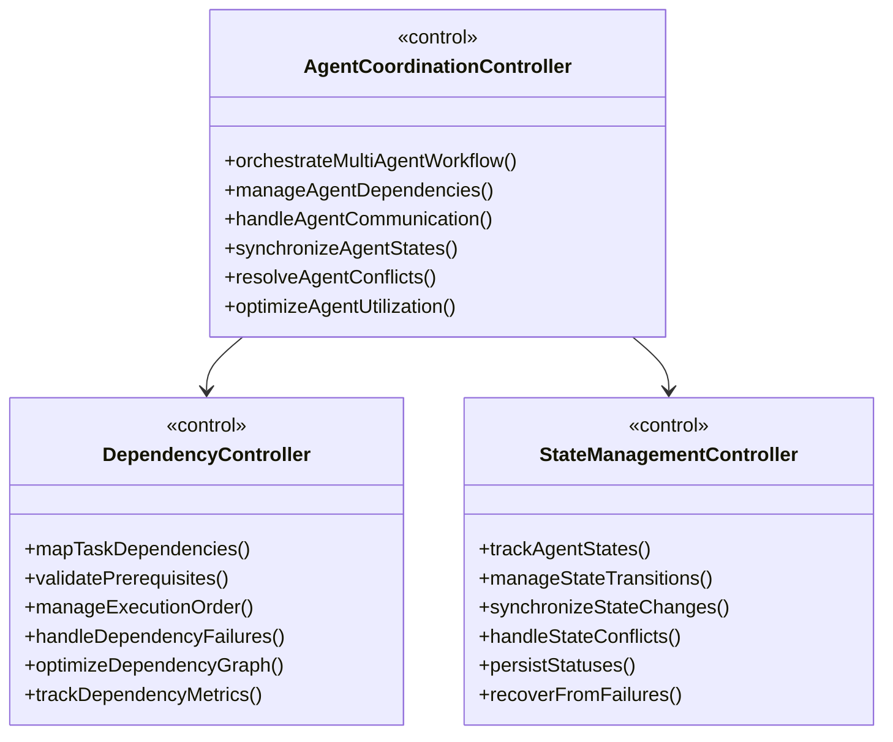

### Concurrent Process Management

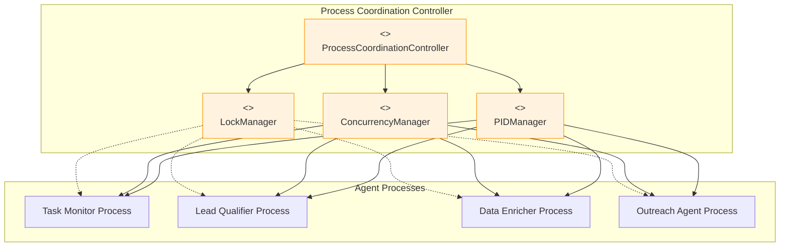

---

## Process Management

### System Process Controllers

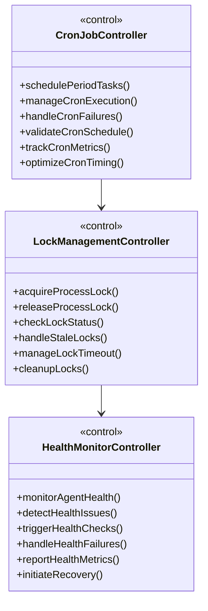

### Error and Recovery Controllers

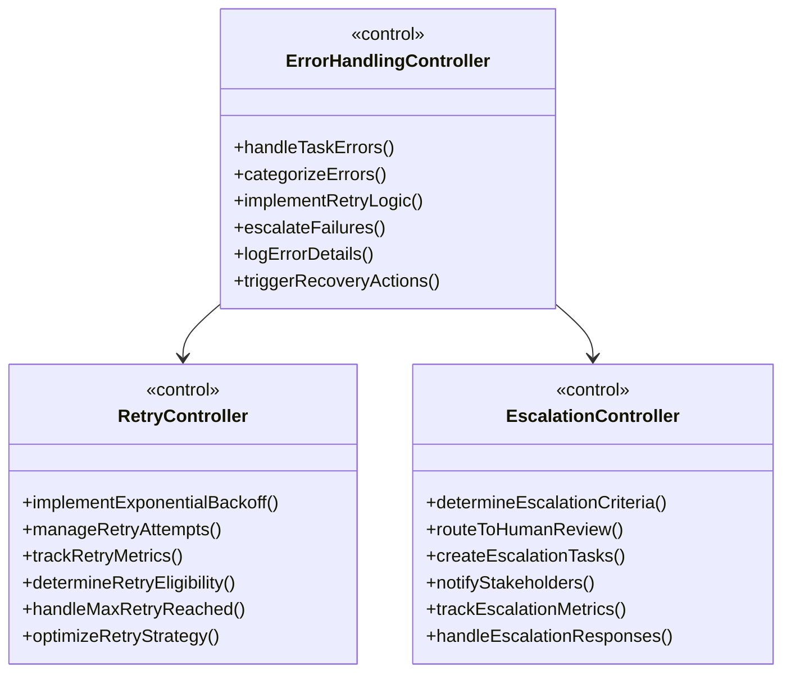

---

## Decision Making Controllers

### Business Rule Controllers

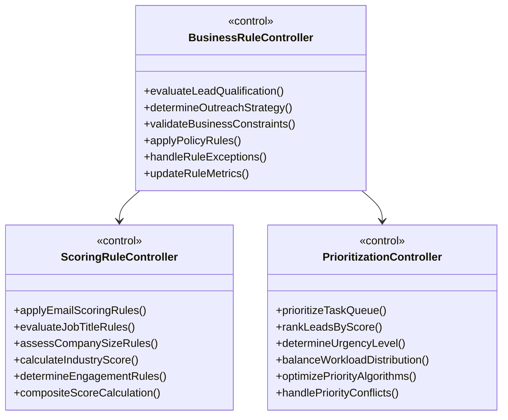

### Conditional Logic Controllers

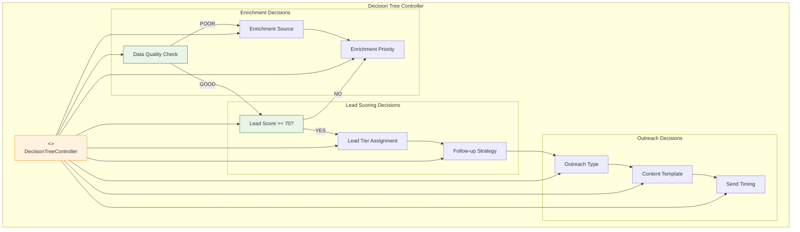

---

## Control Objects Catalog

### Complete Control Objects List

| Control Object | Primary Responsibility | Business Logic | Related Agents |
|---------------|----------------------|----------------|----------------|
| **TaskOrchestrationController** | Task routing and management | Task classification, queue management | All Agents |
| **LeadQualificationController** | Lead scoring and qualification | Scoring algorithms, tier assignment | Lead Qualifier |
| **LeadEnrichmentController** | Data enrichment orchestration | Data quality validation, source prioritization | Data Enricher |
| **OutreachController** | Campaign execution | Message personalization, timing optimization | Outreach Agent |
| **AgentDispatchController** | Agent load balancing | Agent selection, workload distribution | Task Monitor |
| **ProcessCoordinationController** | Process synchronization | Concurrency management, dependency resolution | All Agents |
| **ErrorHandlingController** | Failure management | Retry logic, escalation rules | All Agents |
| **BusinessRuleController** | Rule enforcement | Policy validation, constraint checking | All Agents |
| **CronJobController** | Scheduled execution | Timing validation, schedule optimization | Task Monitor |
| **HealthMonitorController** | System health | Health checks, recovery initiation | All Agents |

### Control Flow Diagram

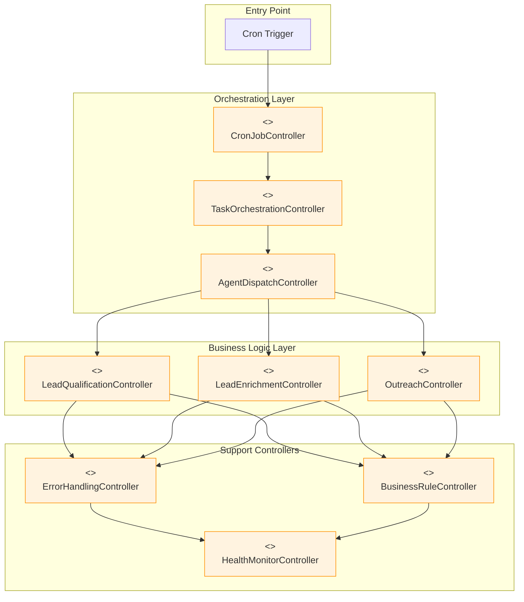

---

## Related Components

### Mapping to Code Components

| Control Object | Implementation Files | Key Functions |
|---------------|---------------------|---------------|
| **TaskOrchestrationController** | `agents/task_monitor.sh` | Task scanning, routing, status management |
| **LeadQualificationController** | `agents/lead_qualifier_v2.sh` | `score_lead()`, `process_task()` |
| **LeadEnrichmentController** | `agents/data_enricher.sh` | Enrichment orchestration, quality validation |
| **OutreachController** | `agents/outreach_agent.sh` | Message generation, campaign execution |
| **AgentDispatchController** | `agents/task_monitor.sh` | Agent spawning, process management |
| **CronJobController** | System cron + script triggers | Scheduled execution, timing management |
| **ErrorHandlingController** | Error handling in all agents | Retry logic, escalation procedures |
| **BusinessRuleController** | Business logic in agents | Scoring rules, validation logic |

### Controller Interaction Patterns

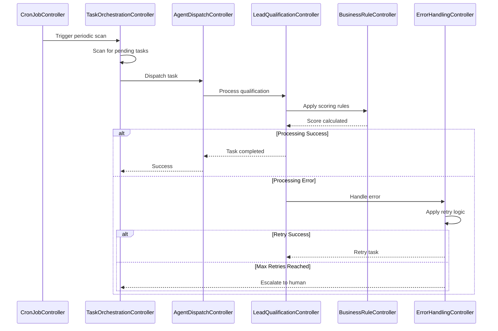

---

[⬆️ Back to top](#-table-of-contents) | [⬅️ Boundary Objects](./boundary-objects.md) | [➡️ Entity Objects](./entity-objects.md)