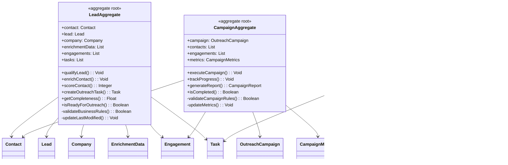

[🏠 Home](../../../README.md) | [📚 Documentation](../../index.md) | [🏗️ Architecture](../../architecture/index.md) | [⬆️ Robustness](./index.md)

---

# Entity Objects Analysis (ICONIX Process)

**Author:** Alex Fedin | [O2.services](https://O2.services) | [LinkedIn](https://linkedin.com/in/alex-fedin)  
**Last Updated:** 2025-08-18  
**Version:** 1.0.0  
**Methodology:** ICONIX Process

## 📑 Table of Contents

1. [Overview](#overview)
2. [Entity Objects Definition](#entity-objects-definition)
3. [Core Domain Entities](#core-domain-entities)
4. [Business Data Objects](#business-data-objects)
5. [Value Objects](#value-objects)
6. [Aggregate Structures](#aggregate-structures)
7. [Entity Relationships](#entity-relationships)
8. [Entity Objects Catalog](#entity-objects-catalog)
9. [Related Components](#related-components)

---

## Overview

In the ICONIX methodology, **Entity Objects** represent the core business data and domain concepts. These objects model the real-world entities that the system manages, along with their attributes, states, and relationships.

### ICONIX Notation in Mermaid
- **Entity Objects**: Represented with `<<entity>>` stereotype
- **Domain Models**: Business concepts and data structures
- **Persistent Data**: Information that survives across system sessions

---

## Entity Objects Definition

### Classification Criteria
1. **Core Business Entities**: Primary domain objects (Contact, Lead, Task)
2. **Supporting Entities**: Secondary objects that support business operations
3. **Value Objects**: Immutable objects that describe characteristics
4. **Configuration Entities**: System configuration and metadata

---

## Core Domain Entities

### Primary Business Entities

```mermaid
classDiagram
    class Contact {
        <<entity>>
        +id: String
        +email: String
        +firstName: String
        +lastName: String
        +company: String
        +jobTitle: String
        +phone: String
        +website: String
        +linkedinProfile: String
        +lastContactedDate: DateTime
        +createdDate: DateTime
        +updatedDate: DateTime
        +getFullName(): String
        +isValidEmail(): Boolean
        +hasCompleteProfile(): Boolean
    }
    
    class Lead {
        <<entity>>
        +contactId: String
        +score: Integer
        +tier: LeadTier
        +status: LeadStatus
        +qualificationDate: DateTime
        +lastScoredDate: DateTime
        +scoringNotes: String
        +decisionMakerScore: Integer
        +qualificationCriteria: Map
        +calculateScore(): Integer
        +isQualified(): Boolean
        +updateTier(): Void
    }
    
    class Company {
        <<entity>>
        +id: String
        +name: String
        +domain: String
        +website: String
        +industry: String
        +size: CompanySize
        +description: String
        +technologies: List<String>
        +location: String
        +foundedYear: Integer
        +revenue: String
        +isTargetCompany(): Boolean
        +getTechnologyStack(): List<String>
    }
    
    class Task {
        <<entity>>
        +id: String
        +subject: String
        +description: String
        +status: TaskStatus
        +priority: Priority
        +type: TaskType
        +assignedTo: String
        +associatedContacts: List<String>
        +associatedCompanies: List<String>
        +dueDate: DateTime
        +createdDate: DateTime
        +completedDate: DateTime
        +notes: String
        +isOverdue(): Boolean
        +markCompleted(): Void
        +updateStatus(status: TaskStatus): Void
    }
    
    Contact ||--o{ Lead : "becomes"
    Contact }o--|| Company : "works at"
    Task }o--o{ Contact : "associated with"
    Task }o--o{ Company : "related to"
```

### Secondary Business Entities

```mermaid
classDiagram
    class Engagement {
        <<entity>>
        +id: String
        +type: EngagementType
        +timestamp: DateTime
        +contactId: String
        +subject: String
        +body: String
        +direction: Direction
        +status: EngagementStatus
        +metadata: Map<String, Object>
        +attachments: List<String>
        +isSuccessful(): Boolean
        +getDuration(): Integer
    }
    
    class OutreachCampaign {
        <<entity>>
        +id: String
        +name: String
        +contactIds: List<String>
        +messageTemplate: String
        +personalizations: Map<String, String>
        +scheduledDate: DateTime
        +sentDate: DateTime
        +status: CampaignStatus
        +metrics: CampaignMetrics
        +followUpDays: Integer
        +getResponseRate(): Float
        +isActive(): Boolean
    }
    
    class EnrichmentData {
        <<entity>>
        +contactId: String
        +companyId: String
        +source: EnrichmentSource
        +quality: DataQuality
        +timestamp: DateTime
        +enrichedFields: Map<String, Object>
        +confidence: Float
        +dataGaps: List<String>
        +verificationStatus: VerificationStatus
        +isHighQuality(): Boolean
        +getCompleteness(): Float
    }
    
    class WorkflowExecution {
        <<entity>>
        +id: String
        +workflowName: String
        +triggeredBy: String
        +startTime: DateTime
        +endTime: DateTime
        +status: ExecutionStatus
        +steps: List<WorkflowStep>
        +errors: List<String>
        +metadata: Map<String, Object>
        +isCompleted(): Boolean
        +getDuration(): Integer
    }
    
    Engagement }o--|| Contact : "involves"
    OutreachCampaign }o--o{ Contact : "targets"
    EnrichmentData }o--|| Contact : "enriches"
    EnrichmentData }o--|| Company : "enriches"
    WorkflowExecution }o--o{ Task : "creates"
```

---

## Business Data Objects

### Configuration and Metadata Entities

```mermaid
classDiagram
    class TaskTemplate {
        <<entity>>
        +name: String
        +subject: String
        +description: String
        +priority: Priority
        +assignee: String
        +estimatedDuration: Integer
        +requiredFields: List<String>
        +businessRules: List<String>
        +createTask(context: Map): Task
        +validate(data: Map): Boolean
    }
    
    class WorkflowTrigger {
        <<entity>>
        +id: String
        +name: String
        +triggerType: TriggerType
        +conditions: List<Condition>
        +actions: List<Action>
        +isActive: Boolean
        +priority: Integer
        +evaluateConditions(context: Map): Boolean
        +executeActions(): Void
    }
    
    class ScoringRule {
        <<entity>>
        +id: String
        +name: String
        +description: String
        +criteria: String
        +points: Integer
        +weight: Float
        +isActive: Boolean
        +category: RuleCategory
        +evaluate(contact: Contact): Integer
        +isApplicable(contact: Contact): Boolean
    }
    
    class AgentConfiguration {
        <<entity>>
        +agentName: String
        +maxConcurrentTasks: Integer
        +retryAttempts: Integer
        +timeoutSeconds: Integer
        +enabledFeatures: List<String>
        +apiEndpoints: Map<String, String>
        +businessRules: List<String>
        +isEnabled(): Boolean
        +getTimeout(): Integer
    }
    
    TaskTemplate ||--o{ Task : "generates"
    WorkflowTrigger ||--o{ Task : "creates"
    ScoringRule }o--|| Lead : "scores"
    AgentConfiguration ||--o{ WorkflowExecution : "configures"
```

### Performance and Analytics Entities

```mermaid
classDiagram
    class AgentMetrics {
        <<entity>>
        +agentName: String
        +executionDate: Date
        +tasksProcessed: Integer
        +successfulTasks: Integer
        +failedTasks: Integer
        +averageProcessingTime: Float
        +errorRate: Float
        +throughputPerHour: Float
        +getSuccessRate(): Float
        +isPerformingWell(): Boolean
    }
    
    class LeadMetrics {
        <<entity>>
        +date: Date
        +totalLeads: Integer
        +qualifiedLeads: Integer
        +hotLeads: Integer
        +warmLeads: Integer
        +coldLeads: Integer
        +averageScore: Float
        +conversionRate: Float
        +getQualificationRate(): Float
        +getTierDistribution(): Map<String, Integer>
    }
    
    class CampaignMetrics {
        <<entity>>
        +campaignId: String
        +emailsSent: Integer
        +emailsDelivered: Integer
        +emailsOpened: Integer
        +emailsClicked: Integer
        +emailsReplied: Integer
        +bounceRate: Float
        +openRate: Float
        +clickRate: Float
        +replyRate: Float
        +getEngagementScore(): Float
        +isSuccessful(): Boolean
    }
    
    AgentMetrics }o--|| AgentConfiguration : "measures"
    LeadMetrics }o--o{ Lead : "aggregates"
    CampaignMetrics }o--|| OutreachCampaign : "tracks"
```

---

## Value Objects

### Immutable Value Objects


### Enumeration Value Objects


---

## Aggregate Structures

### Lead Aggregate Root



---

## Entity Relationships

### Core Entity Relationship Diagram


### Business Process Relationships


---

## Entity Objects Catalog

### Complete Entity Objects List

| Entity Category | Entity Object | Primary Key | Key Attributes | Business Rules |
|----------------|---------------|-------------|----------------|----------------|
| **Core Entities** | Contact | id | email, name, company, jobTitle | Unique email, valid contact info |
| | Lead | contactId | score, tier, status | Score 0-100, tier based on score |
| | Company | id | name, domain, industry | Unique domain, valid website |
| | Task | id | subject, status, priority | Valid status transitions |
| **Support Entities** | Engagement | id | type, timestamp, contactId | Must be associated with contact |
| | OutreachCampaign | id | name, contactIds, status | Must have at least one contact |
| | EnrichmentData | contactId + source | quality, enrichedFields | Must reference valid contact |
| | WorkflowExecution | id | workflowName, status | Must complete all steps |
| **Config Entities** | TaskTemplate | name | subject, priority, rules | Valid template structure |
| | WorkflowTrigger | id | conditions, actions | Valid condition syntax |
| | ScoringRule | id | criteria, points | Valid scoring criteria |
| | AgentConfiguration | agentName | settings, endpoints | Valid configuration |
| **Metrics Entities** | AgentMetrics | agentName + date | tasksProcessed, successRate | Must aggregate from executions |
| | LeadMetrics | date | totalLeads, conversionRate | Must aggregate from leads |
| | CampaignMetrics | campaignId | emailsSent, responseRate | Must track campaign performance |

### Entity State Transitions


---

## Related Components

### Mapping to Code Components

| Entity Object | Implementation | Data Source | Persistence |
|---------------|----------------|-------------|-------------|
| **Contact** | HubSpot Contact Object | HubSpot CRM | HubSpot Database |
| **Lead** | Contact properties (lead_score, tier) | Calculated from Contact | HubSpot Properties |
| **Company** | HubSpot Company Object | HubSpot CRM + Web Enrichment | HubSpot Database |
| **Task** | HubSpot Task Object | HubSpot Workflows | HubSpot Database |
| **Engagement** | HubSpot Engagement Object | Agent Activities | HubSpot Database |
| **EnrichmentData** | Contact/Company Properties | Web Scraping + APIs | HubSpot Properties |
| **TaskTemplate** | `config/task_templates.json` | Configuration Files | File System |
| **WorkflowTrigger** | `config/workflow_triggers.json` | Configuration Files | File System |
| **AgentMetrics** | `logs/*.log` files | Agent Execution Logs | File System |

### Entity Creation Patterns


### Entity Validation Framework


---

[⬆️ Back to top](#-table-of-contents) | [⬅️ Control Objects](./control-objects.md) | [➡️ Use Case Diagrams](./use-case-diagrams.md)