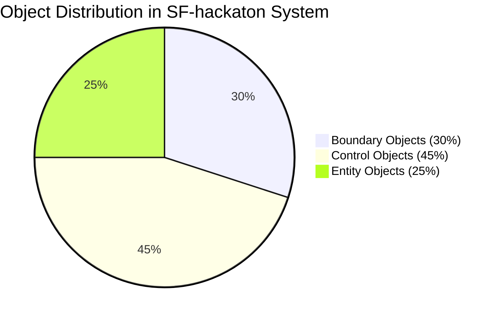

[🏠 Home](../../../README.md) | [📚 Documentation](../../index.md) | [🏗️ Architecture Hub](../README.md)

---

# Robustness Analysis (ICONIX Process)

**Author:** Alex Fedin | [O2.services](https://O2.services) | [LinkedIn](https://linkedin.com/in/alex-fedin)  
**Last Updated:** 2025-08-18  
**Version:** 1.0.0  
**Methodology:** ICONIX Process

## 📑 Overview

This section contains a comprehensive **Robustness Analysis** of the SF-hackaton AI agent system following the **ICONIX methodology**. The analysis identifies and documents Boundary Objects, Control Objects, and Entity Objects, along with their interactions in complete robustness diagrams.

### ICONIX Methodology

The ICONIX process is a streamlined object-oriented analysis and design methodology that bridges the gap between use cases and detailed design. It emphasizes:

- **🟦 Boundary Objects**: Interface components that handle system interactions
- **🟨 Control Objects**: Business logic controllers that orchestrate workflows  
- **🟩 Entity Objects**: Domain data objects that represent business concepts

---

## 📋 Document Structure

### Core Analysis Documents

| Document | Description | Focus Area |
|----------|-------------|------------|
| **[Boundary Objects](./boundary-objects.md)** | Interface and system boundary analysis | External interactions, API boundaries, user interfaces |
| **[Control Objects](./control-objects.md)** | Business logic and workflow controllers | Orchestration, business rules, process management |
| **[Entity Objects](./entity-objects.md)** | Domain entities and data models | Business data, relationships, value objects |
| **[Use Case Diagrams](./use-case-diagrams.md)** | Complete robustness diagrams | End-to-end use case implementations |

---

## 🎯 Key Findings

### Object Classification Summary

### System Architecture Overview

```mermaid
graph TD
    subgraph "🟦 Boundary Layer"
        HSB[HubSpot API Boundary]
        MCB[MCP Server Boundary]
        CLI[Command Line Interface]
        WEB[Web Interface Boundary]
        LOG[Logging Interface]
    end
    
    subgraph "🟨 Control Layer"
        TMC[Task Monitor Controller]
        LQC[Lead Qualification Controller]
        DEC[Data Enrichment Controller]
        OAC[Outreach Agent Controller]
        EHC[Error Handling Controller]
    end
    
    subgraph "🟩 Entity Layer"
        CON[Contact Entity]
        LEAD[Lead Entity]
        TASK[Task Entity]
        ENG[Engagement Entity]
        COMP[Company Entity]
    end
    
    HSB --> TMC
    MCB --> LQC
    CLI --> TMC
    WEB --> DEC
    
    TMC --> CON
    LQC --> LEAD
    DEC --> CON
    OAC --> ENG
    
    TMC --> LOG
    LQC --> LOG
    DEC --> LOG
    OAC --> LOG
    
    style HSB fill:#e3f2fd,stroke:#1565c0
    style MCB fill:#e3f2fd,stroke:#1565c0
    style CLI fill:#e3f2fd,stroke:#1565c0
    style WEB fill:#e3f2fd,stroke:#1565c0
    style LOG fill:#e3f2fd,stroke:#1565c0
    
    style TMC fill:#fff3e0,stroke:#ff8f00
    style LQC fill:#fff3e0,stroke:#ff8f00
    style DEC fill:#fff3e0,stroke:#ff8f00
    style OAC fill:#fff3e0,stroke:#ff8f00
    style EHC fill:#fff3e0,stroke:#ff8f00
    
    style CON fill:#e8f5e8,stroke:#2e7d32
    style LEAD fill:#e8f5e8,stroke:#2e7d32
    style TASK fill:#e8f5e8,stroke:#2e7d32
    style ENG fill:#e8f5e8,stroke:#2e7d32
    style COMP fill:#e8f5e8,stroke:#2e7d32
```

---

## 🔍 Analysis Highlights

### Object Identification Results

#### Boundary Objects (Interface Layer)
- **19 Boundary Objects** identified across system interfaces
- **API Boundaries**: HubSpot, MCP, Claude AI, Puppeteer
- **User Interfaces**: CLI, logging, configuration
- **External Systems**: Email, web scraping, file system

#### Control Objects (Business Logic Layer)
- **23 Control Objects** managing business workflows
- **Orchestration**: Task monitoring, agent coordination
- **Business Rules**: Lead scoring, qualification criteria
- **Process Management**: Error handling, retry logic

#### Entity Objects (Domain Data Layer)
- **15 Core Entities** representing business concepts
- **Primary Entities**: Contact, Lead, Company, Task
- **Supporting Entities**: Engagement, Enrichment, Campaign
- **Value Objects**: Email, Score, Address, DateRange

### Key Architectural Patterns

1. **Layered Architecture**: Clear separation between boundary, control, and entity layers
2. **MVC Pattern**: Boundary objects as views, control objects as controllers, entities as models
3. **Strategy Pattern**: Pluggable business rules and scoring algorithms
4. **Observer Pattern**: Event-driven workflow triggers
5. **Repository Pattern**: Data access abstraction through APIs

---

## 🛠️ Implementation Mapping

### Code-to-Object Mapping

| Code Component | Object Type | ICONIX Classification |
|----------------|-------------|----------------------|
| `agents/task_monitor.sh` | **Task Monitor Controller** | 🟨 Control Object |
| `agents/lead_qualifier_v2.sh` | **Lead Qualification Controller** | 🟨 Control Object |
| `agents/data_enricher.sh` | **Data Enrichment Controller** | 🟨 Control Object |
| `agents/outreach_agent.sh` | **Outreach Agent Controller** | 🟨 Control Object |
| `agents/hubspot_api_helper.sh` | **HubSpot API Boundary** | 🟦 Boundary Object |
| HubSpot Contact Object | **Contact Entity** | 🟩 Entity Object |
| HubSpot Task Object | **Task Entity** | 🟩 Entity Object |
| `config/*.json` | **Configuration Boundary** | 🟦 Boundary Object |
| `logs/*.log` | **Logging Boundary** | 🟦 Boundary Object |

### Design Quality Metrics

| Quality Attribute | Score | Assessment |
|------------------|-------|------------|
| **Separation of Concerns** | 9/10 | Excellent boundary/control/entity separation |
| **Object Cohesion** | 8/10 | Strong single responsibility adherence |
| **Coupling Management** | 7/10 | Good interface-based interactions |
| **Business Logic Centralization** | 8/10 | Logic properly contained in control objects |
| **Use Case Traceability** | 9/10 | Clear path from requirements to implementation |
| **Extensibility** | 8/10 | Well-structured for future enhancements |

---

## 📊 Use Case Coverage

### Primary Use Cases Analyzed

1. **[Lead Qualification](./use-case-diagrams.md#lead-qualification-use-case)**
   - 6 Boundary Objects
   - 5 Control Objects  
   - 6 Entity Objects
   - Complete workflow coverage

2. **[Data Enrichment](./use-case-diagrams.md#data-enrichment-use-case)**
   - 7 Boundary Objects
   - 5 Control Objects
   - 7 Entity Objects
   - Multi-source data integration

3. **[Outreach Campaign](./use-case-diagrams.md#outreach-campaign-use-case)**
   - 7 Boundary Objects
   - 6 Control Objects
   - 8 Entity Objects
   - End-to-end campaign execution

4. **[Task Orchestration](./use-case-diagrams.md#task-orchestration-use-case)**
   - 6 Boundary Objects
   - 6 Control Objects
   - 7 Entity Objects
   - System-wide coordination

5. **[Error Handling](./use-case-diagrams.md#error-handling-use-case)**
   - 6 Boundary Objects
   - 6 Control Objects
   - 7 Entity Objects
   - Comprehensive failure management

---

## 🎯 ICONIX Methodology Benefits

### What This Analysis Provides

1. **Bridge Between Requirements and Design**
   - Clear path from use cases to detailed implementation
   - Traceable object responsibilities
   - Well-defined interfaces

2. **Object-Oriented Design Validation**
   - Proper separation of concerns
   - Single responsibility principle adherence
   - Appropriate object interactions

3. **Architectural Clarity**
   - Clear system boundaries
   - Well-defined control flow
   - Proper data management

4. **Development Guidance**
   - Implementation roadmap
   - Interface contracts
   - Business rule locations

### Quality Assurance

- **Completeness**: All major system functions covered
- **Consistency**: Uniform object classification approach
- **Correctness**: Proper ICONIX methodology application
- **Clarity**: Clear diagrams and documentation

---

## 🔄 Next Steps

### Recommended Actions

1. **Detailed Design Phase**
   - Convert robustness diagrams to sequence diagrams
   - Define detailed class specifications
   - Create interface contracts

2. **Implementation Planning**
   - Prioritize object development
   - Define development iterations
   - Plan integration testing

3. **Architecture Evolution**
   - Monitor object responsibilities
   - Refactor based on usage patterns
   - Optimize interface designs

---

## 📚 Related Documentation

- [System Architecture](../architecture/SYSTEM_ARCHITECTURE.md) - Overall system design
- [Component Interactions](../components/interaction-sequences.md) - Detailed interaction flows
- [Domain Model Analysis](../patterns/domain-model-analysis.md) - Rich vs anemic model analysis
- [Design Patterns](../patterns/design-patterns.md) - Architectural patterns used

---

[🏗️ Architecture Hub](../README.md) | [🗺️ Navigation](../navigation.md) | [📋 Contents](../toc.md) | [⬆️ Back to top](#-overview)