[🏠 Home](../../../README.md) | [📚 Documentation](../../index.md) | [🏗️ Architecture](../../architecture/index.md) | [⬆️ Robustness](./index.md)

---

# Complete Robustness Diagrams (ICONIX Process)

**Author:** Alex Fedin | [O2.services](https://O2.services) | [LinkedIn](https://linkedin.com/in/alex-fedin)  
**Last Updated:** 2025-08-18  
**Version:** 1.0.0  
**Methodology:** ICONIX Process

## 📑 Table of Contents

1. [Overview](#overview)
2. [ICONIX Robustness Analysis](#iconix-robustness-analysis)
3. [Lead Qualification Use Case](#lead-qualification-use-case)
4. [Data Enrichment Use Case](#data-enrichment-use-case)
5. [Outreach Campaign Use Case](#outreach-campaign-use-case)
6. [Task Orchestration Use Case](#task-orchestration-use-case)
7. [Error Handling Use Case](#error-handling-use-case)
8. [System Integration Overview](#system-integration-overview)
9. [Object Interaction Patterns](#object-interaction-patterns)

---

## Overview

This document presents complete **Robustness Diagrams** following the ICONIX methodology, showing the interaction between Boundary Objects (interfaces), Control Objects (business logic), and Entity Objects (domain data) for the main use cases of the SF-hackaton AI agent system.

### ICONIX Methodology Elements
- **🟦 Boundary Objects**: External interfaces and system boundaries
- **🟨 Control Objects**: Business logic and workflow controllers  
- **🟩 Entity Objects**: Domain data and business entities

---

## ICONIX Robustness Analysis

### System Object Classification

```mermaid
graph TD
    subgraph "🟦 Boundary Objects"
        CLI[Command Line Interface]
        HSB[HubSpot API Boundary]
        MCB[MCP Server Boundary]
        PUB[Puppeteer Browser]
        LOG[Log Interface]
        CFG[Config Interface]
        EMAIL[Email Interface]
    end
    
    subgraph "🟨 Control Objects"
        TMC[Task Monitor Controller]
        LQC[Lead Qualifier Controller]
        DEC[Data Enricher Controller]
        OAC[Outreach Agent Controller]
        EHC[Error Handler Controller]
        BRC[Business Rules Controller]
    end
    
    subgraph "🟩 Entity Objects"
        CON[Contact]
        LEAD[Lead]
        COMP[Company]
        TASK[Task]
        ENG[Engagement]
        ENR[Enrichment Data]
        CAM[Campaign]
        MET[Metrics]
    end
    
    CLI --> TMC
    HSB --> TMC
    MCB --> LQC
    PUB --> DEC
    
    TMC --> CON
    LQC --> LEAD
    DEC --> ENR
    OAC --> ENG
    
    style CLI fill:#e3f2fd,stroke:#1565c0
    style HSB fill:#e3f2fd,stroke:#1565c0
    style MCB fill:#e3f2fd,stroke:#1565c0
    style PUB fill:#e3f2fd,stroke:#1565c0
    
    style TMC fill:#fff3e0,stroke:#ff8f00
    style LQC fill:#fff3e0,stroke:#ff8f00
    style DEC fill:#fff3e0,stroke:#ff8f00
    style OAC fill:#fff3e0,stroke:#ff8f00
    
    style CON fill:#e8f5e8,stroke:#2e7d32
    style LEAD fill:#e8f5e8,stroke:#2e7d32
    style COMP fill:#e8f5e8,stroke:#2e7d32
    style TASK fill:#e8f5e8,stroke:#2e7d32
```

---

## Lead Qualification Use Case

### Robustness Diagram: Qualify Lead

### Lead Qualification Interaction Flow

```mermaid
sequenceDiagram
    participant CRON as 🟦 Cron Interface
    participant TMC as 🟨 Task Monitor Controller
    participant HSA as 🟦 HubSpot API
    participant LQC as 🟨 Lead Qualifier Controller
    participant BRC as 🟨 Business Rules Controller
    participant CON as 🟩 Contact Entity
    participant LEAD as 🟩 Lead Entity
    participant TASK as 🟩 Task Entity
    
    CRON->>TMC: Trigger scan
    TMC->>HSA: Query qualification tasks
    HSA->>TASK: Retrieve task entities
    TASK-->>TMC: Task list
    
    loop For each qualification task
        TMC->>LQC: Process task
        LQC->>HSA: Fetch contact data
        HSA->>CON: Load contact entity
        CON-->>LQC: Contact details
        
        LQC->>BRC: Apply scoring rules
        BRC->>CON: Validate contact data
        CON-->>BRC: Data validation
        BRC-->>LQC: Calculated score
        
        LQC->>LEAD: Create/update lead
        LEAD->>LEAD: Set score and tier
        LQC->>HSA: Update contact properties
        LQC->>HSA: Complete task
        
        alt High score lead (>= 70)
            LQC->>TASK: Create outreach task
        else Medium score (40-69)
            LQC->>TASK: Create nurture task
        else Low score (< 40)
            LQC->>TASK: Create enrichment task
        end
    end
```

---

## Data Enrichment Use Case

### Robustness Diagram: Enrich Contact Data

---

## Outreach Campaign Use Case

### Robustness Diagram: Execute Outreach Campaign

### Campaign Priority Logic

---

## Task Orchestration Use Case

### Robustness Diagram: Task Orchestration System

---

## Error Handling Use Case

### Robustness Diagram: Error Handling and Recovery

### Error Recovery Flow

---

## System Integration Overview

### Complete System Robustness Map

```mermaid
graph TB
    subgraph "🟦 External Boundaries"
        USER[Sales Team Interface]
        CRON6[Cron Scheduler]
        HS[HubSpot CRM]
        WEB6[External Websites]
        EMAIL6[Email Services]
        AI[AI Services]
    end
    
    subgraph "🟦 System Boundaries"
        CLI6[Command Interface]
        API[API Gateway]
        LOG6[Logging System]
        FILE[File System]
        BROWSER[Browser Interface]
    end
    
    subgraph "🟨 Core Controllers"
        ORK[Orchestration Controller]
        BIZ[Business Logic Controller]
        DATA[Data Controller]
        COMM[Communication Controller]
        HEALTH[Health Controller]
    end
    
    subgraph "🟨 Agent Controllers"
        TMC6[Task Monitor]
        LQC6[Lead Qualifier]
        DEC6[Data Enricher]
        OAC6[Outreach Agent]
    end
    
    subgraph "🟩 Core Entities"
        TASK6[Tasks]
        CONTACT6[Contacts]
        LEADS6[Leads]
        COMPANY6[Companies]
        ENGAGEMENTS[Engagements]
    end
    
    subgraph "🟩 Support Entities"
        CONFIG[Configuration]
        METRICS6[Metrics]
        WORKFLOWS[Workflows]
        TEMPLATES[Templates]
    end
    
    USER --> CLI6
    CRON6 --> ORK
    HS <--> API
    WEB6 <--> BROWSER
    EMAIL6 <--> COMM
    AI <--> COMM
    
    CLI6 --> ORK
    API --> DATA
    LOG6 --> HEALTH
    FILE --> CONFIG
    BROWSER --> DEC6
    
    ORK --> TMC6
    BIZ --> LQC6
    DATA --> DEC6
    COMM --> OAC6
    HEALTH --> TMC6
    
    TMC6 --> TASK6
    LQC6 --> LEADS6
    DEC6 --> CONTACT6
    OAC6 --> ENGAGEMENTS
    
    TASK6 --> CONTACT6
    LEADS6 --> CONTACT6
    CONTACT6 --> COMPANY6
    ENGAGEMENTS --> CONTACT6
    
    CONFIG --> WORKFLOWS
    METRICS6 --> WORKFLOWS
    WORKFLOWS --> TEMPLATES
    
    style USER fill:#ffebee,stroke:#c62828
    style HS fill:#ffebee,stroke:#c62828
    style WEB6 fill:#ffebee,stroke:#c62828
    
    style CLI6 fill:#e3f2fd,stroke:#1565c0
    style API fill:#e3f2fd,stroke:#1565c0
    style LOG6 fill:#e3f2fd,stroke:#1565c0
    style FILE fill:#e3f2fd,stroke:#1565c0
    style BROWSER fill:#e3f2fd,stroke:#1565c0
    
    style ORK fill:#fff3e0,stroke:#ff8f00
    style BIZ fill:#fff3e0,stroke:#ff8f00
    style DATA fill:#fff3e0,stroke:#ff8f00
    style COMM fill:#fff3e0,stroke:#ff8f00
    style HEALTH fill:#fff3e0,stroke:#ff8f00
    
    style TMC6 fill:#fff8e1,stroke:#f57c00
    style LQC6 fill:#fff8e1,stroke:#f57c00
    style DEC6 fill:#fff8e1,stroke:#f57c00
    style OAC6 fill:#fff8e1,stroke:#f57c00
    
    style TASK6 fill:#e8f5e8,stroke:#2e7d32
    style CONTACT6 fill:#e8f5e8,stroke:#2e7d32
    style LEADS6 fill:#e8f5e8,stroke:#2e7d32
    style COMPANY6 fill:#e8f5e8,stroke:#2e7d32
    style ENGAGEMENTS fill:#e8f5e8,stroke:#2e7d32
    
    style CONFIG fill:#f3e5f5,stroke:#7b1fa2
    style METRICS6 fill:#f3e5f5,stroke:#7b1fa2
    style WORKFLOWS fill:#f3e5f5,stroke:#7b1fa2
    style TEMPLATES fill:#f3e5f5,stroke:#7b1fa2
```

---

## Object Interaction Patterns

### ICONIX Pattern Implementation

```mermaid
graph LR
    subgraph "Boundary → Control → Entity Pattern"
        B1[🟦 Boundary] -->|1. Input/Request| C1[🟨 Control]
        C1 -->|2. Business Logic| E1[🟩 Entity]
        E1 -->|3. Data Access| C1
        C1 -->|4. Response| B1
    end
    
    subgraph "Control → Control Coordination"
        C2[🟨 Controller A] -->|Delegate| C3[🟨 Controller B]
        C3 -->|Collaborate| C4[🟨 Controller C]
        C4 -->|Coordinate| C2
    end
    
    subgraph "Entity → Entity Relationships"
        E2[🟩 Primary Entity] -->|Associates| E3[🟩 Related Entity]
        E3 -->|References| E4[🟩 Supporting Entity]
        E4 -->|Aggregates| E2
    end
    
    style B1 fill:#e3f2fd,stroke:#1565c0
    style C1 fill:#fff3e0,stroke:#ff8f00
    style E1 fill:#e8f5e8,stroke:#2e7d32
    style C2 fill:#fff3e0,stroke:#ff8f00
    style C3 fill:#fff3e0,stroke:#ff8f00
    style C4 fill:#fff3e0,stroke:#ff8f00
    style E2 fill:#e8f5e8,stroke:#2e7d32
    style E3 fill:#e8f5e8,stroke:#2e7d32
    style E4 fill:#e8f5e8,stroke:#2e7d32
```

### Design Principles Validation

| ICONIX Principle | Implementation | Validation |
|-----------------|----------------|------------|
| **Separation of Concerns** | Boundary/Control/Entity layers | ✅ Clear separation maintained |
| **Single Responsibility** | Each object has one clear purpose | ✅ Controllers focus on specific business logic |
| **Object Communication** | Well-defined interfaces | ✅ Clean interaction patterns |
| **Business Logic Centralization** | Logic in control objects only | ✅ No business logic in boundaries or entities |
| **Data Integrity** | Entity objects manage state | ✅ Entities encapsulate business data |
| **Use Case Traceability** | Clear path from use case to implementation | ✅ Robustness diagrams map to code |

---

[⬆️ Back to top](#-table-of-contents) | [⬅️ Entity Objects](./entity-objects.md) | [➡️ Index](./index.md)