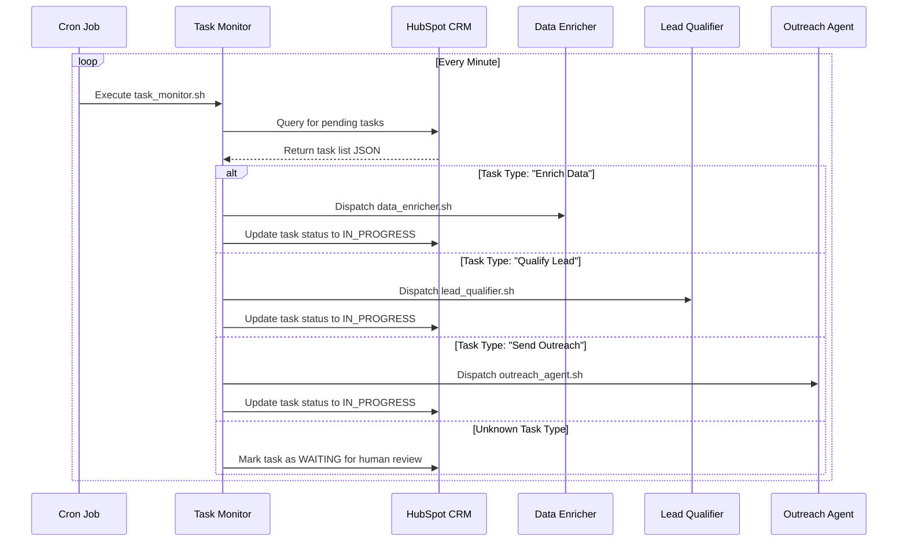
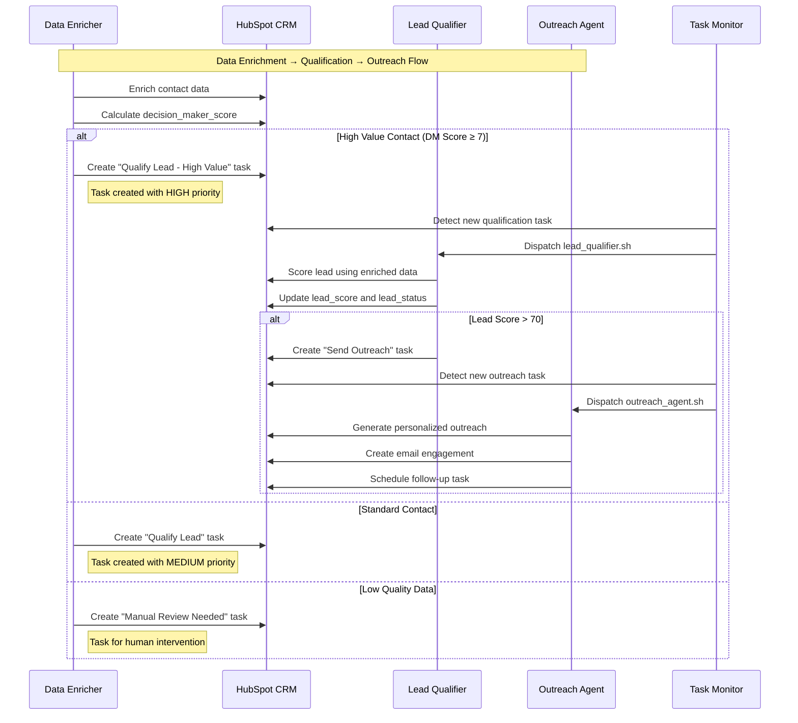
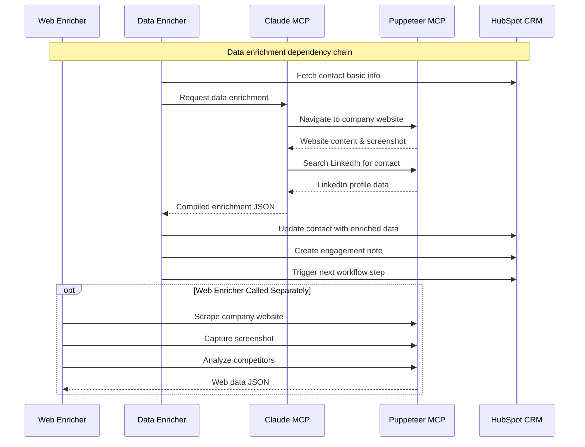
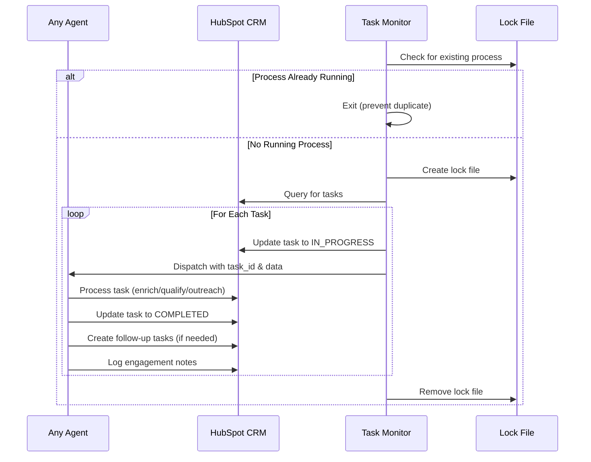
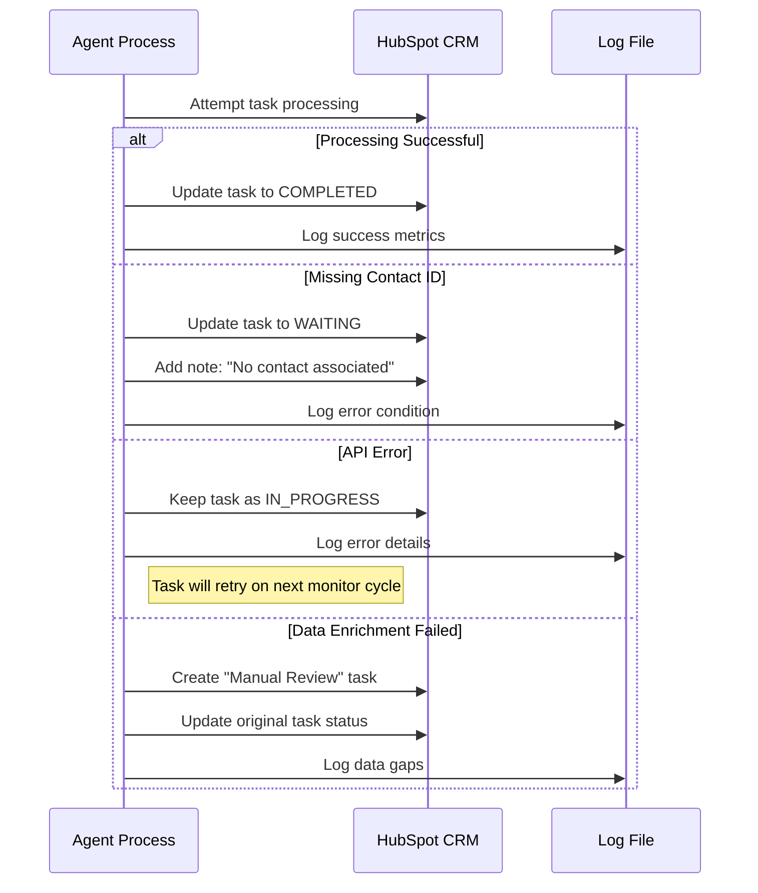
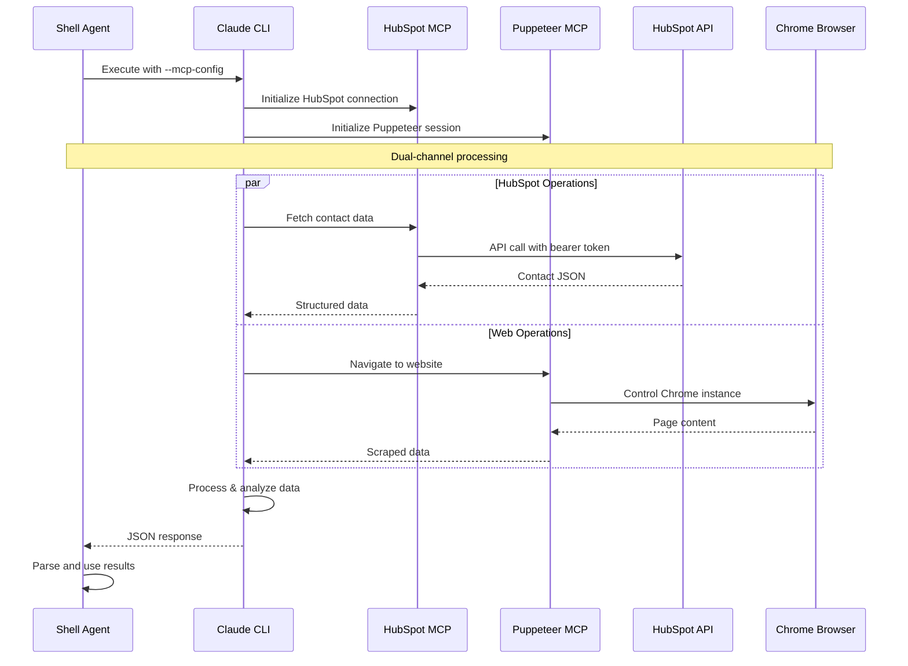
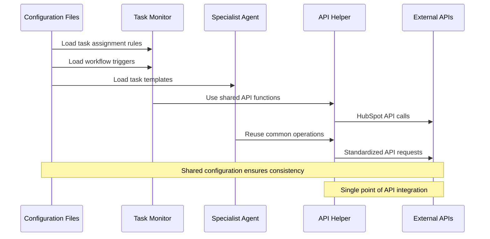

[🏠 Home](../../../README.md) | [📚 Documentation](../../index.md) | [🏗️ Architecture Hub](../README.md) | [🔄 Sequences](../sequences/)

---

# Agent Interactions Sequence Diagrams

This document outlines how the AI agents in the SF-hackaton project communicate and interact with each other, HubSpot CRM, and external services.

## Overview

The system consists of several specialized agents that work together to automate lead processing:

- **Task Monitor Agent**: Central orchestrator that polls HubSpot for tasks
- **Data Enricher Agent**: Enriches contact and company data using web scraping
- **Lead Qualifier Agent**: Scores and qualifies leads based on enriched data
- **Outreach Agent**: Generates and sends personalized outreach messages
- **Web Enricher Agent**: Specialized web scraping and data gathering
- **HubSpot API Helper**: Shared utility for HubSpot API interactions

## Agent Communication Patterns

### 1. Central Task Orchestration

### 2. Agent-to-Agent Workflow Triggers

### 3. Inter-Agent Data Dependencies

## Agent Lifecycle Management

### 4. Task State Management

### 5. Error Handling and Recovery

## MCP Integration Patterns

### 6. Claude MCP Tool Usage

## Communication Interfaces

### 7. Data Flow Between Components

## Key Architectural Patterns

1. **Event-Driven Architecture**: Cron triggers task monitoring, which creates events for agent dispatch
2. **Microservice Communication**: Agents communicate via shared HubSpot state and task creation
3. **Shared State Management**: HubSpot CRM acts as the central state store
4. **Async Processing**: Agents run in background processes with fire-and-forget pattern
5. **Circuit Breaker**: Lock files prevent duplicate processing
6. **Data Pipeline**: Clear data flow from enrichment → qualification → outreach
7. **MCP Abstraction**: Claude MCP tools provide unified interface to external services

## Performance Considerations

- **Rate Limiting**: 2-second delays between API calls to prevent throttling
- **Parallel Processing**: Agents run concurrently using background execution (`&`)
- **Lock Files**: Prevent duplicate task monitor instances
- **Stateless Design**: Each agent execution is independent
- **Caching**: Web data and screenshots cached for efficiency
- **Batch Processing**: Multiple tasks processed in single monitor cycle

---

**Navigation**: [🏗️ Architecture Hub](../README.md) | [🗺️ Navigation](../navigation.md) | [📋 Contents](../toc.md) | [🔄 Sequences](../sequences/) | [🏠 Home](../../../README.md)