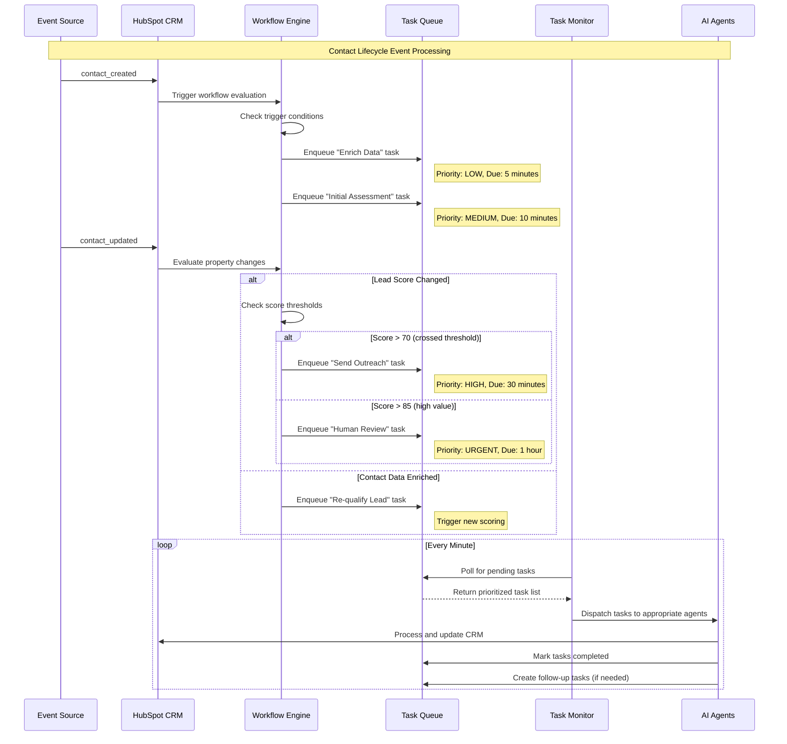
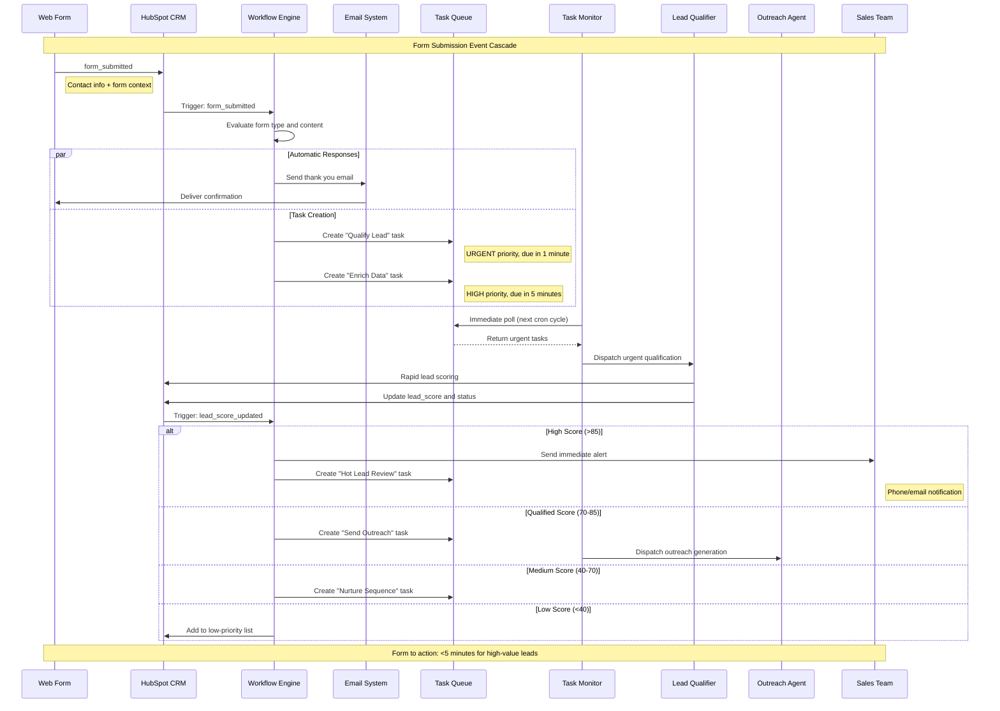
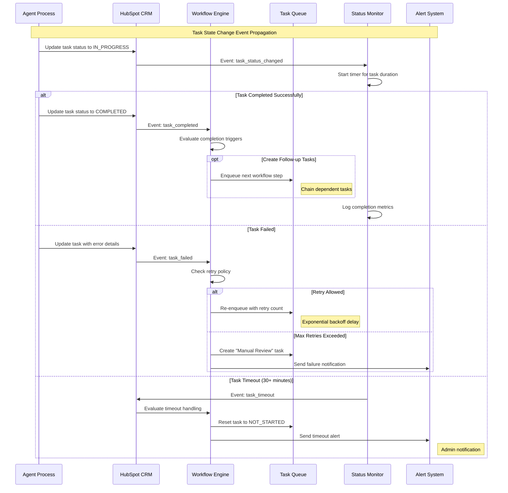
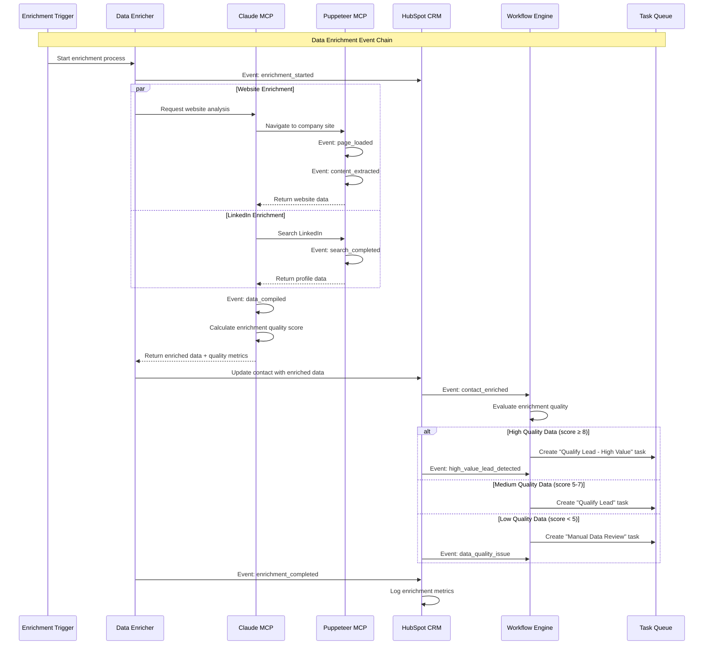
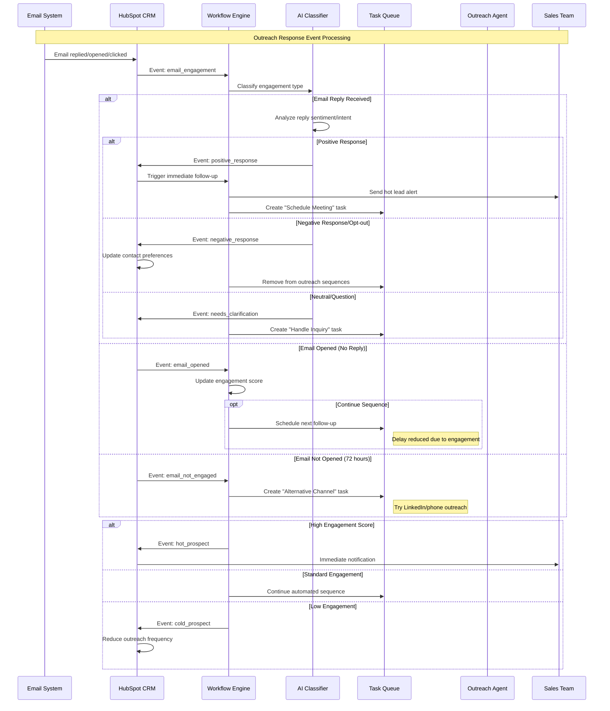
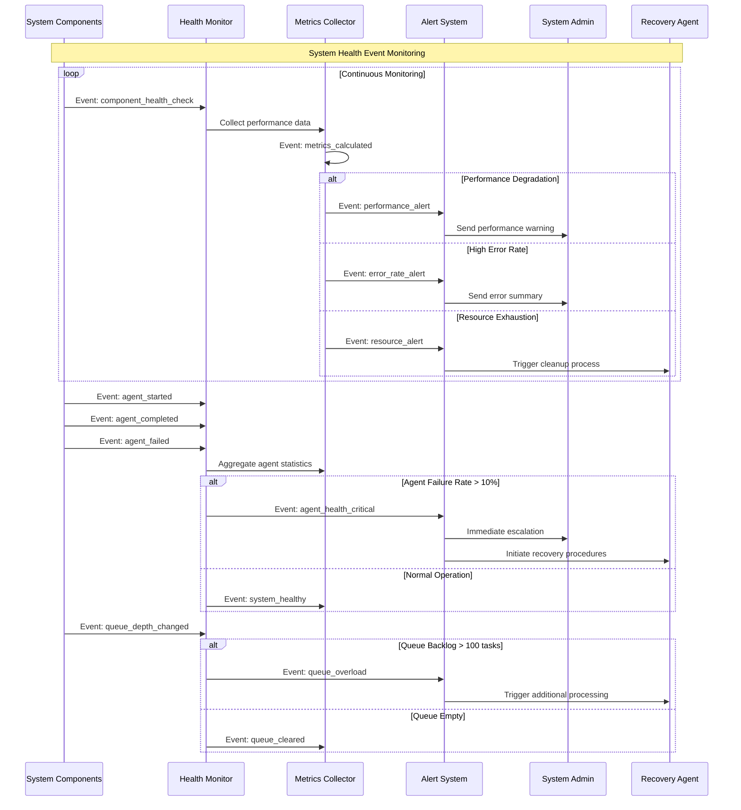
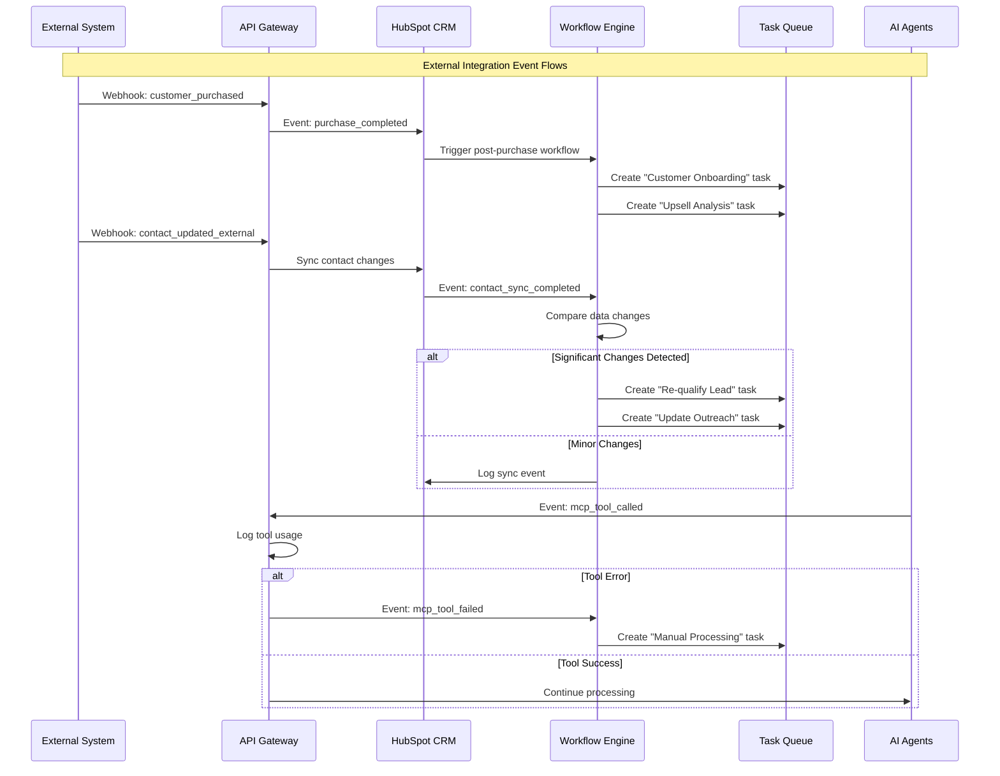
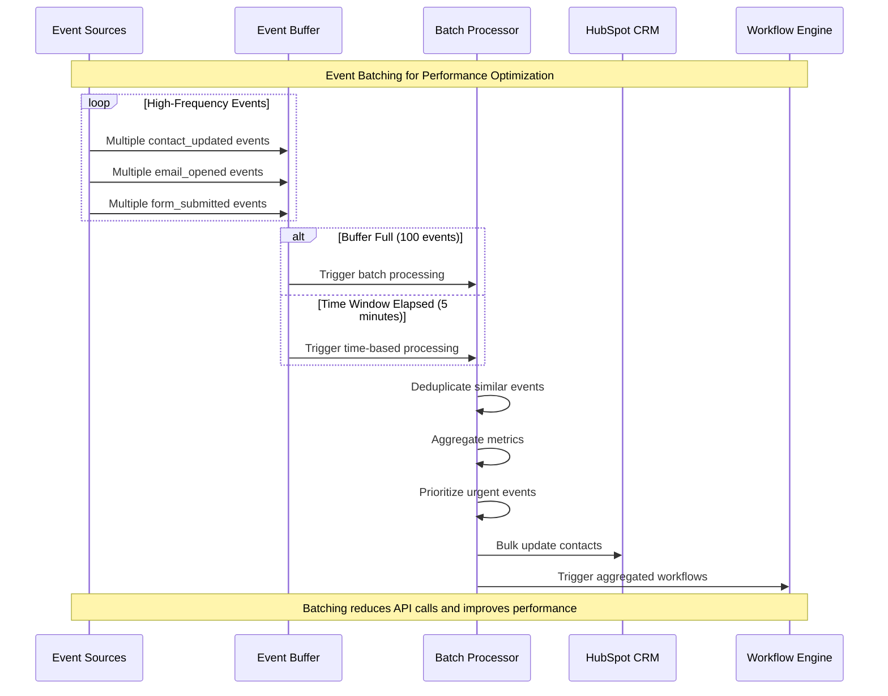
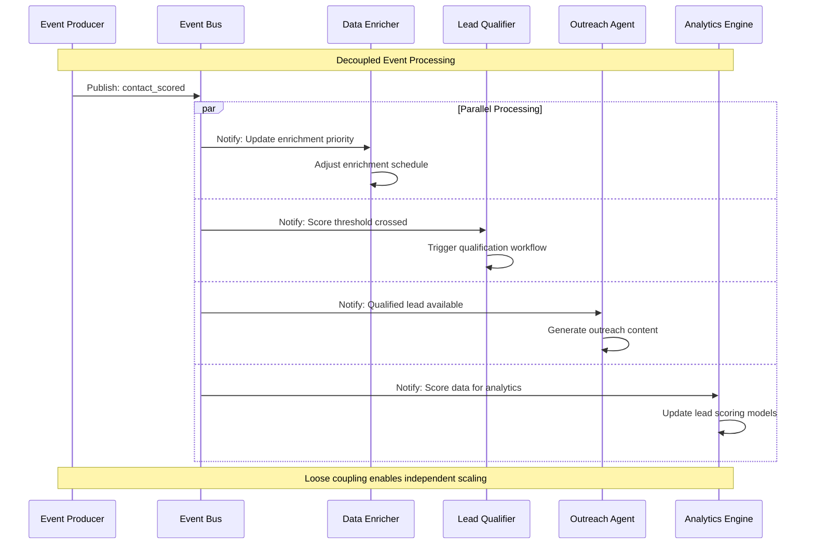

# Event-Driven Interaction Flows

This document details the event-driven architecture of the SF-hackaton AI agent system, showing how events trigger actions and cascade through the system to create automated workflows.

## Event Architecture Overview

The system operates on an event-driven model where:
- **Event Sources**: HubSpot workflows, contact activities, task completions
- **Event Processors**: Task Monitor, individual agents
- **Event Sinks**: HubSpot CRM, external systems, human notifications

## Core Event Types and Flows

### 1. Contact Lifecycle Events

### 2. Form Submission Event Cascade

### 3. Task State Change Events

### 4. Data Enrichment Event Chain

### 5. Outreach Response Event Handling

### 6. System Health and Monitoring Events

### 7. Integration Event Flows

## Event Processing Patterns

### 8. Event Batching and Aggregation

## Event-Driven Architecture Benefits

### 9. Loose Coupling and Scalability

## Key Event Architecture Characteristics

1. **Asynchronous Processing**: Events enable non-blocking, parallel processing
2. **Event Sourcing**: Complete audit trail of all system events and state changes
3. **Reactive Workflows**: Automatic response to system state changes
4. **Scalable Architecture**: Easy to add new event consumers without changing producers
5. **Fault Tolerance**: Failed events can be replayed and reprocessed
6. **Real-time Responsiveness**: Immediate reaction to high-priority events
7. **Data Consistency**: Event-driven updates ensure synchronized state across components
8. **Monitoring and Observability**: Event logs provide comprehensive system visibility