# Use Case Flow Diagrams

This document provides detailed step-by-step sequence diagrams for the primary use cases in the SF-hackaton AI agent system, showing complete user journeys from start to finish.

## Primary Use Cases

### Use Case 1: Cold Lead Acquisition and Qualification

**Scenario**: A new prospect visits the website, fills out a contact form, and gets automatically processed through the AI agent pipeline.

### Use Case 2: High-Value Lead Escalation

**Scenario**: An enterprise contact with excellent qualification metrics gets fast-tracked for immediate human attention.

### Use Case 3: Data Quality Issue Resolution

**Scenario**: The enrichment process encounters incomplete or poor-quality data and requires human intervention.

### Use Case 4: Multi-Touch Outreach Sequence

**Scenario**: A qualified lead goes through multiple automated follow-ups with AI-generated content.

### Use Case 5: System Recovery After Downtime

**Scenario**: The system recovers from a maintenance window or outage and processes accumulated tasks.

### Use Case 6: Real-Time Lead Scoring Update

**Scenario**: A contact's score changes due to new activity, triggering workflow adjustments.

```mermaid
sequenceDiagram
    participant Contact as Existing Contact
    participant HS as HubSpot CRM
    participant WF as Workflow Engine
    participant LQ as Lead Qualifier
    participant TM as Task Monitor
    participant OA as Outreach Agent
    participant Sales as Sales Team

    Note over Contact,Sales: Dynamic Lead Score Adjustment Workflow

    %% Trigger Event
    Contact->>HS: Downloads whitepaper
    HS->>HS: Update contact activity
    HS->>WF: Trigger: engagement_activity
    
    %% Re-qualification
    WF->>HS: Create "Re-qualify Lead" task
    TM->>LQ: Dispatch qualification update
    
    LQ->>HS: Fetch current lead data
    LQ->>HS: Fetch recent activity history
    LQ->>LQ: Recalculate lead score
    Note right of LQ: Previous score: 65 → New score: 78
    
    LQ->>HS: Update lead_score = 78
    LQ->>HS: Update lead_status = "qualified"
    
    %% Workflow Routing Based on New Score
    HS->>WF: Trigger: lead_score_above_70
    
    alt Score Crossed 70 Threshold
        WF->>HS: Create "Send Outreach" task
        TM->>OA: Dispatch immediate outreach
        
        OA->>HS: Check previous outreach history
        alt No Previous Outreach
            OA->>OA: Generate initial outreach
            
        else Previous Outreach Sent
            OA->>OA: Generate follow-up sequence
            Note right of OA: Reference previous communication
        end
        
        OA->>HS: Create engagement
        OA->>HS: Update outreach status
        
    else Score Approaching 85 (>80)
        WF->>Sales: Send alert notification
        Note right of Sales: "Lead warming up - consider personal outreach"
        
    else Standard Qualified Lead
        WF->>HS: Add to automated nurture sequence
    end
    
    Note over Contact,Sales: Real-time scoring enables dynamic workflow adjustments
```

## Cross-Cutting Concerns

### Error Handling Patterns Across Use Cases

## Key Use Case Characteristics

1. **End-to-End Automation**: Complete workflows with minimal human intervention
2. **Graceful Degradation**: System continues operating even with partial failures
3. **Priority-Based Processing**: High-value leads get faster attention
4. **Human Escalation Points**: Clear handoff points for human intervention
5. **Recovery Mechanisms**: Robust handling of system outages and backlogs
6. **Real-Time Adaptation**: Dynamic workflow adjustments based on new data
7. **Multi-Channel Integration**: Seamless operation across HubSpot, web, and email
8. **Audit Trail**: Complete logging of all decisions and actions