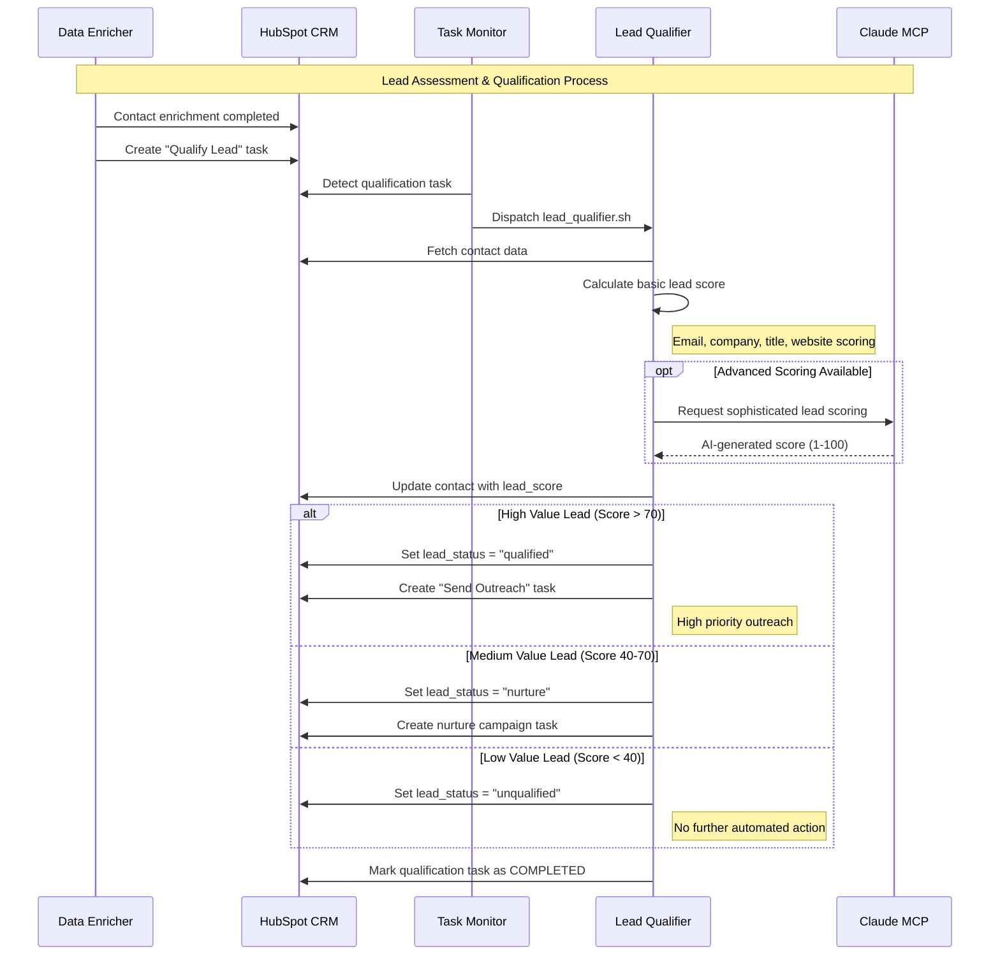
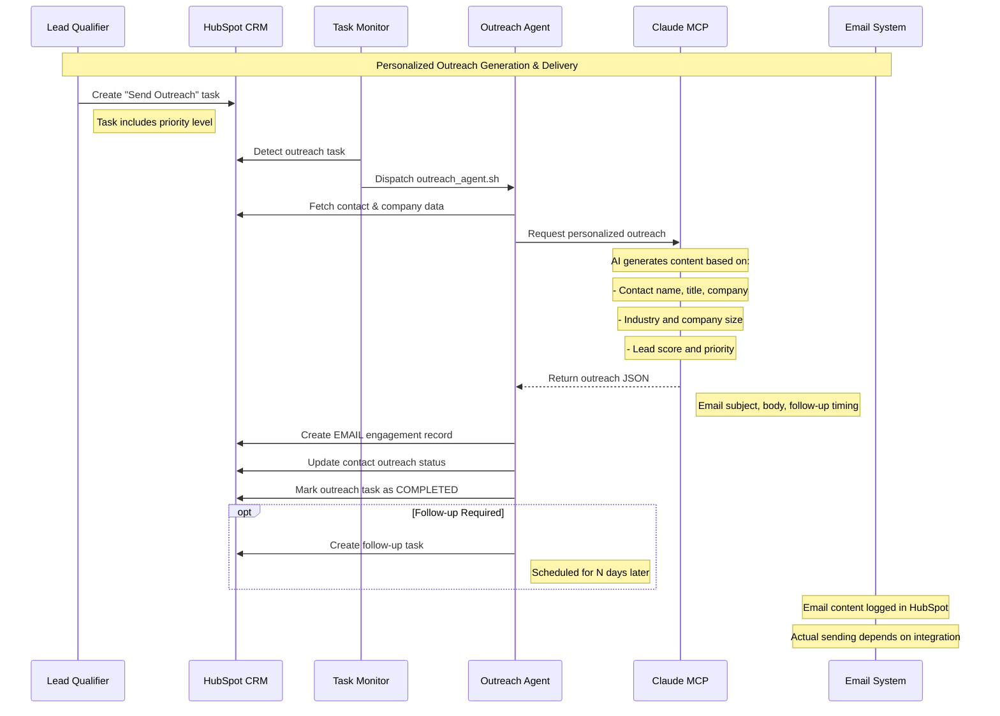
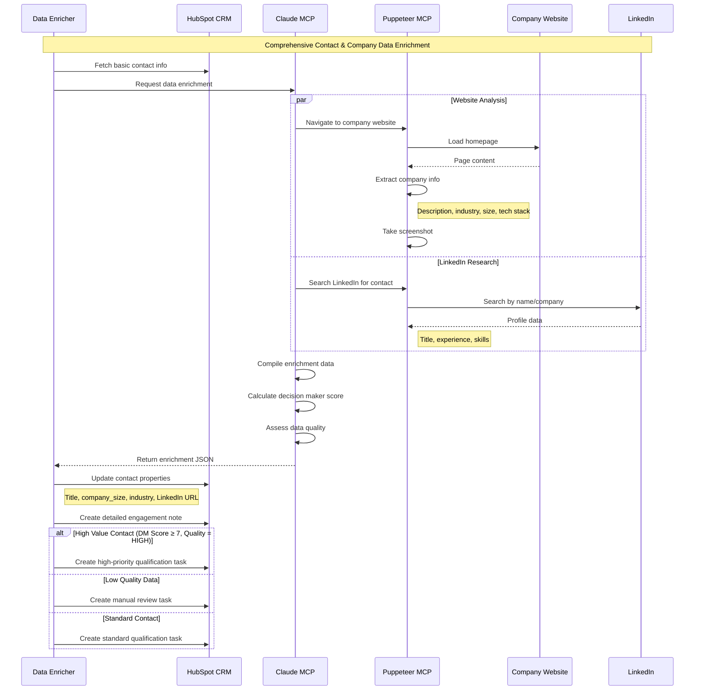
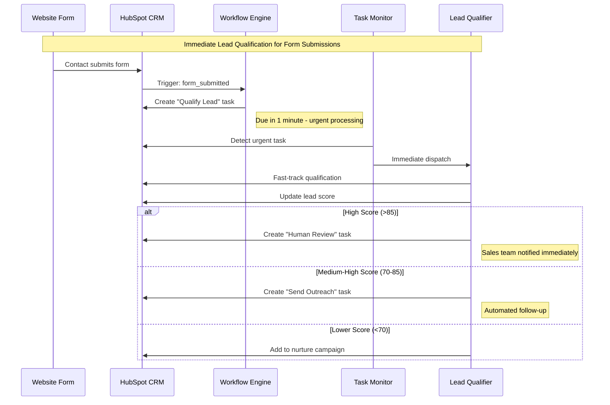
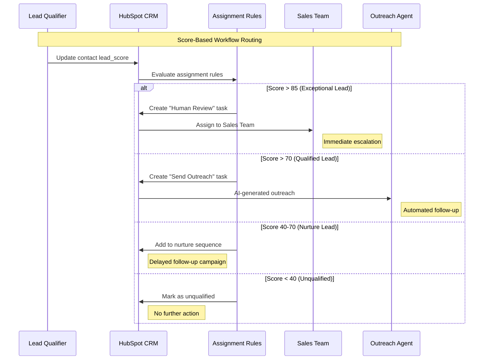
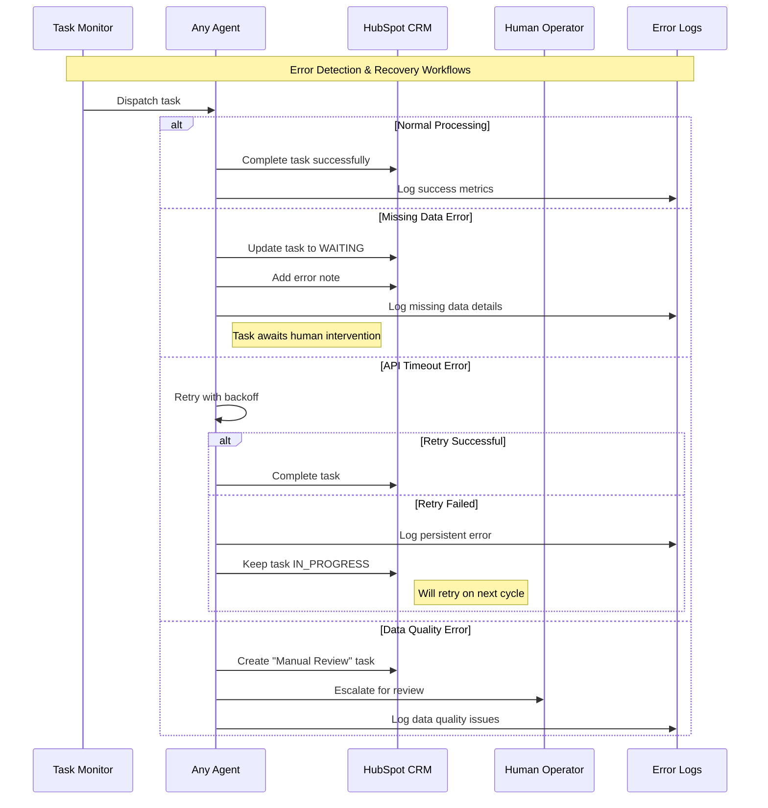
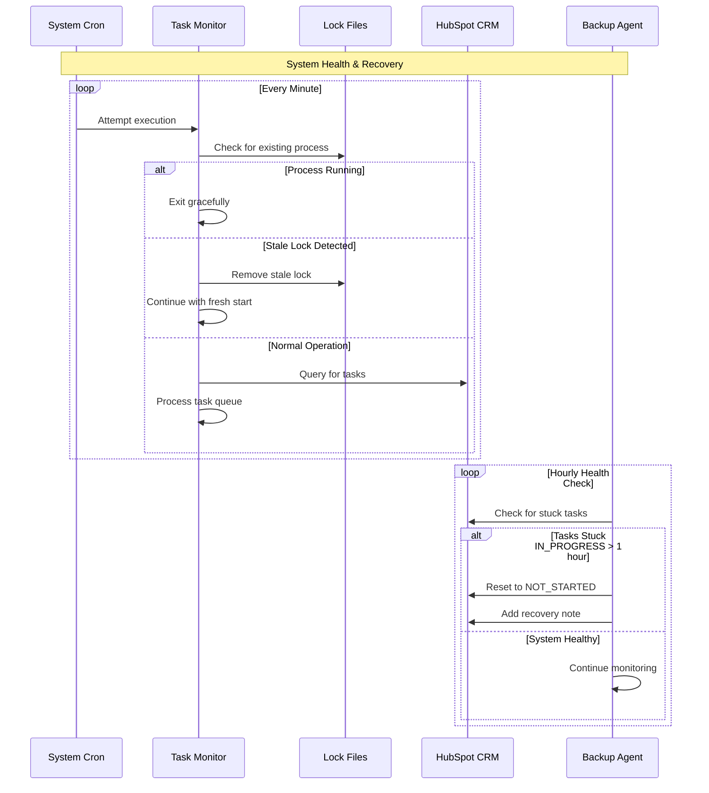
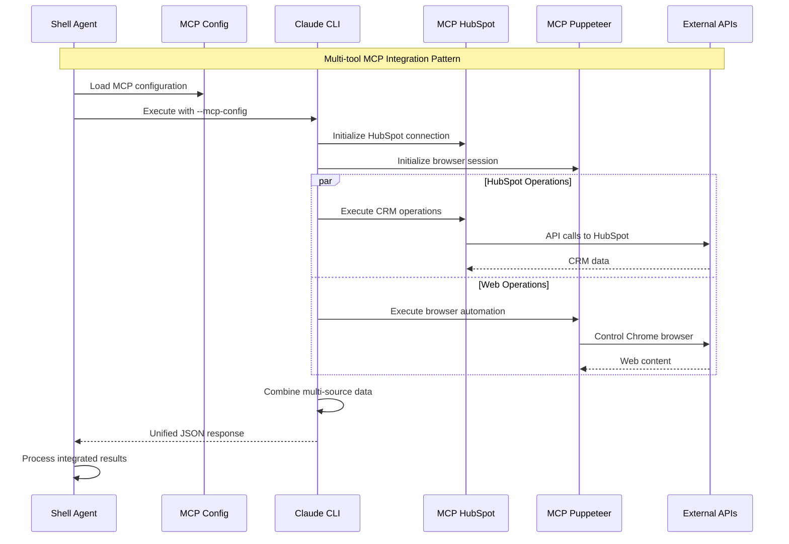
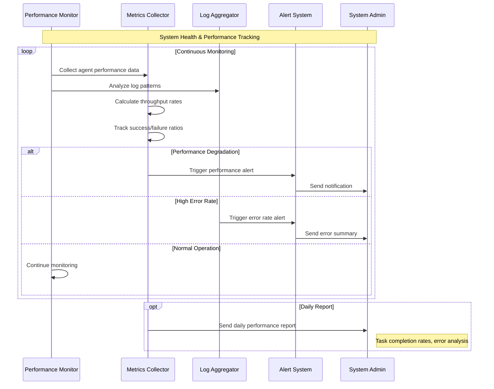

# Workflow Sequence Diagrams

This document details the main workflows and business processes in the SF-hackaton AI agent system, showing how data flows through the system from initial contact creation to final outreach.

## Core Business Workflows

### 1. New Contact Processing Workflow

```mermaid
sequenceDiagram
    participant User as Website Visitor
    participant Form as HubSpot Form
    participant HS as HubSpot CRM
    participant Workflow as HubSpot Workflow
    participant TM as Task Monitor
    participant DE as Data Enricher

    Note over User,DE: New Contact Acquisition & Initial Processing

    User->>Form: Submit contact form
    Form->>HS: Create new contact record
    HS->>Workflow: Trigger: contact_created
    
    Workflow->>HS: Create "Enrich Data" task
    Note right of Workflow: Due in 5 minutes, assigned to AI-Agents
    
    loop Every Minute
        TM->>HS: Query for pending tasks
        HS-->>TM: Return task list
        
        alt Enrich Data Task Found
            TM->>HS: Update task to IN_PROGRESS
            TM->>DE: Dispatch data_enricher.sh
            break Task Processed
        end
    end
    
    DE->>HS: Fetch contact basic info
    DE->>DE: Execute enrichment process
    DE->>HS: Update contact with enriched data
    DE->>HS: Mark task as COMPLETED
    DE->>HS: Create follow-up qualification task
```

### 2. Lead Scoring and Qualification Workflow



### 3. Automated Outreach Workflow



### 4. Data Enrichment Deep-Dive Workflow



## Trigger-Based Workflows

### 5. Form Submission Trigger Workflow



### 6. Lead Score Threshold Workflows



## Error Handling Workflows

### 7. Task Processing Error Recovery



### 8. System Recovery and Backup Workflows



## Integration Workflows

### 9. MCP Tool Integration Workflow



## Performance and Monitoring

### 10. System Performance Monitoring Workflow



## Key Workflow Patterns

1. **Event-Driven Processing**: HubSpot triggers → Task creation → Agent dispatch
2. **Pipeline Architecture**: Sequential processing stages with clear handoffs
3. **Conditional Routing**: Score-based and rule-based task assignment
4. **Error Recovery**: Graceful degradation with human escalation paths
5. **Rate-Limited Processing**: Built-in delays and throttling mechanisms
6. **State Persistence**: All workflow state maintained in HubSpot CRM
7. **Async Execution**: Non-blocking agent processing with background execution
8. **Idempotent Operations**: Safe retry mechanisms for failed operations